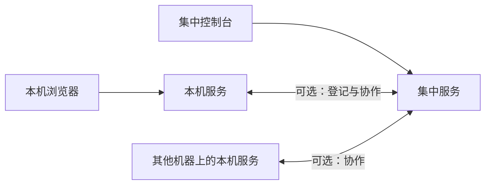

<p align="center">
  
</p>

<p align="center">
  <h1 align="center">DAgents</h1>
  <p align="center">
    跑在你自己机器上的 AI 助手控制台
    <br />
    本机对话 · 工具与审批 · 多机工作组协作
    <br />
    <br />
    <a href="docs/handbook/README.md"><strong>项目手册 »</strong></a>
    ·
    <a href="docs/handbook/07-Workgroup协作.md"><strong>工作组怎么用 »</strong></a>
    ·
    <a href="CHANGELOG.md">变更记录</a>
  </p>
</p>

<p align="center">
  <a href="LICENSE"></a>
  <a href="CHANGELOG.md"></a>
  <a href="https://github.com/DGS-ai-team/DAgents/actions/workflows/pr-tests.yml"></a>
</p>

---

## DAgents 是什么

**DAgents** 把大模型助手装进你的内网或个人电脑：数据与工具默认落在本机，浏览器打开就能用。需要多人、多台电脑一起干活时，再用工作组把几台机器上的助手编在一起。

它不是拖拽式「万能工作流」平台，而是面向企业与团队的 **本地优先助手控制台**——能管工具权限、能等人确认、能把对话与文件留在自己这边。

当前版本为 **v0.9.5**（基于 **v0.9.1** 预览线的稳定性补丁；含 Linux 命令行首配与工作组 Dialer 修复）。能力边界与验收步骤见手册中的 [预览清单](docs/design/v0.9.1-smoke-checklist.md)。

---

## 你能做什么

### 本机助手

- **多助手并行**：按场景创建多个助手，各自对话、各自工具开关。
- **读写本机文件、跑命令**：在设定好的工作目录内读改文件、搜索、执行终端命令（可按策略要求先审批）。
- **技能与定时**：加载技能包扩展能力；按时间或条件触发任务。
- **浏览器任务**：把「打开网页、填表、摘信息」交给伴生浏览器助手，主对话里能看到任务结论与引用。
- **临时帮手**：复杂任务可再开短期子助手，做完回收。
- **需要你拍板时会停住**：危险操作可审批；也可以主动问你一句再继续。

### 工作组协作（可选）

适合几台电脑、几个角色一起完成一件事：

- **建组与成员**：指定哪台机器托管哪个成员，成员只在自己的工作区里动手。
- **主管编排**：主管助手把任务分给成员；也可以在对话里 **@某成员** 直接交代。
- **成员工具**：默认可读写工作区文件与搜索；需要时再单独打开 Shell（默认不开，更安全）。
- **进度可见**：时间线、任务卡片、流式输出；跑偏了可以取消本轮。
- **问人确认**：成员或主管可以把问题抛给你，你回答后再继续。

> 工作组怎么开、默认能勾哪些工具：见 [工作组协作](docs/handbook/07-Workgroup协作.md)。

### 安装与更新

- Windows / Linux 安装包；可选桌面托盘一键启停。
- 可选集中控制台做节点登记与工作组管理。
- 可选通过发布中心做客户端自更新。

---

## 怎么组成

用起来只需要记住三块（后两块都是可选的）：

| 你看到的 | 作用 |
|----------|------|
| **本机控制台**（浏览器） | 日常对话、建助手、改设置；和本机服务绑在一起 |
| **集中控制台**（可选） | 多机登记、建工作组、看协作过程 |
| **桌面托盘**（可选） | Windows 上启停本机服务，少碰命令行 |



- **只想本机聊天**：开本机服务 → 打开本机控制台即可（可先用演示模式，不用填 API Key）。
- **要跨机协作**：再开集中服务，并在本机设置里打开协作相关选项。

架构、接口、配置项等技术说明写在 [项目手册](docs/handbook/README.md)，不在本页展开。

---

## 五分钟上手

### 需要准备

- Go **1.25+**（跑本机服务）
- 第一次从源码跑时：用 Node.js 构建一次前端静态资源
- 若要用工作组：再准备 Python **3.11+**

### 启动本机服务

```bash
git clone https://github.com/DGS-ai-team/DAgents.git
cd DAgents
cp packaging/agent-client/config.example.yaml packaging/agent-client/config.yaml

npm run build --prefix node/webui/frontend
go run ./node/cmd/dagents-node -config packaging/agent-client/config.yaml
```

浏览器打开 **http://127.0.0.1:18765/ui/** → 完成首次设置 → 新建助手开始对话。

### 可选：集中控制台 + 工作组

```bash
pip install -r requirements.txt
npm run build --prefix manage/console/frontend
python run_manage.py
```

浏览器打开 **http://127.0.0.1:8020/console/**。本机设置里启用集中服务与工作组后即可建组协作。

更细的配置、进程锁、联调注意项：[手册 · 导读与快速路径](docs/handbook/00-导读.md)、[配置项参考](docs/handbook/附录/配置项参考.md)、[AGENTS.md](AGENTS.md)。

---

## 当前预览还不能做什么

说人话的边界（细节仍以手册清单为准）：

- 工作组成员 **没有** 浏览器任务、技能包、定时触发等本机助手那一套完整能力，主要在自己的工作区里读写文件（Shell 需额外打开）。
- **没有** 额外的进程隔离沙箱；安全主要靠工作目录边界、工具开关和审批策略。
- 旧的「远端旁观 / 远程放置」产品入口已去掉，跨机请走工作组。

---

## 文档往哪找

| 想了解… | 去这里 |
|---------|--------|
| 特性之后的技术全貌 | [项目手册](docs/handbook/README.md) |
| 工作组逐步操作 | [07 · 工作组协作](docs/handbook/07-Workgroup协作.md) |
| 预览验收勾选 | [v0.9.1 清单](docs/design/v0.9.1-smoke-checklist.md) |
| 版本改了什么 | [CHANGELOG](CHANGELOG.md) |
| 安装包与离线安装 | [packaging 说明](packaging/agent-client/README.md) · [离线安装](packaging/OFFLINE_INSTALL.md) |
| 产品路线 | [roadmap](docs/roadmap.md) |

开发自测、仓库目录、HTTP/事件契约等均以手册与 `docs/architecture/` 为准。

---

## 许可证

[MIT](LICENSE)
