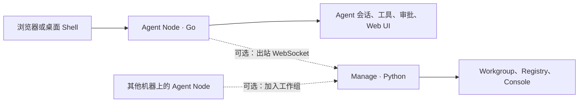

<p align="center">
  
</p>

<h1 align="center">DAgents</h1>

<p align="center">
  本地优先的 AI Agent 工作台
  <br />
  在自己的 Windows 或 Linux 机器上运行助手、工具与工作组协作
</p>

<p align="center">
  <a href="https://github.com/DGS-ai-team/DAgents/releases/latest"><strong>下载最新版本</strong></a>
  ·
  <a href="docs/user/getting-started.md"><strong>五分钟上手</strong></a>
  ·
  <a href="docs/README.md"><strong>阅读文档</strong></a>
  ·
  <a href="CONTRIBUTING.md"><strong>参与贡献</strong></a>
</p>

<p align="center">
  <a href="https://github.com/DGS-ai-team/DAgents/releases/latest"></a>
  <a href="https://github.com/DGS-ai-team/DAgents/actions/workflows/ci-required.yml?query=branch%3Adev"></a>
  <a href="LICENSE"></a>
</p>

> DAgents 是一个开源、本地优先的 Agent 控制台：模型负责理解任务，Node 负责会话、工具、权限和审批；数据与执行环境默认留在你的机器上。

## 为什么是 DAgents

DAgents 适合希望掌控数据、工具权限和执行边界的个人开发者、企业内网和多机协作团队。

- **本机运行**：Go Agent Node 在本地承载对话、工具调用、审批和内嵌 Web UI。
- **显式授权**：每个 Agent 独立配置工作目录、模型、工具组、Skills 和策略；危险操作可以要求人工审批。
- **可观察、可恢复**：流式消息、工具结果、审批、取消和刷新恢复都有明确状态。
- **按需扩展**：支持终端、文件、MCP、Skills、浏览器任务、定时触发和 Computer Use 等能力。
- **可选工作组**：需要跨机器协作时，用 Manage 编排多个 Node 上已经存在的 Agent。

DAgents 不是托管式 SaaS，也不是无边界的自动化脚本运行器。它把模型能力放进一个可配置、可审计、可由人接管的本地执行环境。

## 能力概览

| 场景 | 能力 | 说明 |
| --- | --- | --- |
| 对话 | 多 Agent 会话 | 为不同任务配置独立的模型、工作目录和工具权限 |
| 文件与命令 | 文件、Shell、终端 | 在 Agent 工作目录内读写文件、搜索和执行命令；可按策略审批 |
| 外部能力 | MCP、Skills、浏览器 | 通过配置扩展工具和知识，工具结果回到当前会话 |
| 桌面操作 | 截图、Computer Use | 支持截图、坐标网格和受审批保护的键鼠操作 |
| 自动化 | Triggers | 按时间或条件启动 Agent 任务 |
| 多机协作 | Workgroup | 由 Manage 协调多个 Node，成员在各自机器上执行任务 |

## 工作方式

只使用本机 Agent 时，不需要部署集中服务。需要多机协作时，再增加可选的 Manage 控制面。



| 组件 | 用途 | 是否必需 |
| --- | --- | --- |
| **Agent Node** | 本地 Agent、会话、工具、审批和 Web UI | 是 |
| **Manage** | Node 注册、Workgroup、集中 Console 和发布服务 | 仅多机协作时需要 |
| **桌面 Shell** | Windows 托盘、启动和打开本地 Web UI | 可选 |

## 安装

### 使用发布包（推荐）

前往 [GitHub Releases](https://github.com/DGS-ai-team/DAgents/releases/latest) 下载与你的系统匹配的安装包：

| 平台 | 发布产物 |
| --- | --- |
| Windows 64 位 | `windows-amd64` Inno Setup 安装包 |
| Windows 32 位 | `windows-386` Inno Setup 安装包 |
| Linux 64 位 | `linux-amd64` 本地助手 tar.gz |
| Manage 控制面 | 可选 Manage 离线包 |

Windows 只发布安装包，不提供免安装归档。安装完成后打开本机 Web UI，在“设置 → 连接”中配置模型；LLM、Agent、工具和工作组设置不要求手工编辑大 YAML 文件。

### 从源码运行

适用于开发、调试和希望跟随最新 `dev` 分支的用户。

**环境要求**

| 组件 | 要求 | 用途 |
| --- | --- | --- |
| Go | 1.25 或更高 | Agent Node、Client |
| Node.js | 22 或更高 | 构建 Node Web UI；使用 Manage 时还要构建 Console |
| Python | 3.11 或更高 | 仅 Manage、测试和部分打包流程 |
| Docker | 可选 | 构建或运行 Manage 镜像 |

**1. 获取代码并准备引导配置**

```bash
git clone https://github.com/DGS-ai-team/DAgents.git
cd DAgents
cp packaging/agent-client/config.example.yaml packaging/agent-client/config.yaml
```

Windows PowerShell 使用：

```powershell
Copy-Item packaging/agent-client/config.example.yaml packaging/agent-client/config.yaml
```

`config.yaml` 只承担监听和本地引导配置；运行时设置默认写入 `.runtime/` 下的 SQLite。该文件已被 Git 忽略，不要提交真实配置或密钥。

**2. 构建 Web UI 并启动 Node**

```bash
npm ci --prefix node/webui/frontend
npm run build --prefix node/webui/frontend
go run ./node/cmd/dagents-node -config packaging/agent-client/config.yaml
```

打开 [http://127.0.0.1:18765/ui/](http://127.0.0.1:18765/ui/)，完成首次设置并创建 Agent。没有 API Key 时，可以在设置中选择 Mock LLM 做结构联调；真实对话需要配置对应 Provider 的密钥环境变量。

**3. 可选：启动 Manage 和 Workgroup**

```bash
python3 -m pip install -r requirements.lock -r requirements-dev.txt
npm ci --prefix manage/console/frontend
npm run build --prefix manage/console/frontend
python3 run_manage.py
```

打开 [http://127.0.0.1:8020/console/](http://127.0.0.1:8020/console/)。Windows 也可以使用 `py -3` 替代 `python3`。本机对话不依赖 Manage；只有 Node 注册、工作组和集中控制功能需要它。

## 第一次配置建议

1. 在“设置 → 连接”创建或选择 LLM 配置，并明确是否启用多模态；多模态开关由你的配置决定，不由 DAgents 代替模型做能力判断。
2. 创建 Agent 时选择工作目录。工作目录创建后作为该 Agent 的固定边界，不能再修改。
3. 只打开当前任务需要的工具组；Shell、终端、Computer Use 和外部工具建议配合审批策略使用。
4. 需要扩展能力时，再配置 MCP 服务或加载 Skills；需要多机协作时，最后再启用 Manage/Workgroup。

完整操作路径见 [用户指南](docs/user/README.md)，工具、策略和配置字段见 [参考资料](docs/reference/README.md)。

## 安全边界

DAgents 能够调用本机工具，因此请把它当作一个可以执行操作的本地程序来部署：

- Node 默认只监听 `127.0.0.1`。除非已经配置鉴权、防火墙和反向代理，否则不要直接暴露到公网。
- 工作目录、Shell、终端、MCP 和 Computer Use 都可能读取或改变本机资源；测试时优先使用专用目录和非生产账号。
- 审批是人工确认机制，不等同于进程沙箱或完整隔离环境；当前安全边界主要由工作目录、工具开关、策略和审批组成。
- 模型请求及工具结果可能发送到你配置的模型服务商，请根据组织要求确认数据处理政策。
- 不要提交 API Key、`.runtime/`、SQLite 数据库、构建产物或真实用户数据。安全问题请按 [SECURITY.md](SECURITY.md) 私下报告。

## 文档导航

| 你想了解 | 入口 |
| --- | --- |
| 第一次安装、启动和配置 | [用户指南](docs/user/README.md) · [快速开始](docs/user/getting-started.md) |
| 工作组、成员和审批 | [Workgroup 指南](docs/user/workgroups.md) |
| 安装包、服务和故障排查 | [运维指南](docs/user/operations.md) · [打包说明](packaging/README.md) |
| Node、Session、Turn、Step 和数据流 | [架构文档](docs/architecture.md) |
| API、配置、工具、事件和 Schema | [参考资料](docs/reference/README.md) |
| 开发、测试和发布 | [开发与验证](docs/development.md) · [发布流程](docs/release-process.md) |
| 版本变化 | [CHANGELOG.md](CHANGELOG.md) |
| 未来计划 | [Roadmap](docs/roadmap.md) |

旧版手册章节仍保留为兼容入口，当前文档分层和真相来源以 [docs/README.md](docs/README.md) 为准。

## 开发与验证

提交代码前运行完整本地质量门禁：

Linux：

```bash
bash scripts/verify.sh
```

Windows PowerShell：

```powershell
powershell -ExecutionPolicy Bypass -File scripts/verify.ps1
```

常用的局部验证命令：

```bash
npm test --prefix node/webui/frontend -- --run
go test ./shared/config/... ./shared/logfiles/... ./shared/update/... ./shared/workgroup/... ./node/... ./client/... ./desktop/tray/...
python3 -m unittest discover -s tests -p "test_*.py" -v
```

贡献前请阅读 [CONTRIBUTING.md](CONTRIBUTING.md)，跨 Node、Manage、UI、Client 或 Desktop 的变更应同时更新契约和回归测试。

## 参与贡献

欢迎提交 Issue、改进文档、报告 Bug 或发起 Pull Request。建议先从 [贡献指南](CONTRIBUTING.md) 了解模块边界、测试门禁和 PR 要求；行为变化、API/工具变化和安全边界变化都应附带可验证的说明。

## 许可证

DAgents 使用 [MIT License](LICENSE)。
