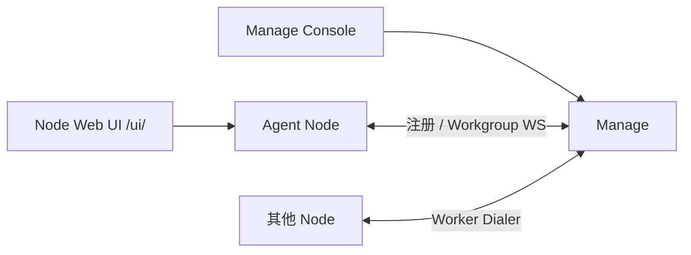

<p align="center">
  
</p>

<p align="center">
  <h1 align="center">DAgents</h1>
  <p align="center">
    本地优先的企业 Agent 控制台 — Go Agent Node · 内嵌 Web UI · Manage 工作组协作
    <br />
    <a href="docs/handbook/README.md"><strong>项目手册 »</strong></a>
    ·
    <a href="docs/handbook/07-Workgroup协作.md"><strong>工作组协作 »</strong></a>
    ·
    <a href="CHANGELOG.md">变更记录</a>
    ·
    <a href="docs/design/v0.9.1-smoke-checklist.md">v0.9.1 预览清单</a>
  </p>
</p>

<p align="center">
  <a href="LICENSE"></a>
  <a href="CHANGELOG.md"></a>
  <a href="go.work"></a>
  <a href="requirements.txt"></a>
  <a href="https://github.com/DGS-ai-team/DAgents/actions/workflows/pr-tests.yml"></a>
</p>

---

## 一句话

**DAgents** 让你在内网机器上跑本地 Agent（工具调用、HITL、持久化），并用 **Manage 工作组** 把多台 Node 上的成员编排在一起——不是通用工作流搭建器，而是可治理的企业本地助手控制台。

当前预览主线：**v0.9.1**（正式版前最后一个大预览）。验收与边界见 [v0.9.1-smoke-checklist.md](docs/design/v0.9.1-smoke-checklist.md)。

---

## 三个组件

| 组件 | 做什么 | 默认入口 |
|------|--------|----------|
| **Agent Node**（Go） | 多 Agent 运行时、内置工具、SSE、内嵌 Web UI | `http://127.0.0.1:18765/ui/` |
| **Manage**（Python） | Registry、工作组 Leader、Console | `http://127.0.0.1:8020/console/` |
| **Desktop Shell**（可选） | Windows 托盘启停 Node（Tauri / Go 双轨） | 安装包附带 |



- **本地对话**：只开 Node + Web UI 即可（可用 `llm.mock` 免 Key）。
- **跨机协作**：开 Manage，Node 开启 `manage` + workgroup，建组后 Supervisor 编排或 `@成员` 直达。

---

## 功能概览

- **Agent 实例** — 模板创建、工具组、skills、triggers、临时子 Agent、浏览器伴生任务
- **HITL** — 工具审批、`ask_user_information`；Web UI 队列 + resume
- **工作组** — 建组 / ACL / 成员 provision；`assign_workgroup_task`；`@member`；信息型 HITL；取消 turn；成员工作区 **fs**（默认）+ 可选 **bash**
- **策略与审计** — 本地 approval 策略、JSONL / SQLite 会话、RunHistory 调试
- **分发** — Windows / Linux 安装包；Manage Docker；Release Hub 自更新（可选）

### 预览边界（请先读）

| 不做 / 限制 | 说明 |
|-------------|------|
| 成员无 browser / skills / triggers | 仅工作区可执行工具（fs + 可选 bash） |
| 无进程级沙箱 | Agent 与成员 bash 均约束在 `fs_root` / 成员目录 + 工具组 |
| Placement / 远端旁观 | 产品入口已拆除 |
| D05 全量契约执行器 | 部分 golden + INDEX harness，非全量 |

---

## 快速开始

### 前置

| 组件 | 要求 |
|------|------|
| Go | 1.25+（[`go.work`](go.work)） |
| Python | 3.11+（仅 Manage / 测试） |
| Web UI 静态资源 | 开发机需先构建：`npm run build --prefix node/webui/frontend`（`go:embed`） |

### 1. 配置

```bash
git clone https://github.com/DGS-ai-team/DAgents.git
cd DAgents
cp packaging/agent-client/config.example.yaml packaging/agent-client/config.yaml
```

YAML 只引导 `listen` / `local`；LLM 与能力在 Web UI / SQLite。联调可开 **mock LLM**（无需 API Key）。

### 2. 启动 Node

```bash
# 若 static/ 为空，先构建 Web UI
npm run build --prefix node/webui/frontend

go run ./node/cmd/dagents-node -config packaging/agent-client/config.yaml
```

打开 `http://127.0.0.1:18765/ui/` → 完成首配 → 新建 Agent 对话。

### 3. （可选）Manage + 工作组

```bash
pip install -r requirements.txt
npm run build --prefix manage/console/frontend   # 首次
python run_manage.py
# Console: http://127.0.0.1:8020/console/
```

Node 设置中启用 Manage / workgroup 后自动注册与 Dialer。工作组用法：[07-Workgroup协作.md](docs/handbook/07-Workgroup协作.md)。

探活：`curl -s http://127.0.0.1:18765/health`

---

## 配置要点

| 来源 | 内容 |
|------|------|
| `config.yaml` | `listen` / `local`；`manage.*` 开关 |
| `./.runtime` | 固定运行时根（不可配置） |
| `node_settings.db` / `llm_configs.db` | LLM、工具、UI、Manage 等 |

进程锁：`packaging/agent-client/.dagents-node-*.lock`；重启报「已在运行」时先确认无存活进程再删锁。

---

## 开发与测试

```bash
npm run build --prefix node/webui/frontend
go test ./node/... ./client/... ./shared/config/...

npm run build --prefix manage/console/frontend
python -m unittest discover -s tests -p "test_*.py" -v

npm test --prefix node/webui/frontend
```

Cloud / 代理环境注意见 [AGENTS.md](AGENTS.md)。

---

## 仓库结构

```text
node/                 # Go Agent Node + 内嵌 Web UI
client/               # 精简 Go client（probe / update / version 等）
manage/               # Manage API + Console + workgroup
shared/config/        # 共用配置
desktop/              # Windows Shell（tray / tray-tauri）
packaging/            # 安装包、模板、config.example
docs/handbook/        # 技术文档主干
docs/design/          # 设计与验收清单（含 workgroup 契约）
tests/                # Python 单测
```

---

## 文档地图

| 文档 | 内容 |
|------|------|
| [docs/handbook/README.md](docs/handbook/README.md) | **唯一正文入口** |
| [docs/handbook/07-Workgroup协作.md](docs/handbook/07-Workgroup协作.md) | 工作组用户向说明 |
| [docs/design/workgroup-and-node-gateway.md](docs/design/workgroup-and-node-gateway.md) | 工作组产品规范 |
| [docs/design/v0.9.1-smoke-checklist.md](docs/design/v0.9.1-smoke-checklist.md) | 预览验收清单 |
| [docs/architecture/agent-node-api.md](docs/architecture/agent-node-api.md) | HTTP / SSE |
| [CHANGELOG.md](CHANGELOG.md) | 版本变更 |
| [docs/roadmap.md](docs/roadmap.md) | 产品路线图 |
| [docs/archive/README.md](docs/archive/README.md) | 历史 / superseded 文档策略 |

---

## 预编译包

GitHub Releases：`dagents-local-assistant-*`（Linux / Windows）、Manage bundle。安装与离线说明见 [packaging/agent-client/README.md](packaging/agent-client/README.md)、[packaging/OFFLINE_INSTALL.md](packaging/OFFLINE_INSTALL.md)。

推荐第三方 CLI：[packaging/runtime/RECOMMENDED_CLI_TOOLS.md](packaging/runtime/RECOMMENDED_CLI_TOOLS.md)。

---

## 许可证

[MIT](LICENSE)
