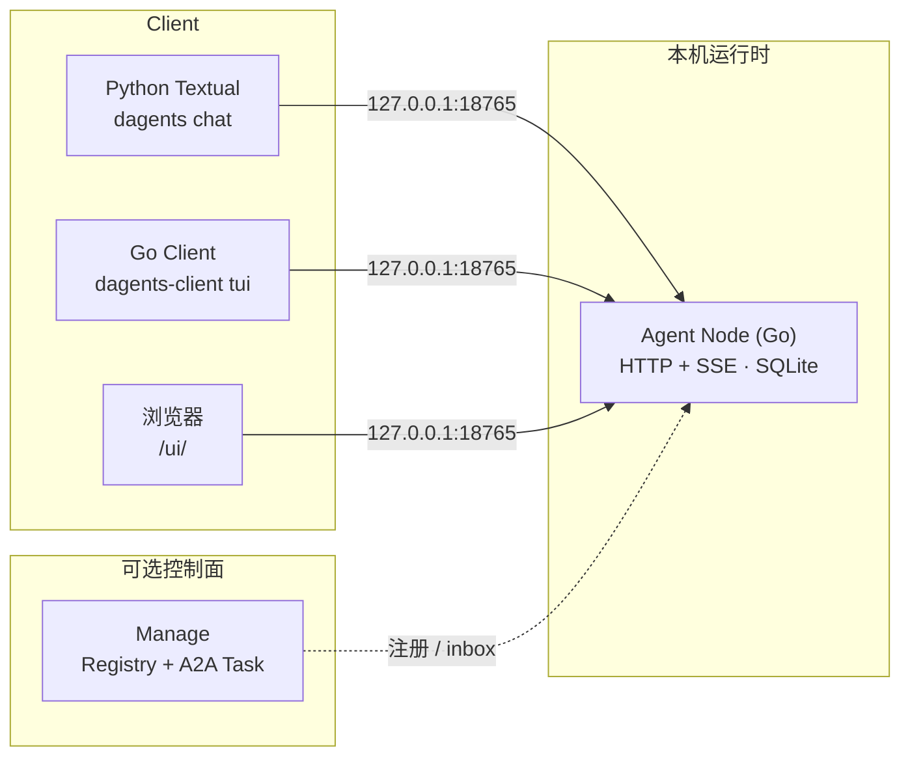

<p align="center">
  
</p>

<p align="center">
  <h1 align="center">DAgents</h1>
  <p align="center">
    本地单 Agent 助手运行时 — Go Agent Node + 终端与浏览器 Client
    <br />
    <a href="docs/handbook/README.md"><strong>项目手册 »</strong></a>
    ·
    <a href="docs/architecture/local-assistant.md"><strong>快速上手 »</strong></a>
    ·
    <a href="CHANGELOG.md">变更记录</a>
    ·
    <a href="docs/architecture/agent-node-api.md">HTTP/SSE API</a>
    ·
    <a href="node/webui/README.md">Web UI（Node 内嵌 /ui/）</a>
  </p>
</p>

<p align="center">
  <a href="LICENSE"></a>
  <a href="CHANGELOG.md"></a>
  <a href="go.work"></a>
  <a href="requirements.txt"></a>
  <a href="https://github.com/DGS-ai-team/DAgents/actions/workflows/pr-tests.yml"></a>
  <a href="node/webui/README.md"></a>
</p>

---

## 简介

**DAgents** 面向需要 **工具调用、人工审批（HITL）、会话持久化** 的 Agent 场景。当前版本（**v0.7.3**）以 **Go Agent Node** 为唯一运行时：单进程承载 LLM turn loop（**OpenAI 兼容 / DeepSeek** 等）、内置工具、SQLite 会话、skills、上下文压缩与 trigger 调度，并内嵌 **Web UI**（`/ui/`）；**Manage 控制面** 提供 Registry、**A2A Task** 与 **Vue Console**（可 Docker 部署）。

终端交互提供 **多种 Client**，共用一份 YAML 配置，按环境任选：

| Client | 适用场景 | 命令 / 入口 |
|--------|----------|-------------|
| **Python Textual TUI** | 现代终端（WSL、新 Linux、Windows Terminal） | `dagents chat` |
| **Go bubbletea TUI** | SSH 全屏、脚本、无 Python 环境 | `dagents-client tui` |
| **Go plain REPL** | 极老 SSH / RHEL6 / `TERM=dumb` | `dagents-client tui --plain` |
| **Node Web UI** | 老 Windows + Chrome/Edge；无需 Python、无需现代终端 | `http://127.0.0.1:<port>/ui/`（`ui.enabled: true`） |

另含 **Manage 控制面**（Python / Docker）：Registry、A2A Task、Console；A2A 协作请用 Manage，不再随本地助手包分发 Register Center。

> **v0.2.0 说明**：原 Python FastAPI Agent API（`run_agent_api.py`）已从仓库移除。详见 [CHANGELOG.md](CHANGELOG.md)。

> **浏览器 Client**：Go Node 进程内嵌 **Web UI**（`node/webui/`，`go:embed` 挂载 `/ui/`），复用现有 `/v1` HTTP/SSE，与终端 Client 能力对齐。原独立前端仓库 [DAgentsUI](https://github.com/DGS-ai-team/DAgentsUI) 面向已移除的 Python Agent API，**不再作为本仓库浏览器 Client 路径**。

---

## 功能特性

- **LLM Turn 编排** — OpenAI 兼容 API；流式 assistant / reasoning / tool 事件；流式 cancel 保留部分 assistant 与合法 tool 序列
- **LLM 厂商适配** — `llm.provider`（`openai` / `deepseek` / `qwen` / `vllm`）；`MessageAdapter` 统一出站序列化与 `reasoning_content` 处理
- **内置工具** — `bash_run`（可配置 GBK/UTF-8 解码）、文件读写与替换、skills 加载、trigger 管理、**临时子 Agent**
- **HITL** — 工具审批、`ask_user_information`；Client 侧非阻塞队列 + resume（**Esc** 取消在途 turn；无 `/cancel` 斜杠命令）
- **A2A（Manage M2）** — Node 注册 Manage、**`agent_invoke` / `agent_discover`**；Task inbox long poll；案例见 [`cases/a2a-manage-docker/`](cases/a2a-manage-docker/)
- **Triggers** — `interval`、`fire_at`、日历 **`schedule`**（含 cmd 门控）
- **Session** — 多会话、SQLite 持久化、context 压缩（silent / blocking）；TUI **`/compress`** 手动压缩；**`/context`** 含 token 估算与 **system prompt**；**`/switch` / `/new`** 切换 session
- **Policy** — `.runtime/policy/*.approval.txt` 本地审批策略
- **可观测** — SSE `usage`（prompt/completion、cache hit、`reasoning_tokens`）；结构化 stderr 日志
- **同包发布** — Release 资产 `dagents-local-assistant-*`（Linux tarball / Windows zip / **Windows 安装包**）；**`dagents chat|tui --withnode`** 自动后台 Node；第三方 CLI 见 **[推荐工具清单](packaging/runtime/RECOMMENDED_CLI_TOOLS.md)**（如 [OfficeCLI](https://github.com/iOfficeAI/OfficeCLI)，需自行安装）

---

## 设计优化与重大变更

除 [CHANGELOG.md](CHANGELOG.md) 中的版本记录外，仓库维护 **[设计优化实录](docs/design/major-changes.md)**，用「背景 → 思路 → 落地」说明架构级改进，便于回顾取舍与 onboarding。

| 主题 | 摘要 | 文档 |
|------|------|------|
| **上下文压缩 × Prompt Cache** | 侧车 `StreamChat` 与主 turn 前缀对齐（system + tools + messages）；改 `CompleteText` 二次序列化；M3 silent 冷却抑制重复侧车 | [major-changes.md §1](docs/design/major-changes.md#1-上下文压缩与-prompt-cache-对齐m2--m3) · [完整分析](docs/design/context-compression-cache-analysis.md) |
| **工具链上下文成本** | WS1/3/5/6 已落地；WS4 skills 搁置 | [major-changes.md §2](docs/design/major-changes.md#2-工具链上下文成本优化已落地) · [tool-context-cost-analysis.md](docs/design/tool-context-cost-analysis.md) |
| **Tool Before Hook** | 执行前 Hook + 重复调用 60s 内三选项审批 | [tool-before-hook-duplicate-approval.md](docs/design/tool-before-hook-duplicate-approval.md) |

新的大项优化请按 [major-changes.md 条目模板](docs/design/major-changes.md#条目模板复制使用) 追加；大型专题宜用 **四段结构**（见 [docs/README.md](docs/README.md) §2）。

---

## 架构

> 完整技术说明见 **[项目手册（docs/handbook/）](docs/handbook/README.md)**。



> **Web UI**：内嵌于 Agent Node（`GET /ui/`），源码见 [`node/webui/`](node/webui/)。不替代 Manage Console 的跨 Agent 运维入口。

配置：`packaging/agent-client/config.yaml`（Node 读 `listen` / `llm`；Client 读 `local.endpoint`）。

---

## 快速开始

### 前置条件

| 组件 | 要求 |
|------|------|
| **Go** | 1.25+（见 [`go.work`](go.work)） |
| **Python**（Textual TUI / Manage） | 3.11+；CI 验证 3.13 |
| **LLM** | 默认 `llm.mock: true`，**无需 API Key** 即可联调 |

### 1. 克隆与配置

```bash
git clone https://github.com/DGS-ai-team/DAgents.git
cd DAgents

cp packaging/agent-client/config.example.yaml packaging/agent-client/config.yaml
# 可选：编辑 config.yaml（真实 LLM 时设 llm.mock: false 并 export OPENAI_API_KEY）
```

### 2. 启动 Agent Node

```bash
go run ./node/cmd/dagents-node -config packaging/agent-client/config.yaml
```

探活：

```bash
curl -s http://127.0.0.1:18765/health | jq .
# 或
go run ./client/cmd/dagents-client -config packaging/agent-client/config.yaml probe
```

### 3. 启动 Client（按环境任选）

**Textual TUI（现代终端推荐）**

```bash
python -m venv .venv && source .venv/bin/activate
pip install -r requirements.txt
python -m app.cli.main chat --config packaging/agent-client/config.yaml
```

**Go TUI**

```bash
# 全屏（默认）
go run ./client/cmd/dagents-client -config packaging/agent-client/config.yaml tui

# 老终端行模式
go run ./client/cmd/dagents-client -config packaging/agent-client/config.yaml tui --plain
```

**浏览器 Web UI（老 Windows + Chrome/Edge）**

Node 启动后在本机浏览器打开：

```text
http://127.0.0.1:18765/ui/
```

详见 [node/webui/README.md](node/webui/README.md)。可通过 `ui.enabled: false` 关闭挂载。

恢复已有 session：

```bash
dagents chat --session sess-xxxxxxxx
dagents-client tui sess-xxxxxxxx
```

---

## 配置说明

| 字段 | 说明 |
|------|------|
| `listen.host` / `listen.port` | Node 监听地址（默认 `127.0.0.1:18765`） |
| `local.endpoint` | Client 连接 URL |
| `llm.provider` | `openai` / `deepseek` / `qwen` / `vllm`（deepseek/qwen 支持 `/thinking` 热更新） |
| `llm.mock` | `true` 时使用 mock LLM（开发默认） |
| `llm.api_key_env` | API Key 环境变量名（默认 `OPENAI_API_KEY`，所有 provider 共用） |
| `tools.bash_output_encoding` | `bash_run` 子进程输出解码（如 `gbk`；Windows cmd 默认 gbk） |
| `tools.file_encoding` | FS 工具磁盘读写默认编码（`read_file` 等；Windows 默认 gbk，可单次 `encoding` 覆盖） |
| `fs_root` | 工作区根（默认 `./.runtime`）；`data/`、`memory/`、`skills/` 等子路径均相对此根硬编码 |
| `triggers.enabled` | 触发器调度开关 |
| `child_agents.enabled` | 临时子 Agent 开关 |
| `manage.enabled` | 向 Manage 注册并启用 A2A inbox（见 [manage/README.md](manage/README.md)） |
| `ui.enabled` | Node 内嵌 Web UI（`/ui/`）；省略时默认 `true` |

完整示例：[packaging/agent-client/config.example.yaml](packaging/agent-client/config.example.yaml)

查找顺序：`--config` / `-config` → 环境变量 `DAGENTS_CONFIG` → 默认路径。

---

## Client 命令速查

### Python `dagents`

```bash
dagents chat [--config PATH] [--session ID] [--show-reasoning]
dagents show session [--config PATH]
dagents delete session SESSION_ID [--config PATH]
```

TUI 内常用：`/help` `/status` `/context` `/sessions` `/switch` `/new` `/skill` `/children` `/reasoning on|off` `/clear` `/exit`（**Esc** 取消在途 turn）

### Go `dagents-client`

```bash
dagents-client probe
dagents-client tui [--plain] [--show-reasoning] [session_id]
dagents-client chat "你好"        # 一次性非交互
```

TUI 内常用：`/help` `/status` `/context` `/sessions` `/switch` `/new` `/skill` `/children` `/tools expand|collapse` `/reasoning on|off` `/clear` `/quit`（**Esc** 取消在途 turn）

---

## Manage 控制面（推荐）

**Registry**、**A2A Task inbox** 与 **Console**（Node 目录、A2A Inbox 只读列表、各 Node session 观测）。默认 **`0.0.0.0:8020`**。

```bash
pip install -r requirements.txt
python run_manage.py
# Console: http://127.0.0.1:8020/console/
```

Docker 部署与 Release 镜像导出见 [`packaging/manage/README.md`](packaging/manage/README.md)。双 Node 联调案例：[`cases/a2a-manage-docker/`](cases/a2a-manage-docker/README.md)。

Node 侧在 `config.yaml` 启用 `manage.enabled` 后自动注册与 inbox poll。详见 [manage/README.md](manage/README.md)。

---

## 项目结构

```text
DAgents/
├── node/                    # Go Agent Node（运行时；含 internal/llm、turn、session 等）
├── client/                  # Go TUI Client（full + plain REPL）
├── shared/config/           # Node / Client 共用 YAML 解析
├── app/cli/                 # Python Textual TUI
├── manage/                  # Manage 控制面（Registry + A2A + Console）
├── cases/                   # 落地案例（CentOS7 导览、A2A Manage Docker 等）
├── packaging/
│   ├── agent-client/        # config.example.yaml、启动脚本
│   ├── manage/              # Manage Docker / compose
│   ├── linux/               # install.sh、分发脚本
│   └── windows/             # Inno Setup 安装包模板
├── docs/                    # 架构与 API 文档
├── tests/                   # Python CLI / Manage 单测
├── go.work
├── requirements.txt
├── run_manage.py
└── run_dev_stack.py         # 开发：仅启动 Manage
```

各目录 [`README.md`](node/README.md) / [`REFERENCE.md`](node/REFERENCE.md) 随源码维护。

---

## 开发与测试

```bash
# Go 全量单测（与 CI go-ac 一致）
go test ./node/... ./client/... ./shared/config/...

# Python CLI / Manage
pip install -r requirements.txt
python -m unittest discover -s tests -p "test_*.py" -v
```

| 工作流 | 说明 |
|--------|------|
| [pr-tests.yml](.github/workflows/pr-tests.yml) | PR：Go + Python unittest |
| [go-ac.yml](.github/workflows/go-ac.yml) | Go Node / Client 持续集成 |
| [build-and-release.yml](.github/workflows/build-and-release.yml) | Release 构建与发布 |

详见 [tests/README.md](tests/README.md)。

---

## 预编译包

GitHub **Releases** 提供 **`dagents-local-assistant-*`**（Linux tarball、Windows zip、**Windows `.exe` 安装包**）及 **`dagents-manage-*`**（Manage Docker 镜像 tar.gz）：

| 二进制 | 说明 |
|--------|------|
| `dagents-node` | Agent Node |
| `dagents-client` | Go TUI（`tui` / `tui --plain`） |
| `dagents-cli` / `dagents` | Python Textual TUI |

解压后：

```bash
# 终端 1
./bin/dagents-node -config config.yaml

# 终端 2（任选）
./bin/dagents-cli chat -config config.yaml
./bin/dagents-client -config config.yaml tui
```

打包与离线安装：[packaging/agent-client/README.md](packaging/agent-client/README.md)、[packaging/OFFLINE_INSTALL.md](packaging/OFFLINE_INSTALL.md)

### 推荐 CLI 工具（需自行安装）

发布包**不内置** OfficeCLI 等第三方 CLI。推荐清单与安装步骤见 **[packaging/runtime/RECOMMENDED_CLI_TOOLS.md](packaging/runtime/RECOMMENDED_CLI_TOOLS.md)**；Office 文档处理可安装 **[iOfficeAI/OfficeCLI](https://github.com/iOfficeAI/OfficeCLI)**（AGPL-3.0），拷贝 skills 后 `/skill load officecli`。详情见 [packaging/runtime/externaltools/OFFICECLI.md](packaging/runtime/externaltools/OFFICECLI.md)。

安装 **`install.sh`** 或 Windows 安装包会将 **`.runtime/externaltools`** 加入 `PATH`，便于放置自行下载的工具。

---

## 文档

| 文档 | 内容 |
|------|------|
| [docs/README.md](docs/README.md) | 文档索引 |
| [docs/architecture/overview.md](docs/architecture/overview.md) | 架构总览（Manage 控制面） |
| [docs/architecture/go-node-internals.md](docs/architecture/go-node-internals.md) | Go Node 内部结构（runtime / queue / turn / llm） |
| [manage/README.md](manage/README.md) | Manage 控制面 API 与 Console |
| [docs/architecture/local-assistant.md](docs/architecture/local-assistant.md) | 本地助手联调 |
| [docs/architecture/agent-node-api.md](docs/architecture/agent-node-api.md) | Go Node HTTP/SSE 契约 |
| [docs/architecture/child-agent-tools.md](docs/architecture/child-agent-tools.md) | 子 Agent 工具 |
| [docs/architecture/go-node-compatibility.md](docs/architecture/go-node-compatibility.md) | 老旧 OS / 静态构建 |
| [packaging/manage/README.md](packaging/manage/README.md) | Manage Docker 部署 |
| [packaging/runtime/RECOMMENDED_CLI_TOOLS.md](packaging/runtime/RECOMMENDED_CLI_TOOLS.md) | 推荐 CLI 工具（如 OfficeCLI，需自行安装） |
| [cases/README.md](cases/README.md) | 落地案例（CentOS 7 特性导览 + A2A Manage Docker） |
| [node/webui/README.md](node/webui/README.md) | Node 内嵌 Web UI（`/ui/`） |
| [CHANGELOG.md](CHANGELOG.md) | 版本变更（**v0.5.4**） |

---

## 版本与兼容性

| 项 | 说明 |
|----|------|
| **当前版本** | **v0.5.4**（2026-06-30，0.x 预览；tag `v0.5.4`） |
| **Go** | 1.25+（`node` / `client` / `shared/config`） |
| **Python** | 3.11+ 可运行；CI 验证 3.13 |
| **破坏性变更** | 1.0 前仍可能出现；见 [CHANGELOG.md](CHANGELOG.md) |
| **浏览器 Client** | Node 内嵌 Web UI（`/ui/`）；`ui.enabled` 默认 `true` |

OS 与 glibc 说明：[docs/os-compatibility.md](docs/os-compatibility.md)

---

## 反馈与安全

- **Bug / 功能请求**：[GitHub Issues](https://github.com/DGS-ai-team/DAgents/issues) — 请注明版本、OS、Client 类型与复现步骤
- **安全漏洞**：[SECURITY.md](SECURITY.md)（请勿在公开 Issue 中提交 exploit）

---

## License

[MIT License](LICENSE)
