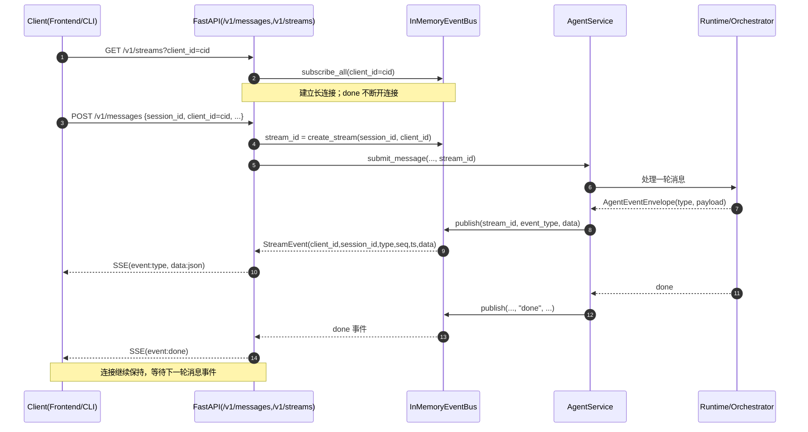

# `app/harness/streaming/`

流式事件层（SSE/未来 Redis 共用的抽象层）。

| 文件 | 说明 |
|------|------|
| **`events.py`** | `EventBus` 协议与 `InMemoryEventBus` 实现（当前 SSE 使用） |

## 当前 SSE 设计（2026-04）

当前采用 **单连接 SSE + `client_id` 分桶投递** 的模式：

- 客户端建立 `GET /v1/streams?client_id=...` 长连接。
- 发送 `POST /v1/messages` 时携带相同 `client_id` 与目标 `session_id`。
- 服务端内部为每次提交生成 `stream_id`（仅内部关联键），并将后续事件发布到总线。
- 总线仅把事件投递到目标 `client_id` 对应的订阅桶（可选再投递给全量订阅桶）。
- `done` 事件保留，但 **不**用于断开 SSE；连接只在客户端关闭/网络中断时结束。

## 关键字段

### 消息提交（HTTP 请求体）

- `session_id`: 会话标识（用于前端分会话展示）
- `client_id`: SSE 通道标识（同一前端实例应稳定复用）
- `request_type`: `message | resume`
- `content/resume_value`: 业务输入

### SSE 信封（`StreamEvent` 顶层）

- `client_id`: 事件归属通道
- `session_id`: 事件所属会话
- `type`: 事件类型（`assistant/reasoning/tool_call/tool_result/approval_required/error/done/...`）
- `seq`: 序号（当前按 `client_id` 递增）
- `ts`: 事件时间戳（ISO）
- `data`: 事件载荷（不同类型结构不同）

### 载荷元信息（`data.meta`）

- `session_id`
- `model`

说明：`stream_id` 是服务端内部事件流关联键，不对外暴露；客户端只需要关注 `session_id + client_id`。

## 不同 `client_id` 的流管理方式

当前并不维护 `client_id -> 生成器` 的全局映射，而是 **连接级队列 + `client_id` 分桶**：

1. 每个 `/v1/streams` 连接都会创建一个独立 `queue`。
2. 带 `client_id` 的连接会注册到 `_subscribers_by_client[client_id]`；未传 `client_id` 的连接注册到 `_all_subscribers`。
3. `publish(...)` 只投递到目标 `client_id` 桶和 `_all_subscribers`，不再全量轮询所有连接。
4. 连接断开时在 `finally` 中注销对应 queue，避免泄漏。

## 端到端时序图

