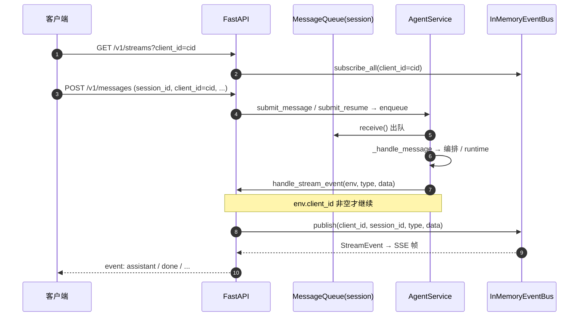

# 代理输入与输出（HTTP 入队 · SSE 出站）

本文是 **DAgents 后端「入站」与「出站」** 的专题说明：**入站**指客户端经 HTTP 投递、进入 **`AgentService`** 的 **进程内优先级消息队列**；**出站**指处理链路产生的流式事件经 **内存总线** 以 **SSE** 推回客户端。字段级 HTTP/SSE 契约仍以 [api-reference.md](./api-reference.md) 为准；整体编排见 [architecture-and-flows.md](./architecture-and-flows.md)。

---

## 第一部分：入站 — 用户消息队列（进程内）

### 1.1 设计目标与边界

| 项目 | 说明 |
|------|------|
| **目标** | 同一 **`session_id`** 上 **串行** 处理入队请求，避免并发修改同一 **`OpenAIConversationContext`**；在积压时让 **工具结果** 优先于普通用户闲聊出队。 |
| **范围** | **单进程**、**内存** 队列；**不**做跨进程 broker、**不**对队列内容做磁盘持久化（会话上下文持久化由 **`SqliteMessageStore`** 另行承担）。 |
| **非职责** | **`MessageQueue`** 不内嵌消费者；**不**根据优先级自动 **`cancel_current_turn`**（取消在途推理须 **`POST /v1/sessions/{session_id}/cancel`**，见 [api-reference.md](./api-reference.md)）。 |

**源码位置**：**`app/harness/queue/message_queue.py`**（队列类）、**`app/harness/service/agent_service.py`**（装配、入队、消费循环）。

### 1.2 总体结构：「每会话一条队列 + 单消费者循环」

```text
session_id=A  →  MessageQueue_A  →  asyncio.Task(_session_consume_loop("A"))
                         ↑
              submit_message / submit_resume / 异步工具回调
```

- **`_session_queues`**：每个活跃 **`session_id`** 至多一个 **`MessageQueue`**。
- **`_session_consumer_tasks`**：每个队列一个 **`_session_consume_loop(session_id)`**；循环内 **`await q.receive()`** 再 **`await _handle_message(env)`**，故 **同一 session 内任意时刻最多一条 envelope 在业务层执行**。
- **首次入队**某 `session_id` 时：**`_get_or_create_session_queue_async`** 创建队列并 **`create_task(_session_consume_loop)`**。

### 1.3 载荷：`MessageEnvelope`

| 字段 | 作用 |
|------|------|
| **`session_id`** | 路由到哪一个 **`MessageQueue`**。 |
| **`request_type`** | **`message`**、**`resume`**、**`tool_result`**、**`async_tool_result`**。 |
| **`content` / `resume_value` / `tool_result` / `async_tool_result`** | 各类型业务载荷。 |
| **`client_id`** | **不参与** 队列排序；出队后用于 **SSE 路由**。**`async_tool_result`** 入队路径下 **须非空**（与 **`AsyncToolJob.client_id`** 一致，源自会话上最近一次非空入站 **`client_id`**）；其它 **`request_type`** 在纯内部场景下仍可为 **`None`**（总线不投递）。 |
| **`source`** | 观测标签，不影响优先级。 |

### 1.3.1 会话上的 `sse_client_id`（进程内）

- **`OpenAIConversationContext.sse_client_id`**：在 **`AgentService._handle_message`** 中，当 **`env.client_id`** 非空白时写入，表示「本会话当前绑定的 SSE 通道」；**不入库**，重启后为空直至再次收到带 **`client_id`** 的入站消息。  
- **异步工具**：**`_decorate_async_tool`** 在 **`submit_coroutine`** 时读取 **`ctx.sse_client_id`**；若从未建立（空白），**`submit_coroutine`** / 装饰层会 **`ValueError`**，避免终态无法 **`publish`** 到客户端。  
- **内部回灌**：**`async_tool_result`** 的 **`MessageEnvelope`** 带 **`client_id`**，处理该 envelope 时若再次写入 **`ctx.sse_client_id`**，可刷新通道（与入站人类消息一致）。

### 1.4 优先级：`MessagePriority`

**`MessageQueue`** 使用 **`asyncio.PriorityQueue`**，元素为 **`(priority_int, seq, envelope)`**：`priority_int` 越小越先出队；**`seq`** 保证同优先级 **FIFO**。

| 标签 | 整数值 | 典型用途 |
|------|--------|----------|
| **`tool_result`** | **-1** | 工具结果回灌；**`submit_message`** 在 **`request_type` 为 `tool_result`/`async_tool_result` 且 `priority==other`** 时升格为 **`tool_result`**。 |
| **`human`** | **0** | **`POST /v1/messages`** 默认下 **`request_type=message`**（**`MessageIn._fill_default_priority`**）。 |
| **`resume`** | **1** | 默认 **`request_type=resume`**。 |
| **`other`** | **10** | 显式或默认兜底。 |

**与打断推理**：**`human` 先于 `resume` 出队**只影响 **排队顺序**；**`submit_message` 不会**因 **`human`** 自动 **`cancel_current_turn`**。若 **`MessageIn`** 注释写「可打断」，指产品侧「先入队再调 cancel」的组合策略，**不是**服务端单靠优先级取消当前 turn。

### 1.5 `MessageQueue` 行为摘要

- **`enqueue`**：非阻塞 **`put_nowait`**；有界满 → **`QueueFull`**；已 **`stop`** → **`RuntimeError`**。
- **`receive`**：先过 **`_consume_gate`**，再 **`get`**；关闭后抛 **`RuntimeError`**。
- **`pause_consuming` / `resume_consuming`**：闸门暂停/恢复出队；**`AgentService` 当前业务路径未使用**（预留给队列类；单测见 **`tests/test_message_queue.py`**）。
- **`stop`**：**不**清空堆内未 **`receive`** 的消息（MVP）；与 session 释放、进程关停组合使用。

**`pending_metrics_rows`**：依赖 CPython **`PriorityQueue._queue`** 堆快照供观测，**非**对外稳定 API。

### 1.6 入队入口（`AgentService`）

| 方法 | 摘要 |
|------|------|
| **`submit_message`** | 构造 **`MessageEnvelope`** 并 **`enqueue`**（**`effective_priority`** 含工具升格逻辑）。 |
| **`submit_resume`** | **`request_type=resume`**，默认 **`priority="resume"`**。 |
| **`_enqueue_async_tool_result_message`** | 从 **`AsyncToolResultStore`** 的 **`payload.client_id`** 取通道，**`MessageEnvelope.client_id`** 与之相同后 **`enqueue`**（缺 **`client_id`** 时抛错）。 |

HTTP：**`POST /v1/messages`** → **`submit_message` / `submit_resume`**（**`app/harness/api/app.py`**）。

### 1.7 消费循环与在途 turn

**`_session_consume_loop`**：**`receive` → `create_task(_handle_message)` → `await` 子任务**；**`cancel_current_turn`** 只 **`cancel`** 子任务，**消费者循环不退出**；服务 **`stop()`** 时取消消费者与子任务再 **`MessageQueue.stop()`**。

### 1.8 背压与会话数上限

- **`max_queue_size`**（**`<=0`** 无界）：单队列长度。
- **`agent_max_active_session_queues`**：超限则尝试按闲置时间淘汰其它 session；无淘汰对象则 **`RuntimeError`**。

### 1.9 入站小结

| 维度 | 要点 |
|------|------|
| 隔离 | **`session_id` → 独立队列 + 独立 consumer** |
| 顺序 | **串行 `receive` → `_handle_message`** |
| 优先级 | **`tool_result` < `human` < `resume` < `other`**（数值）；同优先级 FIFO |
| 与出站 | 出队后的 **`env.client_id`** 随 **`_emit_stream_event`** 传入 API 回调，决定能否写入 SSE 总线（见第二部分）。 |

---

## 第二部分：出站 — SSE 与事件总线

### 2.1 设计要点

| 项目 | 说明 |
|------|------|
| **模式** | **单进程内存总线** **`InMemoryEventBus`**（**`app/harness/streaming/events.py`**）；**`GET /v1/streams`** 长连接订阅，**按 `client_id` 分桶** **`publish`**。 |
| **不回放** | **`subscribe_all`** 仅推送 **订阅建立之后** 的事件。 |
| **`done` 不断连** | **`done`** 只表示一轮处理语义结束；**SSE 连接保持**，由客户端关闭或网络中断结束。 |
| **与入队的关系** | 事件携带的 **`client_id` / `session_id`** 来自当前处理的 **`MessageEnvelope`**；若 **`env.client_id` 为空/空白**，API 层 **`handle_stream_event` 直接 return**，**不向总线发布**（无通道可归因）。 |

### 2.2 端到端链路（出站）

编排 / 运行时在 **`AgentService._handle_message`** 路径上产出 **`AgentEventEnvelope`**，经服务层统一映射并转发：

1. **`MainAgentTurnOrchestrator`**（等）调用注入的 **`emit_envelope`** → 实为 **`AgentService._emit_envelope`**  
2. **`_map_event_envelope_to_stream`** → **`(event_type, data)`**（**`data` 内含 `meta`**，见 [api-reference.md](./api-reference.md) §4）  
3. **`_emit_stream_event`** → **`await handle_stream_event(env, event_type, data)`**（FastAPI **`lifespan`** 内闭包）  
4. **`handle_stream_event`**：校验 **`env.client_id`** 后 **`bus.publish(client_id=..., session_id=..., event_type=..., data=...)`**  
5. **`InMemoryEventBus.publish`**：构造 **`StreamEvent`**（含 **`seq`**、**`ts`**），**`put_nowait`** 到该 **`client_id`** 桶内各订阅队列，并复制一份到 **`_all_subscribers`**（无 **`client_id`** 的调试订阅）  
6. **`GET /v1/streams`** 的生成器从连接级 **`asyncio.Queue`** 取事件，格式化为 SSE 帧写出  

**源码锚点**：**`app/harness/service/agent_service.py`**（**`_emit_envelope` / `_emit_stream_event` / `_map_event_envelope_to_stream`**）；**`app/harness/api/app.py`**（**`lifespan` → `handle_stream_event`**、**`_to_sse`**）；**`app/harness/streaming/events.py`**（**`InMemoryEventBus` / `StreamEvent`**）。

### 2.3 `StreamEvent` 与 SSE 帧形状

- **顶层**：**`client_id`**、**`session_id`**、**`type`**（与 SSE **`event:`** 行一致）、**`seq`**（按 **`client_id` 单调递增**）、**`ts`**（UTC ISO）、**`data`**（业务载荷 + **`meta`**）。  
- **帧格式**与 **`data` 内各 `type` 扁平字段** 见 [api-reference.md](./api-reference.md) **§3.5、§4**。

### 2.4 `type` 与编排层 `event_type` 的映射关系

**`AgentService._map_event_envelope_to_stream`** 将 **`AgentEventEnvelope.event_type`** 映射为 SSE 上的 **`type`**（多数同名）；主要分支包括：**`assistant`**、**`reasoning`**、**`usage`**、**`tool_call`**、**`tool_result`**、**`approval_required`**、**`error`**、**`done`**，未命中则兜底 **`chunk`**。实现见 **`app/harness/service/agent_service.py`** 中该静态方法全文。

### 2.5 客户端联调要点

1. 启动后生成并稳定复用 **`client_id`**。  
2. 建立 **`GET /v1/streams?client_id=...`**（缺参 **422**）。  
3. **`POST /v1/messages`** 使用 **同一 `client_id`** 与目标 **`session_id`**，否则可能 **收不到 SSE**（服务层仍处理消息，但总线不投递）。  
4. 多 **`session_id`** 可共用 **一条** SSE，在客户端用 **`session_id`** 分流展示。

### 2.6 端到端时序图（入站 + 出站）



---

## 第三部分：与观测、其它文档的交叉引用

- **Prometheus**：队列积压等若暴露为指标，见 [prometheus-metrics.md](./prometheus-metrics.md)。  
- **子目录维护笔记**：**`app/harness/streaming/README.md`**（实现细节与早期设计笔记）；**`app/harness/queue/REFERENCE.md`**（符号索引）。

---

实现若有变更，以 **`app/harness/queue/message_queue.py`**、**`app/harness/service/agent_service.py`**、**`app/harness/api/app.py`**、**`app/harness/streaming/events.py`** 为准；本文随行为演进需同步修订。
