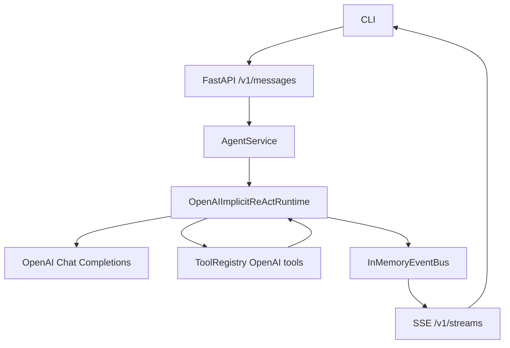

# Agent 设计（主 Agent）

**版本**：1.0（实现对齐）  
**状态**：已落地（持续迭代）

---

## 1. 设计目标

- 使用 **OpenAI 原生 tool calling** 实现主执行链路。
- 采用**隐式 ReAct**：模型负责规划工具调用，服务端负责执行与审批编排。
- 将“普通消息”和“工具审批”统一为单一事件结构，减少多层格式判断。
- 保持对外接口稳定：`/v1/messages` + SSE `/v1/streams/{request_id}`。

---

## 2. 当前架构（实现态）

对应代码：

- 运行时入口：`app/core/main_agent/agent.py`
- 隐式 ReAct：`app/core/main_agent/runtime_openai.py`
- OpenAI 客户端：`app/core/main_agent/model.py`
- 系统提示词：`app/core/main_agent/prompt.py`
- 服务编排：`app/harness/service/agent_service.py`
- API：`app/harness/api/app.py`
- CLI：`app/harness/cli/main.py`
- 工具适配：`app/harness/tools/openai_tools.py`

---

## 3. 隐式 ReAct 运行逻辑

### 3.1 单轮 message

1. 将用户输入写入会话历史（按 `session_id`）。
2. 请求 OpenAI（system + history + tools schema）。
3. 若模型返回 `tool_calls`：
   - 产出 `tool_call` 事件；
   - 产出 `interrupt` 事件（等待审批）；
   - 缓存待执行工具调用并结束本轮，等待 `resume`。
4. 若无工具调用：
   - 产出 `assistant`；
   - 产出 `done`。

### 3.2 resume（审批后）

1. 接收 `resume_value`（`approve/reject`）。
2. 若 reject：清空 pending tool call，直接 `done`。
3. 若 approve：
   - 执行待调用工具；
   - 产出 `tool_result`；
   - 将工具结果写入历史（tool role）；
   - 再次请求模型继续推理。
4. 循环直到无工具调用或超过上限。

### 3.3 保护机制

- 最大工具循环：`LLM_MAX_TOOL_LOOPS`（默认 16）。
- 超限时产出 `error` + `done`，避免无限递归调用。

---

## 4. 统一事件信封

运行时内部统一结构：

- `event_type`
- `payload`
- `meta`

代码模型：`AgentEventEnvelope`（`app/harness/service/interface.py`）。

当前主要 `event_type`：

- `assistant`
- `tool_call`
- `tool_result`
- `interrupt`
- `error`
- `done`

`AgentService` 仅在一个映射点把统一信封转换为 API/CLI 兼容输出（`messages/updates/error/done`），避免在 service/api/cli 多处重复判断。

---

## 5. 工具与审批边界

- 工具注册由 `get_tools()` 提供，当前主用：
  - `bash_run`
  - `host_platform`
- `openai_tools.py` 负责：
  - 从 Python 工具生成 OpenAI tools schema；
  - 建立 `tool_name -> invoke` 映射；
  - 解析 tool arguments。

审批策略：

- 审批统一在 runtime 层触发 `interrupt`。
- 工具层（如 `bash_run`）不再直接发起会话 interrupt，避免双重审批和状态割裂。

---

## 6. 会话与状态模型

- 以 `session_id` 作为会话主键。
- 每个会话维护：
  - `messages`（user/assistant/tool）
  - `pending_tool_calls`（审批前暂存）
- 服务层按 `session_id` 维护独立队列（当前上限 3 个活跃会话队列）。

---

## 7. 配置项（当前有效）

- `LLM_API_KEY` / `LLM_API_BASE` / `LLM_MODEL` / `LLM_TIMEOUT`
- `LLM_ENABLE_THINKING` / `LLM_THINKING_BUDGET`
- `LLM_MAX_TOOL_LOOPS`
- `MAX_QUEUE_SIZE`
- `AGENT_CLI_MODE`（当前仅 `api/http`）
- `AGENT_API_BASE`

---

## 8. 已知限制

- 事件总线当前为内存实现，服务重启后流事件不可回放。
- 工具参数校验目前为轻量级（依赖 schema + 运行时错误回传），可继续收紧。
- `runtime_openai.py` 当前输出为消息级事件，未做 token 级增量流式渲染。

---

## 9. 后续建议

- 增加 token 级 `assistant_delta` 事件，优化前端实时体验。
- 引入更严格的工具参数校验与高危命令策略模板。
- 将事件信封协议抽象为版本化 schema，便于多端兼容演进。
- 增加会话持久化（替换/扩展内存事件总线与会话状态存储）。

---

## 10. Agent 间交互协议（A2A-Dagents v1）

### 10.1 统一信封

新增 `app/schemas/agent_peer.py`，定义统一结构：

- `protocol_version`：固定 `a2a-dagents/1.0`
- `trace_id/message_id/timestamp_unix_ms`：全链路追踪字段
- `caller`：`agent_id/session_id/discovery_groups[]`
- `target`：`agent_id` 与 `discovery_groups[]` 二选一
- `intent`：`ask/delegate/notify/broadcast/task_update`
- `payload`：`content_type + content`
- `task`：`task_id + state + artifact_refs`
- `error`：`code/message/retryable`

### 10.2 交互工具集合

`app/harness/tools/agent_peer.py` 提供 3 个工具：

- `agent_discover`：按组发现 Agent（支持 `capabilities_hint` 过滤，并在 `agents` 中内联固定结构 `agent_card`，含访问 URL 与端口）
- `agent_send_message`：异步点对点发送（`session_id` 从 `context` 解析）并汇总对端 SSE 已输出内容
- `agent_broadcast`：异步通过 register-center 分组广播，并在超时阈值内汇总各目标 SSE 输出（超时截断）

### 10.3 Runtime 映射约定

`runtime_openai.py` 在 `tool_result` 中新增结构化字段映射：

- `trace_id`
- `peer_intent`
- `peer_message_id`
- `task_id/task_state`（若存在）
- `peer_error_code/peer_error_retryable`（若存在）

实现方式：在工具结果文本可解析为 `AgentPeerEnvelope` 时提取；非该格式保持原行为不变。
