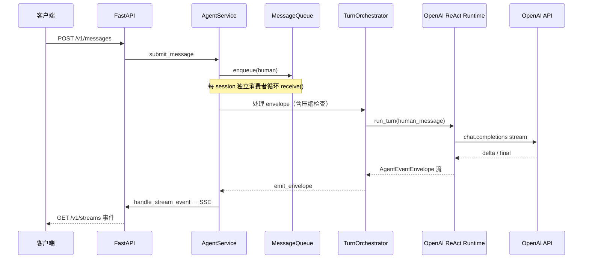

# DAgents 架构与业务流程

本文说明 **DAgents 后端** 的整体分层、运行时组件与一条用户消息从进入到模型/工具/SSE 输出的主路径。实现细节以源码为准；HTTP 字段级说明见 [api-reference.md](./api-reference.md)。

## 1. 系统边界与部署形态

| 组件 | 入口/位置 | 职责概要 |
|------|------------|----------|
| **Agent API** | `run_agent_api.py` → `app/harness/api/app.py` | FastAPI：会话、消息提交、SSE、健康检查、可选 Prometheus |
| **AgentService** | `app/harness/service/agent_service.py` | 常驻异步服务：按 `session_id` 维护队列与上下文，驱动编排与持久化 |
| **Register Center** | `run_register_center.py` → `register_center/` | 可选：Agent 登记、按组发现、广播/中继到各 Agent 的 `/v1/messages` |
| **前端** | 独立仓库 [DAgentsUI](https://github.com/DGS-ai-team/DAgentsUI) | 浏览器 UI；与本后端通过 OpenAPI 约定联调 |

本地可同时拉起 API 与 Register Center：`python run_dev_stack.py`（见仓库根 `README.md`）。

## 2. 逻辑分层（自上而下）

```text
客户端（浏览器或其它调用 HTTP 的服务 / Agent）
        │ HTTP
        ▼
┌───────────────────────────────────────┐
│  FastAPI（app/harness/api/app.py）     │  lifespan：创建 AgentService、InMemoryEventBus；
│  路由：/health、/v1/sessions、          │  启动/关闭时可选向 Register Center 登记/注销
│        /v1/messages、/v1/streams、…    │
└───────────────────┬───────────────────┘
                    │ 调用 submit_message / create_session / …
                    ▼
┌───────────────────────────────────────┐
│  AgentService                          │  每 session 一个 MessageQueue + 消费协程；
│  （harness/service/agent_service.py）   │  SqliteMessageStore 可选；异步工具结果回灌入队
└───────────────────┬───────────────────┘
                    │
        ┌───────────┴───────────┐
        ▼                       ▼
┌───────────────────┐   ┌──────────────────────────┐
│ MessageQueue       │   │ MainAgentTurnOrchestrator │
│（queue/）          │   │（core/main_agent/agent.py）│ 审批、tool 执行、summary 压缩编排
└───────────────────┘   └───────────┬────────────────┘
                                    │ run_turn（单轮模型）
                                    ▼
                        ┌───────────────────────────┐
                        │ OpenAIImplicitReActRuntime │
                        │（core/main_agent/runtime_   │ 流式 Chat Completions + tools；
                        │  openai.py）                │ 不执行工具，只产出 tool_call 事件
                        └───────────────────────────┘
```

**横向能力**（与主链路边接）：

- **配置**：`app/config/settings.py`、`app/config/env.py`（`.env`）
- **上下文模型**：`app/context/models.py`（`OpenAIConversationContext`、`PendingToolCall` 等）
- **历史与落盘**：`app/harness/history/raw_message_journal.py`、`app/harness/memory/store.py`
- **工具集**：`app/harness/tools/*`（bash、fs、agent_peer、async_store 等），由 `build_openai_toolkit()` 组装
- **可观测性**：`app/observability/metrics.py`（可选 `/metrics`）
- **压缩子 Agent**：`app/core/summary_agent/agent.py`（由编排器按 token 阈值触发）

## 3. 核心概念

### 3.1 会话（session）

- **`session_id`**：隔离队列与 `OpenAIConversationContext` 的键；可通过 `POST /v1/sessions` 预创建或随首条消息隐式创建（以服务端实现为准）。
- **串行语义**：同一 `session_id` 上，消息在 **该 session 的 `MessageQueue` 内按优先级出队**，由消费协程 **串行** 处理，避免并发破坏对话顺序。

### 3.2 消息信封 `MessageEnvelope`

定义见 `app/harness/queue/message_queue.py`。常见 `request_type`：

| 类型 | 含义 |
|------|------|
| `message` | 用户自然语言输入 |
| `resume` | 恢复流（如工具审批决策） |
| `tool_result` | 同步工具已执行完毕，结果写回后再推理 |
| `async_tool_result` | 异步工具完成，经 `AsyncToolResultStore` 回调入队 |

### 3.3 队列优先级

数值越小越优先（见 `MessageQueue` 文档）：**`tool_result` > `human` > `resume` > `other`**。  
这样设计的目的：尽快消化模型已请求的 tool 结果，减少「悬空 pending」；人类消息可打断当前推理路径（与产品策略一致处见代码注释）。

### 3.4 单轮运行时 `OpenAIImplicitReActRuntime`

- **单次 `run_turn`**：最多一次模型流式请求；若输出 `tool_calls`，仅写入上下文并向上层抛事件，**不在 runtime 内执行工具**。
- **多步工具**：由 `MainAgentTurnOrchestrator` 循环：执行/审批 → `tool_result` 入队 → 再次 `run_turn(..., tool_message)`，并受 `llm_max_tool_loops` 等配置约束。

## 4. 主业务流程（用户发一句到看到回复）

以下描述 **典型聊天路径**（无审批或审批已通过）；带审批与异步工具的分支见下一节。



**文字顺序摘要**：

1. 客户端提交消息（HTTP）；API 校验后调用 `AgentService.submit_message`。
2. 服务将 `MessageEnvelope` 按优先级放入该 session 的 `MessageQueue`。
3. 消费协程 `receive()` 取出一条，进入 `MainAgentTurnOrchestrator`（含可选 **上下文压缩**：静默/阻塞两档阈值）。
4. 编排器调用 `OpenAIImplicitReActRuntime.run_turn`：更新 `OpenAIConversationContext`，请求模型，流式解析。
5. 若本轮无工具调用：增量 assistant 流消息，`done` 类事件经 `emit_envelope` → API 层注册的 `handle_stream_event` → **InMemoryEventBus** → SSE 订阅方。
6. 若本轮有 `tool_calls`：进入工具路径（见第 5 节）。

**取消当前轮**：`POST /v1/sessions/{id}/cancel` 取消正在执行的 `_handle_message` 任务；runtime 侧 `flush_cancelled_turn` 修补半截流式正文，保证后续 OpenAI 请求消息序列合法。

## 5. 分支流程

### 5.1 工具审批（approval）

- 部分工具在 `should_require_tool_approval` 规则下需人工确认。
- 编排器发出「需审批」类事件后，客户端通过 **`resume` + `resume_value`**（结构见 `app/schemas/approval.py`）提交同意/拒绝/选择；服务层走 `submit_resume` 入队，`priority` 默认与 `resume` 语义一致。

### 5.2 同步工具执行与回灌

- 审批通过后，编排器调用 `tool_map` 中具体工具实现，得到结果。
- 将结果以 **`request_type=tool_result`** 再次 `submit_message`（或等价路径）入队，**高优先级**先于新的用户闲聊被处理。
- 下一轮 `run_turn` 以 `tool_message` 语义推进（由编排层保证 `ctx.messages` 与 OpenAI 约定一致）。

### 5.3 异步工具（async tool）

- 长时间任务可将完成回调注册到 `AsyncToolResultStore`；完成时调用服务注册的 **`_enqueue_async_tool_result_message`**，以 `async_tool_result` 入队。
- 消费逻辑与同步 `tool_result` 类似，均回到「模型继续推理」闭环。

### 5.4 SSE 与 `client_id`

- API lifespan 创建 **`InMemoryEventBus`**；仅当 envelope 上带有 **`client_id`** 时，才把事件发布到总线（与旧行为一致：无 `client_id` 则无法关联订阅端）。
- `GET /v1/streams?client_id=...`：**不回放历史**，仅推送连接建立后的实时事件；前端可按 `session_id` 分流展示。

### 5.5 Register Center 与多 Agent

- Agent API 启动时若配置 `REGISTRY_URL`、`AGENT_PUBLIC_BASE_URL`、`DISCOVERY_GROUPS`、`AGENT_ID` 等，会向 Register Center **`POST /v1/agents`** 自登记；关闭时 **`DELETE`**。
- Register Center 提供按组 **`POST /v1/broadcast`** 与 **`POST /v1/relay`**，将负载转发到各 Agent 对外暴露的 **`POST /v1/messages`**（详见 **`register_center/README.md`** 与 [a2a-and-register-center.md](./a2a-and-register-center.md)）。
- 跨 Agent 协作工具（**`agent_discover` / `agent_send_message` / `agent_broadcast` / `agent_peer_approve_tools`**，**`app/harness/tools/agent_peer.py`**）依赖上述发现与 HTTP 投递能力；**`AGENT_PEER_DELIVERY_MODE=direct|relay`**、对端 SSE 回放与 **`resume` relay** 等边界见该专题文档。

## 6. 持久化与运行时目录

- **`agent_session_store_enabled`** 为真时，`AgentService` 使用 **`SqliteMessageStore`** 在会话创建/处理中加载或保存消息历史（路径固定为 **`<运行根>/.runtime/memory/session.sqlite3`**，见 **`runtime_layout`**）。
- 释放会话 **`DELETE /v1/sessions/{session_id}`** 可清理服务端资源并删除持久化记录（以当前实现为准）。
- `.runtime/`、`history/` 等本地目录用途见根 `README.md` 与 `.gitignore`。

## 7. 与其它文档的关系

| 文档 | 内容 |
|------|------|
| **本文** | 整体架构与主/分支业务流程 |
| [agent-turn-loop.md](./agent-turn-loop.md) | **编排循环专题**：`handle_message` 分流、`run_turn` 与 **`tool_result` 队列闭环**、审批与异步工具 |
| [a2a-and-register-center.md](./a2a-and-register-center.md) | **A2A 与 Register Center**：目录、广播/中继、`agent_peer` 工具与配置 |
| [agent-input-output.md](./agent-input-output.md) | HTTP 入队（消息队列）与 SSE 出站专题 |
| [context-compression-and-state.md](./context-compression-and-state.md) | 上下文双层模型、压缩与 `ctx` 字段状态 |
| [api-reference.md](./api-reference.md) | HTTP/SSE 路径与请求体 |
| [prometheus-metrics.md](./prometheus-metrics.md) | `/metrics` 指标说明 |
| [built-in-tools.md](./built-in-tools.md) | **内置工具清单**：**`get_tools()`**、**docstring → LLM**、**Schema/参数**、审批与异步工具前提 |
| [roadmap.md](./roadmap.md) | **路线图**：已实现能力、待实现项、已知限制（与 **CHANGELOG** 互补） |
| [cases/README.md](./cases/README.md) | **落地案例**索引：场景实践、效果与限制（与契约类 **`doc/*.md`** 分工） |
| `register_center/README.md` | 注册中心 API |
| 根目录 `README.md` | 安装、环境变量、安全与版本 |

---

**说明**：0.x 阶段 HTTP/OpenAPI 与配置项可能演进；以 `CHANGELOG.md` 与导出的 OpenAPI 为准。
