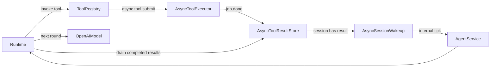

# 异步工具执行设计（Agent Runtime）

## 0. 文档信息

| 项 | 说明 |
|----|------|
| 目标读者 | Runtime / Service / Tool 维护者 |
| 适用范围 | `app/core/main_agent/runtime_openai.py` 与 `app/harness/tools/*` |
| 背景 | 现有 `_invoke_tool` 即使支持 coroutine，也会在当前 turn `await`，导致推理循环阻塞 |

---

## 1. 问题定义

当前工具调用行为存在一个核心限制：

- 运行时在工具调用点必须等待结果返回，才能继续下一步模型请求；
- 即使工具函数返回协程，也是在 `_invoke_tool` 内被 `await`，不会真正异步解耦。

这与“Agent 异步工具调用”目标不一致。目标行为应为：

1. **同步工具**：保持现状，立即执行并返回结果；
2. **异步工具**：调用后立即返回“已受理”消息，不阻塞本轮；
3. 异步结果完成后，按协议回灌到会话上下文，驱动 Agent 继续推理。

---

## 2. 目标与非目标

## 2.1 目标

- 在不破坏现有 `assistant -> tool -> assistant` 协议约束下支持异步工具。
- 支持两类回灌场景：
  - **场景 A（会话在跑）**：当前 session 仍处于 runtime 循环中；
  - **场景 B（会话已停）**：当前 session 已 done，用户尚未输入新消息。
- 提供统一状态模型（job/result）与可观测字段（trace/task/state/error）。

## 2.2 非目标（本阶段）

- 不引入跨进程分布式任务队列（如 Celery/RQ）。
- 不做强鉴权（当前沿用分组隔离）。
- 不在本阶段实现跨重启恢复未完成异步任务。

---

## 3. 总体架构

核心原则：

- 工具执行与模型推理解耦；
- 异步结果以“模拟 assistant-tool 消息对”方式注入，维持模型上下文一致性；
- Session 是否在跑由 Service 统一判断，避免重复唤醒。

---

## 4. 模块设计

## 4.1 `AsyncToolExecutor`

建议位置：`app/harness/tools/async_executor.py`

职责：

1. 接收异步工具提交请求，创建后台 `asyncio.Task`；
2. 立即返回 `accepted + job_id`；
3. 任务完成后写入结果仓库；
4. 通知 `AsyncSessionWakeup`。

关键方法（建议）：

- `submit(session_id, tool_name, call_id, coro_factory, meta) -> AsyncToolJob`
- `_run_job(job_id) -> None`
- `cancel_session_jobs(session_id) -> int`（可选）

异常处理：

- 工具协程异常不向 runtime 冒泡，统一转为 `failed` 结果。

---

## 4.2 `AsyncToolResultStore`

建议位置：`app/harness/tools/async_store.py`

职责：

1. 保存 job 生命周期状态；
2. 保存已完成结果队列；
3. 提供原子 drain（消费即移除）；
4. 提供幂等保护（防重复注入）。

建议数据结构：

- `jobs_by_id: dict[job_id, AsyncToolJob]`
- `pending_by_session: dict[session_id, set[job_id]]`
- `completed_by_session: dict[session_id, list[AsyncToolResult]]`
- `consumed_markers: set[str]`（如 `session_id:job_id:turn_id`）

---

## 4.3 `AsyncToolBridge`（Runtime 注入桥）

建议位置：`app/core/main_agent/async_bridge.py`

职责：

1. 将已完成异步结果转换为“模拟 assistant-tool 消息对”；
2. 在 runtime 合适时机插入 `ctx.messages`；
3. 产出可观测映射字段（`trace_id/task_id/state`）。

约束：

- 注入顺序必须稳定（按完成时间或提交顺序）；
- 每条结果只消费一次。

---

## 4.4 `AsyncSessionWakeup`

建议位置：`app/harness/service/async_wakeup.py`

职责：

1. 接收“session 有新异步结果”的通知；
2. 检查 session 是否有 in-flight turn；
3. 若无 in-flight，向队列投递内部 tick 消息，触发新一轮 runtime。

关键点：

- 唤醒消息是内部类型（如 `request_type="internal_async_tick"`）；
- 不需要用户输入触发。

---

## 5. 工具分类与注册规范

## 5.1 分类

- `sync`：当前行为，直接执行并返回；
- `async`：提交后台执行，立即返回 ACK。

## 5.2 元数据规范（建议）

在工具装饰器层提供可读取属性：

- `name`
- `description`
- `execution_mode`: `sync | async`
- `result_schema`（可选）

说明：

- 现有工具默认 `sync`；
- 仅标记为 `async` 的工具走异步执行器。

---

## 6. 统一状态模型

## 6.1 `AsyncToolJob`

- `job_id`
- `session_id`
- `tool_name`
- `call_id`
- `trace_id`
- `status`: `accepted|running|succeeded|failed|cancelled`
- `submitted_at_unix_ms`
- `started_at_unix_ms`
- `finished_at_unix_ms`
- `request_payload`（可选）

## 6.2 `AsyncToolResult`

- `job_id`
- `session_id`
- `tool_name`
- `call_id`
- `trace_id`
- `status`
- `result_text`
- `error_text`
- `finished_at_unix_ms`
- `consumed`（运行时语义，仓库内部可选）

---

## 7. 消费机制设计

## 7.1 统一注入协议：模拟 assistant-tool 消息对

为每个完成结果，向 `ctx.messages` 注入两条消息：

1) assistant（含工具调用）  
2) tool（对应 `tool_call_id`，内容为异步结果）

目的：

- 保持 OpenAI tool message 序列合法；
- 让模型“看到”这是一次工具返回，从而自然续推理。

---

## 7.2 场景 A：session 仍在 runtime 循环

触发时机：

- 每次工具处理后、下一次 `_request_model_stream` 前执行 `drain_completed(session_id)`。

流程：

1. 取完成结果队列；
2. 注入模拟 assistant-tool 对；
3. 清理消费标记；
4. 再调用模型。

---

## 7.3 场景 B：session 已结束、用户未输入

触发时机：

- 异步任务完成回调时。

流程：

1. `AsyncToolExecutor` 写入结果；
2. `AsyncSessionWakeup` 检查 session 无 in-flight；
3. Service 投递内部 tick 消息；
4. Runtime 处理 tick 时先注入模拟 assistant-tool 对，再触发模型推理。

---

## 8. Runtime 改造点

目标文件：`app/core/main_agent/runtime_openai.py`

改造建议：

1. `_invoke_tool` 分流：
   - `sync`：原逻辑；
   - `async`：`submit` 后返回 ACK 文本（含 job_id），不等待结果。
2. 每轮模型请求前增加“异步结果 drain 注入”阶段。
3. 对内部 tick 类型请求支持“无用户输入也可启动一轮推理”。

兼容性：

- 保持现有审批流程与 `done` 事件策略不变；
- 未启用异步工具时行为与当前一致。

---

## 9. Service 改造点

目标文件：`app/harness/service/agent_service.py`

改造建议：

1. 增加 session in-flight 状态查询能力（用于唤醒去重）。
2. 支持内部消息类型（`internal_async_tick`）。
3. 与 `AsyncSessionWakeup` 对接，确保同一 session 不重复唤醒。

---

## 10. 故障与边界策略

- 异步任务失败：转为 `failed` 结果注入，让模型决定下一步（重试/降级/解释）。
- session 被取消：默认不取消已提交异步任务（可配置）。
- 结果堆积：按 session 设置结果队列上限（超限丢弃最旧并打日志）。
- 重复消费：`job_id` + 消费标记保证幂等。

---

## 11. 可观测性

建议指标：

- `async_tool_jobs_total{tool_name,status}`
- `async_tool_running_jobs`
- `async_tool_result_queue_size{session_id}`（可做聚合，不建议高基数）
- `async_tool_latency_ms_bucket`
- `async_session_wakeup_total{reason}`

建议日志字段：

- `trace_id`, `session_id`, `job_id`, `tool_name`, `status`, `elapsed_ms`

---

## 12. 分阶段实施计划

### Phase 1（最小可用）

- 落地 `AsyncToolResultStore` + `AsyncToolExecutor`
- runtime 支持 async tool submit + 场景 A 注入
- 单测覆盖 job 生命周期与注入幂等

### Phase 2（自动唤醒）

- 落地 `AsyncSessionWakeup`
- service 支持内部 tick
- 打通场景 B（无用户输入继续推理）

### Phase 3（增强）

- 结果持久化（可选）
- 超时/重试策略
- 更细粒度鉴权与审计链路

---

## 13. 测试策略

单测：

- 任务提交后立即返回 ACK；
- 异步完成后结果入仓；
- 同一结果只注入一次；
- 失败任务注入 `failed` 结果。

集成测试：

- 构造一个慢异步工具，验证场景 A；
- 构造 runtime 先 done，再完成异步工具，验证场景 B 自动唤醒；
- 验证最终 `tool_result` 与 assistant 输出链路完整。

---

## 14. 与现有规范的对齐说明

- 不改变同步工具行为，兼容当前调用链；
- 异步工具仍通过“assistant-tool 对”回灌，符合 OpenAI 消息序列约束；
- 协议字段继续复用 `app/schemas/agent_peer.py` 的 `trace/task/error` 结构，减少重复定义。
