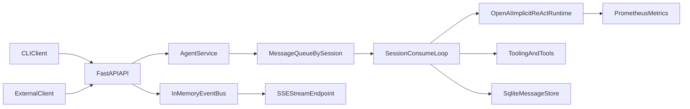
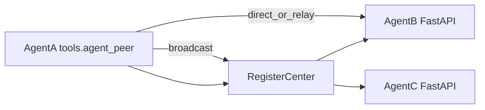

# DAgents 项目实现总览（代码实况版）

本文件用于替代分散设计文档，基于当前仓库实现状态梳理系统架构、模块职责、模块内部逻辑与功能清单。

## 1. 架构总览

### 1.1 主链路架构图（Agent 侧）

### 1.2 多 Agent 协作架构图

### 1.3 模块关系说明

- 外部统一入口是 `app/harness/api/app.py`，负责会话创建、消息提交、SSE 订阅、健康检查与指标暴露。
- 核心编排在 `app/harness/service/agent_service.py`，负责按 `session_id` 串行消费、工具审批与恢复、上下文持久化。
- 模型推理最小内核在 `app/core/main_agent/runtime_openai.py`，只处理 `human_message/tool_message` 单轮推理。
- 事件分发通过 `app/harness/streaming/events.py` 的内存总线落地到 SSE。
- 多 Agent 协作通过 `app/harness/tools/agent_peer.py` 对接 `register-center/`。

## 2. 模块职责与实现逻辑

## 2.1 启动与入口层

- `run_agent.py`：CLI 入口，加载 `app.harness.cli.main.main`。
- `run_agent_api.py`：FastAPI 入口（默认 `0.0.0.0:8000`）。
- `run_agent_service.py`：仅启动常驻 `AgentService`。
- `run_register_center.py`：启动注册中心（默认 `0.0.0.0:8010`）。

核心价值：
- 将运行模式拆分为 CLI / API / 服务进程 / 注册中心，便于本地调试和部署解耦。

## 2.2 配置层 `app/config/`

- `settings.py`：`Settings` + `get_settings()`，统一管理 LLM、队列、存储、协作等配置。
- `env.py`：`load_env()` 将 `.env` 注入进程环境（不覆盖已有变量）。

关键逻辑：
- 支持 `AGENT_ID` 文件持久化与自动生成，避免重启漂移。

## 2.3 会话与上下文模型 `app/context/`

- `OpenAIConversationContext` 统一承载：
  - `messages`
  - `pending_tool_calls`
  - `run_turn_phase`
  - `tool_loop_count`

关键逻辑：
- 提供 `from_conversation_context/to_conversation_context`，让运行态与持久化态可互转。
- `extras` 内使用保留键与 runtime 对齐，保证跨轮次状态连续。

## 2.4 契约层 `app/schemas/`

- `approval.py`：定义审批事件 payload 与 `resume approve/reject` 判别式结构。
- `agent_peer.py`：定义 agent 间信封结构（caller/target/payload/task/error）。

关键逻辑：
- `parse_resume_tool_decision`、`is_tool_execution_approved` 把任意 `resume_value` 归一为审批决策。
- `build_agent_peer_envelope` 为跨 Agent 调用统一 trace 与协议字段。

## 2.5 主 Agent 运行时 `app/core/main_agent/`

- `agent.py`：`init_agent()` 装配 runtime。
- `model.py`：OpenAI 客户端与模型配置。
- `prompt.py`：系统提示词拼装（静态 + `prompt_context/*.md` + 运行上下文）。
- `runtime_openai.py`：OpenAI 原生 tool calling 单轮运行时。

关键逻辑：
- runtime 不做 session 管理、不直接做审批执行；只做一次模型流请求并产出事件信封。
- 当模型产出工具调用时，仅写入 `pending_tool_calls` 并发 `tool_call` 事件，后续执行交给 `AgentService`。
- 支持 `flush_cancelled_turn`，保证取消时上下文仍可修补为一致状态。

## 2.6 服务编排层 `app/harness/service/`

- `agent_service.py`：全项目核心编排层。
- `interface.py`：统一客户端接口模型与协议抽象。
- `http_client.py`：基于 HTTP + SSE 的服务客户端实现。

关键逻辑（`AgentService`）：
- 每个 `session_id` 对应独立 `MessageQueue` 与单消费者循环，保证会话内串行。
- `submit_message` 仅入队，不自动打断在途推理；打断由 `cancel_current_turn` 显式触发。
- `_handle_message` 内处理三类输入：
  - `message`：驱动模型 -> 捕获 `tool_call` -> 按审批策略执行工具/等待审批；
  - `resume`：审批通过后继续执行 pending 工具并回灌；
  - `tool_result` / `async_tool_result`：补齐消息协议后继续推进推理。
- 事件统一映射为 SSE 结构并回调至 API 层事件总线。
- 上下文通过 `SqliteMessageStore` 可选持久化。

## 2.7 API 层 `app/harness/api/`

- 核心路由：
  - `POST /v1/sessions`
  - `POST /v1/messages`
  - `POST /v1/sessions/{session_id}/cancel`
  - `GET /v1/streams/{request_id}`
  - `GET /health`
  - `GET /metrics`（按配置开启）

关键逻辑：
- 提交消息时先创建 `request_id`，再调用 `AgentService.submit_*` 入队。
- SSE 通过 `InMemoryEventBus.subscribe()` 推送，`done` 事件结束流。
- `MessageIn.priority` 默认策略：`message -> human`，`resume -> resume`。

## 2.8 队列层 `app/harness/queue/`

- `MessageQueue`：进程内优先级队列（MVP）。
- 优先级：`tool_result=-1`、`human=0`、`resume=1`、`other=10`。

关键逻辑：
- 仅提供入队 / 阻塞出队 / pause / resume / stop；
- 不内嵌消费者，消费循环由 `AgentService` 托管；
- 同优先级按递增序号保持稳定顺序。

## 2.9 事件流层 `app/harness/streaming/`

- `InMemoryEventBus`：维护每个 request 的 `history + queue + seq`。

关键逻辑：
- 支持“先补历史再实时订阅”，确保后加入订阅者也能拿到已产出事件。
- 当前是单进程内存实现，Redis 总线为预留方向。

## 2.10 工具层 `app/harness/tools/`

- `tooling.py`：工具装饰器（同步/异步工具统一注册语义）。
- `openai_tools.py`：转换为 OpenAI tools 规格并执行。
- `async_store.py`：异步工具任务托管、状态跟踪、完成回灌。
- `agent_peer.py`：跨 Agent 发现、点对点发送、分组广播。
- `bash.py`：多 shell 执行与策略校验。
- `fs.py`：受根路径约束的读写编辑。
- `host_platform.py`：宿主平台探测。
- `common.py`：通用工具样例（当前为最小实现）。

关键逻辑：
- 异步工具完成后通过 `register_message_queue_sender` 主动回灌为 `async_tool_result` 消息。
- `agent_peer` 支持 direct/relay 两种投递链路，并带缓存与流输出汇总。
- `bash` 工具有 allow/deny 校验与人工确认机制，降低误执行风险。

## 2.11 存储层 `app/harness/memory/`

- `SqliteMessageStore`：每会话一行 `content` BLOB（`history+extras` JSON）。

关键逻辑：
- `append/save/load/clear` 均对 `session_id` 做边界处理；
- 解析异常时读路径容错返回空结构，避免运行时崩溃。

## 2.12 可观测性 `app/observability/`

- token 指标：`dagents_llm_prompt_tokens_total`、`dagents_llm_completion_tokens_total`
- `metrics_text()`：导出 Prometheus 文本供 `/metrics`。

关键逻辑：
- 兼容 SDK 对象或 dict 的 usage 结构；
- label 统一清洗，防止非法字符污染指标。

## 2.13 CLI 层 `app/harness/cli/`

- 支持 TTY 与非 TTY 两种输入模式。
- 支持命令：
  - `/yes`
  - `/no`
  - `/cancel`
  - `/cancel <message>`

关键逻辑：
- 正常输入默认“只入队不打断”；
- `/cancel` 系列显式触发取消；
- 可并发“读用户输入 + 消费 SSE”，避免流式输出阻塞输入。

## 2.14 UI 层 `app/harness/ui/`

- 当前仅占位函数，尚未提供 Web/TUI 功能。

## 2.15 注册中心子系统 `register-center/`

- `rc_app.py`：Agent CRUD + broadcast + relay 路由。
- `rc_store.py`：内存登记表（线程安全）。
- `rc_models.py`：请求响应模型校验。

关键逻辑：
- `/v1/agents` 查询要求分组参数，避免全量视图暴露。
- `/v1/relay` 做目标可见性校验后转发到目标 Agent `/v1/messages`。
- `/v1/broadcast` 按分组聚合目标并并发发送，失败不阻断全批次。

## 2.16 测试覆盖 `tests/`

已覆盖方向：
- 队列优先级与稳定顺序
- AgentService 核心行为（消费、取消、事件映射、会话上限）
- API SSE 与取消接口
- 审批与 agent_peer schema
- metrics token 解析
- register-center 模型与 agent_peer 工具行为

## 3. 功能实现状态清单

## 3.1 已实现

- 基于 FastAPI 的统一消息入口与 SSE 流输出。
- `session_id` 维度的串行消费与可取消执行。
- OpenAI tool calling 运行时与工具审批/恢复机制。
- 异步工具执行与结果回灌链路。
- 会话上下文 SQLite 持久化（`history + extras`）。
- Prometheus token 指标与 `/metrics` 暴露。
- register-center 的注册/发现/中继/广播。
- agent_peer 直连/中继协作与输出汇总。
- 基础测试套件覆盖核心链路。

## 3.2 正在实现（已可用但仍是 MVP 形态）

- 队列体系：当前为单进程内存优先级队列，未引入跨进程 broker。
- 事件总线：当前为 `InMemoryEventBus`，Redis 总线尚未接入。
- register-center：当前为内存存储版本，未落地持久化与多实例一致性。
- 工具生态：已具备核心工具，但仍是“最小可运行集合”。

## 3.3 待优化

- 出站路由能力：目前主要以 API/SSE 为主，尚缺统一多客户端适配器层。
- 可靠性治理：缺少系统化重试、死信、幂等投递与投递审计链路。
- 安全与治理：register-center/API 缺少鉴权、限流、审计字段标准化。
- 观测能力：缺少更细粒度的会话级指标、工具耗时分布与错误分类看板。
- 性能能力：长会话历史增长后的裁剪/归档策略可进一步增强。

## 3.4 待补充

- `app/harness/ui/` 实际可用界面（Web 或 TUI）。
- 事件总线与服务编排的分布式部署形态说明文档。
- 端到端联调示例（多 Agent 协作、审批流、异步工具回灌）。

## 4. 建议阅读顺序

- 先看 `run_agent_api.py` + `app/harness/api/app.py`
- 再看 `app/harness/service/agent_service.py`
- 再看 `app/core/main_agent/runtime_openai.py`
- 最后看 `app/harness/tools/` 与 `register-center/`
