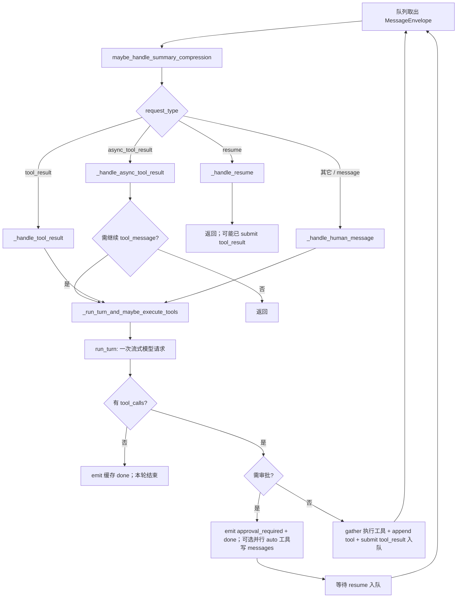

# Agent 循环流程逻辑

本文聚焦 **一条 `session_id` 上**，从 **`MessageEnvelope` 出队** 到 **多轮模型调用（ReAct 风格）** 如何闭合：外层由 **消息队列** 串行驱动，内层由 **`OpenAIImplicitReActRuntime.run_turn`** 每次只做 **一轮** Chat Completions。实现以 **`MainAgentTurnOrchestrator`**（**`app/core/main_agent/agent.py`**）与 **`OpenAIImplicitReActRuntime`**（**`app/core/main_agent/runtime_openai.py`**）为准；HTTP 与队列语义见 [agent-input-output.md](./agent-input-output.md)，整体分层见 [architecture-and-flows.md](./architecture-and-flows.md)。

---

## 1. 两层循环：不要混淆

| 层级 | 谁在循环 | 每一跳做什么 |
|------|-----------|----------------|
| **外层（会话队列）** | **`AgentService`** 每 session 一个消费协程，对 **`MessageQueue.receive()`** 循环 | 取出一条 **`MessageEnvelope`**，调用 **`MainAgentTurnOrchestrator.handle_message`**；处理完再取下一条。 |
| **内层（单轮模型）** | **`OpenAIImplicitReActRuntime.run_turn`** **不**自带 `while`；多轮靠编排器 **再次入队** 或 **同次 `handle_message` 内链式调用** | 单次流式请求：可能产出 **无 tool** 的自然语言结束本跳，或产出 **`tool_calls`** 并把执行交给编排器。 |

因此：**「Agent 循环」在代码里主要是「队列上的多条 envelope」+「编排器在一条 envelope 内触发的 1～N 次 `run_turn`」**；其中 **`tool_result` / `async_tool_result`** 往往对应 **新的一条 envelope**（高优先级），从而在队列上形成 **模型 → 工具 → 再模型** 的闭合。

---

## 2. 单条 envelope 入口：`handle_message`

对任意出队消息，编排器 **始终先** 执行 **`maybe_handle_summary_compression`**（应用上一轮静默/阻塞压缩结果，并按阈值决定是否再压），再按 **`env.request_type`** 分流：

```text
maybe_handle_summary_compression(session_id, ctx)
        │
        ├─ resume              → _handle_resume（审批决策；可能 submit tool_result）
        ├─ async_tool_result   → _handle_async_tool_result（改写 messages；可能再 _run_turn_and_maybe_execute_tools）
        ├─ tool_result         → _handle_tool_result → _run_turn_and_maybe_execute_tools(..., tool_message)
        └─ 其它（含 message）  → _handle_human_message → _run_turn_and_maybe_execute_tools(..., human_message)
```

**人类消息打断 pending**：若 **`ctx.pending_tool_calls` 非空** 时收到「默认人类路径」，**`_handle_human_message`** 会先为每个 pending 补 **`role=tool`** 占位结果并 **`emit` `tool_result`**（带 **`interrupted_by_user_message`**），再 **`clear()`** pending，然后才 **`human_message`** 进入 **`run_turn`**。这样 OpenAI 消息序列不会出现「assistant 带 `tool_calls` 却长期无对应 tool」的悬挂状态。

---

## 3. 单轮 runtime：`run_turn` 状态要点

**`run_turn(ctx, request_type, content)`** 只接受 **`human_message`** 或 **`tool_message`**；**`content` 必须非空**（占位串 **`"tool_message"`** 用于 tool 分支，见编排器常量 **`_RUNTIME_TOOL_MESSAGE_CONTENT`**）。

执行顺序概要：

1. **`human_message`**：**`append_openai_message_with_journal`** 追加一条 **`role=user`**。  
2. **`tool_message`**：**不**追加新 user（假定外层已写好 **`role=tool`** 等）。  
3. 检查 **`ctx.tool_loop_count >= llm_max_tool_loops`**：超限则 **`error` + `done`** 并返回，避免工具链死循环。  
4. **`ctx.tool_loop_count += 1`**，进入流式 **`_request_model_stream`**（请求体为 **`system` + `ctx.messages`** + tools）。  
5. **若 final 含 `tool_calls`**：写入带 **`tool_calls`** 的 assistant、填充 **`ctx.pending_tool_calls`**、**`yield tool_call`**、**`run_turn_phase = AWAITING_TOOL_EXECUTION`**、**`yield done`**，**结束本跳**（**不在 runtime 内执行工具**）。  
6. **若无 `tool_calls`**：写入最终 assistant、**`ctx.tool_loop_count = 0`**（视为本轮多跳工具链已收口）、**`run_turn_phase = IDLE`**、**`yield done`**。

**取消**：流式任务被取消时由 **`AgentService`** 侧调用 **`flush_cancelled_turn`**，把 **`assistant_stream_buffer`** 固化为一条 assistant，避免下次请求非法。

---

## 4. 编排核心：`_run_turn_and_maybe_execute_tools`

该方法 **消费一次** **`async for runtime.run_turn(...)`**：

1. 将 **`assistant` / `reasoning` / `usage` / `error`** 等事件 **实时** **`emit`**；**`done`** 先缓存，等工具分支结束再发（避免客户端过早认为整轮结束）。  
2. 若本轮 **未捕获 `tool_calls`**：补发缓存的 **`done`**，**返回**（本轮自然语言已结束）。  
3. 若有 **`tool_calls`**：调用 **`_split_calls_by_approval`** 拆成 **`auto_exec_calls`** 与 **`need_approval_calls`**。

### 4.1 无需审批（或仅自动执行集合）

- **`asyncio.gather`** 并行执行自动工具；每条结果 **`_append_tool_message`** 写入 **`ctx.messages`**；**`_invoke_tool`** 内已对每条结果 **`emit` `tool_result`**。  
- **`ctx.pending_tool_calls.clear()`**。  
- **`_submit_message(..., request_type="tool_result", priority="tool_result")`** 把「工具已写完历史」这一事实 **重新入队**。  
- **当前 `handle_message` 返回**；队列消费者 **下一条** 处理 **`tool_result`** → **`_handle_tool_result`** → **再次** **`_run_turn_and_maybe_execute_tools(..., tool_message)`**，从而进入 **下一轮模型**，**无需用户再发 HTTP 消息**。

这就是 **同步工具路径下的「隐式多轮」**：靠 **`tool_result` envelope** 在进程内再走一圈。

### 4.2 需要审批

- **`ctx.pending_tool_calls = need_approval_calls`**。  
- **`emit` `approval_required`**，再发缓存的 **`done`**。  
- 若同一轮仍有 **可自动执行** 的工具：在发 **`done`** 后 **`await asyncio.gather`** 执行它们并 **`_append_tool_message`**；**不**在本分支 **`submit tool_result`**（仍等有 **`resume`** 处理完审批工具后再统一闭环）。  
- **`return`**，等待客户端 **`resume`**。

**`resume`** 路径（**`_handle_resume`**）：解析 **`resume_value`**；拒绝则 **`error` + `done`**；批准则对 pending **逐个 `_invoke_tool` + `_append_tool_message`**，最后 **`_submit_message(tool_result)`** 与无审批闭环相同。

### 4.3 异步工具完成：`async_tool_result`

**`_handle_async_tool_result`** 按 **`messages` 尾部形态** 插入 **`user` / `assistant(tool_calls)` / `tool`**（见 **`_classify_tool_result_tail`**），并 **`emit`** 合成的 **`tool_call` + `tool_result`**。仅当尾部形态为 **`tail_tool`** 或 **`tail_assistant_without_tool_calls`** 时，再 **`_run_turn_and_maybe_execute_tools(..., tool_message)`**，否则认为上下文已完整、不再自动起一轮模型。

---

## 5. 流程总览（Mermaid）



---

## 6. 与配置、观测相关的边界

- **`llm_max_tool_loops`**：限制 **`run_turn` 调用次数**（每次 human 或 tool_message 进模型前累加），**正常无 tool 的 assistant 收口时清零** **`tool_loop_count`**。  
- **队列优先级**：**`tool_result` 高于普通人类消息**，便于尽快补全 OpenAI 所需的 **`assistant → tool`** 对（见 **`MessageQueue`** 文档与 [architecture-and-flows.md](./architecture-and-flows.md) §3.3）。  
- **持久化**：每条 envelope 处理结束在 **`AgentService._handle_message`** 的 **`finally`** 中落库（若启用 SQLite）；**`run_turn_phase`** 在持久化前会规整（流式中间态不写库）。

---

## 7. 相关文档

| 文档 | 内容 |
|------|------|
| [architecture-and-flows.md](./architecture-and-flows.md) | 组件分层、主序列图、分支概览 |
| [agent-input-output.md](./agent-input-output.md) | 入队、SSE、`connection_id` |
| [context-compression-and-state.md](./context-compression-and-state.md) | 压缩与 `ctx` 字段 |
| [api-reference.md](./api-reference.md) | HTTP 契约 |

---

**说明**：0.x 阶段若增加新 **`request_type`** 或调整审批与 **`tool_result` 入队** 时机，以 **`agent.py` / `runtime_openai.py`** 与 **`CHANGELOG.md`** 为准。
