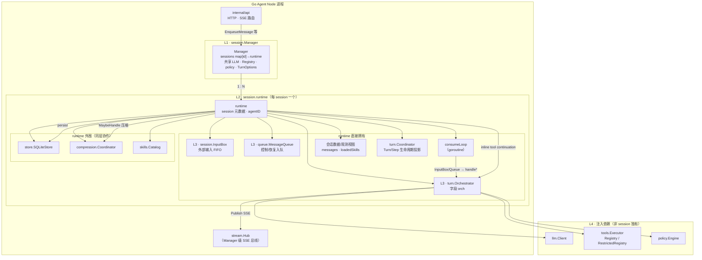
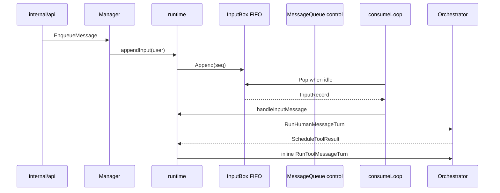

# Go Agent Node 内部结构

本文说明 **`node/`** 内会话运行时核心组件的职责与协作关系：**Manager**、**runtime**、**InputBox**、**MessageQueue**、**Orchestrator**，以及它们与 HTTP/SSE、工具、持久化的边界。

实现细节见代码目录 README：

- [`node/internal/session/README.md`](../../node/internal/session/README.md)
- [`node/internal/turn/README.md`](../../node/internal/turn/README.md)
- [`node/internal/queue/`](../../node/internal/queue/)（`queue.go`、`envelope.go`）

对外 HTTP/SSE 契约见 [agent-node-api.md](./agent-node-api.md)。

---

## 1. 组件层级关系

下图表示 **拥有 / 包含**（实线框嵌套）与 **调用 / 委托**（箭头）。自上而下：进程入口 → 会话表 → 单 session 运行时 → 队列与编排器 → 外部依赖。



**读图要点**：

| 关系 | 说明 |
|------|------|
| **Manager → runtime** | 一对多；`Create` / `SpawnChild` 时插入 `sessions` 表 |
| **runtime → InputBox / MessageQueue** | 每个 runtime 独占一个 InputBox 和一个控制/恢复队列；Manager 不直接操作队列 |
| **runtime → Orchestrator** | `orch` 是 runtime 的**成员字段**；Orchestrator **不包含** runtime |
| **consumeLoop → Orchestrator** | consumer 取 InputBox/控制项并调用 orchestrator；orchestrator 不消费输入 |
| **Orchestrator → runtime** | 工具结果由 runtime 在同一 Turn 链内 inline 续跑 |
| **Hub / LLM / Tools** | Manager 构造时注入，经 runtime 传给 Orchestrator 或步前压缩使用 |

父 session 与临时子 session **层级相同**（都是 `Manager` 下的一条 `runtime`）；子 runtime 的差异是 `RelayHub`、`RestrictedRegistry`、`store=nil`，图中未单独展开。

### 1.1 单 session 内调用方向（时序）

与上图「谁拥有谁」互补：一条 user 消息从入队到模型/工具的大致顺序。



---

## 2. 组件总览（文字）

```text
HTTP / CLI（internal/api）
        │ EnqueueMessage / EnqueueResume / …
        ▼
  session.Manager  ──sessions[id]──►  runtime × N
        ├─ InputBox + MessageQueue + consumeLoop
                                        ├─ messages / skills
                                        ├─ turn.Coordinator（Turn/Step 投影）
                                        ├─ store · compression · catalog
                                        └─ orch *Orchestrator ──► LLM · Tools · Hub
```

**包含关系**：`runtime` **拥有** `Orchestrator`（字段 `orch`），**不是** orchestrator 包含 runtime。  
`Orchestrator` 不持有 session 表或队列；每次 turn 由 runtime 传入 `history` 指针与 `sessionID`。

---

## 3. 四层职责

| 层级 | 包 / 类型 | 职责 |
|------|-----------|------|
| **会话表** | `session.Manager` | 创建/恢复/删除 session；对外入队 API；skills 管理；子 Agent `SpawnChild`（`manager_child.go`） |
| **会话运行时** | `session.runtime` | 每 session 独立 InputBox、控制队列与 consumer；维护 messages/skills 与执行边界；步前压缩；SQLite 持久化 |
| **输入邮箱** | `session.InputBox` | 外部 user/trigger/A2A 输入的单调 seq FIFO；活动 Turn 期间只缓存，不打断 |
| **消息队列** | `queue.MessageQueue` | resume、异步工具事实和恢复控制项的进程内优先级队列；**无内嵌 consumer** |
| **Turn 编排** | `turn.Orchestrator` | 单步：system prompt → LLM 流式 → 工具分流/执行 → SSE；连续工具 Step 由 runtime 在同一 Turn 内 inline 续跑 |

---

## 4. MessageQueue

**路径**：`node/internal/queue/`

每个 `runtime` 在构造时创建 **一个** InputBox 和一个 MessageQueue。`Manager.EnqueueMessage` 将 user 输入追加到 InputBox；resume 等控制项仍调用 `runtime.enqueue`。

### 4.1 入队类型（`Envelope.RequestType`）

| 类型 | 常量 | 典型来源 | consume 处理 |
|------|------|----------|--------------|
| 用户消息 / trigger / A2A | InputBox record | HTTP、trigger、child relay | `handleInputMessage`；活动 Turn 期间只排队 |
| HITL 恢复 | `resume` | 审批 / `ask_user_information` 提交 | `handleResume` |
| 工具续跑 | inline | runtime 在同一 Turn 链内继续调用 | `handleTurnContinuation`（仅恢复入口） |
| 旁路续跑 | `side_effect_continue` | Produce 后 / Cancel 恢复 | `handleSideEffectContinue` |
| 异步工具完成 | `async_tool_result` | 浏览器异步任务完成（旧后台 job 仅兼容） | `handleSideEffectProduceAsync`（Produce） |
| Trigger（新路径） | InputBox record | trigger fire | `handleInputMessage` |

### 4.2 优先级（`Priority`）

控制队列内高优先级项先出队（同优先级 FIFO 按 `seq`）。外部输入不参与该优先级排序，而按 InputBox 的单调 seq FIFO 处理。

```text
continuation(-1) > resume(1) > async_completion(2) > other(10)
```

| 档位 | 典型 `request_type` | 说明 |
|------|----------------------|------|
| `continuation` | `turn_continuation` / `side_effect_continue` | 恢复或旁路 Apply 后续跑 LLM |
| InputBox | user / trigger / A2A | 新外部输入；活动 Turn 或 pending HITL 期间只缓存 |
| `resume` | `resume` | HITL 提交 |
| `async_completion` | `async_tool_result` | 浏览器任务 **Produce**（缓冲 + SSE） |
| `other` | — | 预留 |

**注意**：`async_tool_result` 等在 pending HITL 期间仍会被 **Produce**，但 **不** inline 改 history（`sideEffectStore`）。open batch 下 Apply 在步首或 TaskComplete/Cancel 时 continue。见 [turn-side-effects-refactor.md](../design/turn-side-effects-refactor.md)。

### 4.3 与 turn 的关系

InputBox 负责外部输入的 **FIFO 顺序**；控制队列负责 resume、异步事实和恢复项；orchestrator 负责 **这一步跑什么**。orchestrator 返回 `ScheduleToolResult=true` 后，runtime 直接在同一 Turn 链内调用 `RunToolMessageTurn`，不把工具结果重新放回 MessageQueue。

---

## 5. runtime

**路径**：`node/internal/session/runtime.go`（主体）、`runtime_child.go`（子 session）

### 5.1 构造

- **父 session**：`Manager.Create` → `newRuntime` → `newRuntimeWithPublisher`
- **子 session**（临时 Agent）：`SpawnChild` → `newChildRuntime` → 同一 `newRuntimeWithPublisher`，但换用 `RelayHub`、`RestrictedRegistry`、`store=nil`

`newRuntimeWithPublisher` 内：

1. 创建 `InputBox`、控制 `MessageQueue`、`skills.Catalog`、`compression.Coordinator`、`history.Journal`
2. `rt.orch = turn.NewOrchestrator(...)`
3. 工具续跑由 runtime inline 处理；恢复 continuation 只在持久化状态需要补偿时入队

### 5.2 内存状态与生命周期权威

| 字段 | 说明 |
|------|------|
| `messages` | OpenAI 格式对话历史 |
| `turnCoordinator` | Turn/Step、HITL、工具执行事实、StepIndex、generation 与恢复栅栏的唯一权威 |
| `pending` / `toolLoopCount` / `state` | 不再是 runtime 字段；由 Coordinator 投影为兼容 API 视图。旧 SQLite 字段只用于迁移旧数据库 |
| `loadedSkills` | 已加载 skill 元数据（持久化到 SQLite，子 session 不持久化） |

Orchestrator 通过 `SkillAccess{Get, Set}` 回调读写 `loadedSkills`。

### 5.3 consumeLoop

单 goroutine 串行处理同一 session 上的控制项和 InputBox 输入；InputBox 只在 runtime idle 时 Pop，因此新 user/trigger 到达 pending HITL 时保持排队。只有显式 `CancelTurn` 才结束当前 Turn，取消后再消费 FIFO 尾部。

**父 session 专有**：`handleInputMessage` / `handleTurnContinuation` 步前可调用 `compression.MaybeHandle`。
**子 session**：跳过压缩；空闲且末条为 assistant 时 `tryCompleteChildIfIdle` → `childagent.OnChildSettled`。

---

## 6. Orchestrator

**路径**：`node/internal/turn/orchestrator.go`

### 6.1 依赖注入（`NewOrchestrator`）

| 参数 | 作用 |
|------|------|
| `hub` | SSE 发布（父用 `*stream.Hub`，子用 `*childagent.RelayHub` 转发到父 `session_id`） |
| `client` | `llm.Client` 流式补全 |
| `toolExec` | `tools.Executor`（父：完整 Registry；子：白名单 `RestrictedRegistry`） |
| `policy` | 工具 auto / approval / deny |
| `skillAccess` | skills 目录与 loaded 读写 |
| `promptCtx` | `agents.db` 中的 soul/custom/long_term；旧 `.runtime/prompt_context/user.md` 仅作迁移来源 |
| `maxToolLoops` | 单条 user 消息内工具循环上限 |

事后设置：

- `SetChildAgentManager(mgr)` — 父 session 注入管理器，可 `create_temporary_agent`
- `SetChildSession(true)` — 子 session 禁止管理类工具

### 6.2 单步主路径（`runOneStep`）

1. `buildSystemPrompt(sessionID)` + request-only `ContextInjection` → [`BuildSystemPrompt`](../../node/internal/turn/prompt.go)
2. `llm.StreamChat` → 推送 `assistant` / `reasoning` / `usage`
3. 若有 `tool_calls` → `processToolCalls`（policy、临时 Agent 工具、skills 工具、auto 批执行）
4. 无待处理 HITL 且需续跑 → `ScheduleToolResult=true`，由 runtime 在同一 Turn 链内 inline 续跑
5. 回合结束 → `turn_finished` SSE（语义见 [agent-node-api.md](./agent-node-api.md) §2.4.1）

### 6.3 与 runtime 的边界

| 事项 | 归属 |
|------|------|
| 队列、取消 turn、持久化 | runtime |
| LLM 请求、工具执行、SSE 事件类型 | orchestrator |
| 压缩触发时机 | runtime 在调用 orchestrator **之前** |
| SQLite 写入 | runtime `persist`（orchestrator 可选写 raw journal） |

---

## 7. 父 session 与 子 session

| 项 | 父 | 子（临时 Agent） |
|----|-----|------------------|
| 创建 | `Manager.Create` | `childagent` → `SpawnChild` |
| Orchestrator | `NewOrchestrator` + `SetChildAgentManager` | 同上 + `SetChildSession(true)` |
| SSE | 直接 `Hub.Publish(sessionID)` | `RelayHub` → 父 `session_id` |
| 持久化 | SQLite | 无 |
| 压缩 | 可选 | 关闭 |

详见 [child-agent-tools.md](./child-agent-tools.md)。

---

## 8. 从 HTTP 到 SSE 的端到端路径

```text
POST /v1/messages
  → Manager.EnqueueMessage
  → runtime.appendInput(InputBox FIFO)
  → consumeLoop（idle 时 Pop）→ handleInputMessage
  → orch.RunHumanMessageTurn
  → [可选] inline RunToolMessageTurn（同一 Turn 链）
  → persist
  → Hub 事件 → GET /v1/streams（Client 订阅）
```

Resume、异步工具、trigger 入队路径见 `runtime.consumeLoop` 的 `switch` 分支。

---

## 9. 相关文档

| 文档 | 内容 |
|------|------|
| [agent-node-api.md](./agent-node-api.md) | HTTP 路径、SSE `type`、`turn_finished` 语义 |
| [child-agent-tools.md](./child-agent-tools.md) | 临时子 Agent 工具与生命周期 |
| [development.md](../development.md) | Node 构建、启动与测试 |
| [context-compression-cache-analysis.md](../design/context-compression-cache-analysis.md) | 压缩与 prompt 侧车（Go：`compression` 包） |
| [design/agent-hooks.md](../design/agent-hooks.md) | **Hook 扩展点**（已落地）：Registry、phase 锚点、与 runtime/Orchestrator 映射 |
