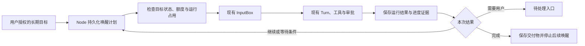
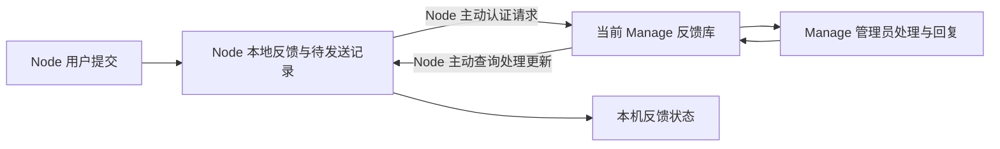

# 自主长期任务、Node 反馈与 UI 产品方向

> **检查日期**：2026-09-07
>
> **状态**：研究与产品规划，尚未实现；不是当前 API 契约
>
> **本地基线**：v0.10.7，`b9cf7b3b75a939af495fd060ba6c1178c101724b`
>
> **用户已确认**：反馈提交给当前 Node 连接的 Manage，由该 Manage 管理员查看和处理
>
> **工作分工**：主负责人负责方向、计划、设计约束和独立验收；Luna 负责具体编码、测试实现与返工
>
> **验证范围**：官方资料与部分上游源码、DAgents 静态代码审查、Node 前端无后端时的启动失败页面；未执行竞品部署比较、真实 LLM 长期运行测试或完整 UI 回归。

## 1. 产品决策

**值得建设“长期任务（自主执行）”，并把它列为近期产品主线。** 它能把已有 Node、Trigger、Session、审批和工具组合为一个用户可以持续委托的产品承诺：给定目标与边界后，Agent 分多次运行推进工作，保存进度，在必要时请求接管，最终交付可验证的结果。

“自主”在这里指用户授权范围内的持续执行。Node 必须保持运行，机器必须可用；关闭浏览器不应影响任务，但关机、系统休眠或 Node 停止后不能继续按时运行。恢复后如何处理错过的时间必须明确展示。

三项需求的价值与安排：

| 方向 | 主要价值 | 决策 |
|---|---|---|
| 长期任务 | 用户无需反复提醒，Agent 可以等待外部条件并持续推进目标 | 核心产品能力；先补执行与调度闭环，再开放自主续跑 |
| Node → Manage 反馈 | 把使用问题带回部署管理员，形成持续改进证据 | 较小、独立的产品交付；随默认鉴权收紧一起实施 |
| UI | 让用户理解目标、进度、等待原因和下一步 | 随前两项逐批改善；保留已有对话、终端和设置体系 |

首批场景建议采用三类可验证任务：

1. **持续观察**：在指定期限内检查构建或内部服务状态，有变化再通知。
2. **分批完成**：按批次整理工作目录中的文档，记录已完成文件和产物，达到清单要求后停止。
3. **条件跟进**：等待指定文件或运行结果，条件满足后继续分析并提交结果；需审批时等待用户。

周期报表继续作为普通定时任务。它可以反复成功运行，而“长期目标”还需要说明整个目标是否完成。两者应复用调度基础设施，在产品中区分用途。

## 2. 开源产品如何实现

以下只引用官方文档与官方仓库；“借鉴与判断”是针对 DAgents 的产品推论。页面当前内容不等于已发布版本承诺，也不代表已通过本次运行测试。

| 项目 | 已核实机制 | 特点及对 DAgents 的启发 |
|---|---|---|
| OpenClaw | 当前文档把 heartbeat 纳入统一 Automation 调度；支持主会话/隔离上下文、忙碌延后、静默结果和独立通知策略 | 最接近“定期醒来查看是否需要行动”。借鉴调度、上下文、通知的分离，避免照搬旧版独立 HEARTBEAT 文件方案。[官方 Heartbeat](https://docs.openclaw.ai/gateway/heartbeat)、[Automations](https://docs.openclaw.ai/automation/cron-jobs) |
| Hermes Agent | 定时任务可由 Agent 工具管理；每次使用新会话，支持 Skills、暂停恢复、结果投递、脚本模式；调度源码有 tick 锁 | 自我安排跟进的入口直接；独立会话要求显式携带任务上下文。可借鉴低成本条件检查和任务结果衔接。[官方 Cron](https://hermes-agent.nousresearch.com/docs/user-guide/features/cron)、[调度源码](https://github.com/NousResearch/hermes-agent/blob/693641aa8b4359c602283bdbbc14041e03bc47bc/cron/scheduler.py) |
| Goose | 将 Recipe 加入 schedule；源码创建 Scheduled Session，保留运行关联并使用取消 token；重载会清理旧 running 标记 | 适合可复用的定时操作。清理运行标志无法单独证明外部副作用未发生；DAgents 的恢复还需结果对账。[CLI 文档](https://github.com/aaif-goose/goose/blob/main/documentation/docs/guides/goose-cli-commands.md)、[固定版本源码](https://github.com/aaif-goose/goose/blob/5e90925962f05acf8e255032de44d16c4a7768a2/crates/goose/src/scheduler.rs) |
| Cline | CLI/SDK/Kanban 通过后台 Hub 调度；提供下次运行预览、暂停恢复、执行历史与耗时/token/成本统计；文档说明当前不适用于 IDE 扩展 | 值得借鉴的是用户可查看和控制每次运行的完整界面。[官方 Scheduling](https://docs.cline.bot/cli/scheduling) |
| Letta | 官方 sleep-time 设计用后台 Agent 整理主 Agent 的记忆，可独立配置模型与频率 | 对长期上下文维护有价值；其核心是后台记忆计算，不能据此认定已经解决通用长期目标的调度与完成验收。[官方说明，发布于 2025-04-21](https://www.letta.com/blog/sleep-time-compute/) |

OpenClaw 的固定版本执行代码也将唤醒准备、Agent 运行和结果分类/投递拆分，能看到忙碌、跳过与失败结果的区别：[heartbeat-runner-run.ts](https://github.com/openclaw/openclaw/blob/ff0a9039a5d171046a11e22c5160e03a04053f9f/src/infra/heartbeat-runner-run.ts)。

综合判断：定时调用模型已经是基础能力。DAgents 的投入重点应是**目标状态、恢复证据、预算、人工接管与本地执行边界**。本次资料核验不足以证明任何竞品对任意非幂等操作提供 exactly-once 保证。

## 3. DAgents 已有什么，缺什么

| 实现事实 | 代码依据 | 对规划的影响 |
|---|---|---|
| 支持间隔、单次、日/周/月调度 | [models.go](../../node/internal/triggers/models.go)、[schedule.go](../../node/internal/triggers/schedule.go) | 不必为新功能再建立一套计时器 |
| Trigger 定义和触发记录保存在 JSON 文件 | [store.go](../../node/internal/triggers/store.go) | 不能把文件落盘直接视为与会话入队原子一致 |
| Agent 已能 list/get/create/update/delete trigger | [tool_triggers.go](../../node/internal/tools/tool_triggers.go) | 自我安排唤醒已有工具入口，应补约束与任务关联 |
| HTTP 已有手动 fire 与 history | [triggers_api.go](../../node/internal/api/triggers_api.go) | 前端可以补接入；history 当前是投递记录，不是任务结果 |
| 触发输入进入已有 InputBox，忙碌或等待 HITL 时不抢占活动 Turn | [triggers.go](../../node/internal/session/triggers.go)、[runtime.go](../../node/internal/session/runtime.go) | 保留现有执行链和取消语义 |
| FireRecord 已有 fire_id，但状态只有 queued/skipped/error | [models.go](../../node/internal/triggers/models.go) | 应建立 fire → run → Turn 的关联，不能把 queued 显示为成功完成 |
| pending 标志仅在内存中；检查、投递、标记与调度落盘分多步完成 | [delivery.go](../../node/internal/triggers/delivery.go)、[scheduler.go](../../node/internal/triggers/scheduler.go) | 并发与重启窗口需故障注入测试，不能用进程内标志承诺可靠去重 |
| Turn 已有步骤、工具调用、token、成本、时长预算判断 | [coordinator.go](../../node/internal/turn/coordinator.go) | 复用单轮预算，新增跨运行的目标累计额度；计费准确性需另外核验 |
| UI 已有定时任务列表与调度表单，但创建 payload 不包含目标 Agent/会话选择 | [triggerForm.js](../../node/webui/frontend/src/utils/triggerForm.js)、[TriggersPanel.vue](../../node/webui/frontend/src/components/TriggersPanel.vue) | 目标归属和执行记录是首批 UI 缺口 |
| Scheduler.fire 没有使用 TargetAgentID 选择 Agent，只向已注入的 Manager 传递 session ID | [scheduler.go](../../node/internal/triggers/scheduler.go)、[triggers.go](../../node/internal/session/triggers.go)、[server.go](../../node/internal/api/server.go) | 字段存在不能视为已支持指定 Agent 派发；需补所属 Agent 校验、运行时解析与未加载 Agent 的回归 |
| 未找到用户意见反馈模块；AgentDetailSettings 中的 feedback 只是保存提示样式 | [AgentDetailSettings.vue](../../node/webui/frontend/src/views/settings/AgentDetailSettings.vue)、[Manage 导航](../../manage/console/frontend/src/components/AppTopNav.vue) | 新建独立反馈领域，不复用会话案例库 |

调研时另有一个需要纳入立项前审查的具体执行路径：`node/internal/triggers/cmd_gate.go` 会直接启动宿主 shell，并继承 Node 进程环境。[默认工具策略](../../node/internal/policy/engine.go) 对 trigger 创建/更新要求审批，但当时调度时的 gate 执行没有经过同一工具路由；创建时的批准不能替代后续策略收紧后的重新判断。该路径已在后续 P0 中移除，现行约束见 [P0 验收记录](../design/p0-controlled-execution-foundation.md)，本段保留历史调研背景。

## 4. 自主长期任务的最小产品设计

### 4.1 明确四种对象

| 对象 | 回答的问题 | 责任边界 |
|---|---|---|
| 长期目标 Goal | 要做成什么、什么算完成、允许做到哪一步 | 用户目标、验收条件、负责人 Agent、累计额度、授权范围 |
| 唤醒计划 Trigger | 什么时候再检查或继续 | 复用现有调度；持久记录下一次时间和调整原因 |
| 单次运行 Run | 这一次醒来发生了什么 | 关联输入、Session、Turn、结果、用量与产物；由执行事实更新 |
| 进度记录 Checkpoint | 下一次从哪里接着做 | 已完成项、待办、证据引用、外部条件、版本；不替代工具真实执行结果 |

Goal 有自己的业务状态是合理的；Run 的执行状态应来自已有 Turn/Execution 事实与投影，不再复制一套工具状态机。一次“运行成功”不自动意味着“目标完成”。

### 4.2 第一版用户流程

1. 在当前 Agent 下创建长期任务，填写目标和可观察的完成条件。
2. 显示运行位置、工作目录、允许操作、首次/后续唤醒时间、时区、额度和通知规则。
3. 用户启动后，Node 在时机合适时安排一次有限的执行。
4. 每次运行结束保存“做了什么、依据在哪里、下一步是什么、何时再醒”。
5. 需要审批/回答时进入等待状态；重复时钟到期不会不断发送同一问题。
6. 完成后展示产物和验收证据，并停止后续唤醒。

创建表单应提供“持续观察 / 分批完成 / 条件跟进”模板，普通用户不必填写 cron 或内部 Session ID。Agent 可以在用户已经授权的目标内调整下一次唤醒；增加频率、预算或能力范围超过原授权时必须由用户决定。

### 4.3 必须具备的运行约束

- **上下文连续**：第一版优先给每个目标绑定专用 Session；从目标摘要和结构化进度恢复，不依赖“最近活跃聊天”。普通定时任务保留既有模式，避免迁移时改变含义。
- **额度约束**：限制单次步骤、工具调用、时长与输出，同时记录目标累计 token/运行次数和期限。成本只有在模型费率与用量可用时才展示为估算；未知不显示为零。达到额度后暂停，Agent 不能自增额度。
- **并发约束**：同一目标最多一个排队或活动运行；首版无人值守任务在同一 Agent 上保守串行。共享工作目录、终端和浏览器还需资源占用判断，独立 Session 不等于隔离执行环境。
- **不中断人工工作**：忙碌时延后或合并唤醒，不改变已有 InputBox FIFO，也不靠不断入队实现轮询。用户消息仍按现有规则处理，显式停止才取消当前 Turn。
- **停机恢复**：默认合并错过的唤醒为最多一次检查，不逐次补跑整个离线区间；显示错过原因和新的执行时间。日历、间隔、一次性任务分别规定规则。
- **幂等派发**：为计划时刻建立持久 occurrence 身份并原子领取，关联 input/run/turn；手动“立即执行”使用稳定请求 ID。跨存储应使用可重放的投递记录和消费去重，不宣称一个数据库锁能消除所有外部副作用重复。
- **未知结果**：副作用已发出而结果丢失时进入明确的未知状态；查询外部证据或要求人工接管。不得把模型建议的“重试”直接变成再次执行非幂等操作。
- **暂停与停止**：“暂停后续运行”允许当前运行收尾；“停止任务”同时阻止后续唤醒并通过现有 Turn cancel 终止当前运行。UI 明确二者差别，旧回调不能重启已停止目标。
- **有证据地结束**：使用受控的进度/完成接口记录依据和下一步。完成只在相关运行已对账、没有未决工具副作用且满足目标验收规则后成立；不能仅解析回复里的一句“完成了”。
- **通知可控**：默认只在完成、需要审批/回答、阻塞、预算耗尽和实质异常时通知；无变化检查记入运行历史。重复失败合并提醒，通知投递失败不应导致业务任务重新执行。
- **无进展退出**：连续若干次没有证据更新时降低频率或暂停并说明原因，阈值由产品默认值与用户配置确定；避免无限自问自答。
- **所有入口一致受控**：目标关联的 trigger 工具不能通过创建新触发器绕开预算、频率、暂停或权限；先修清楚命令门控的执行边界，再使用可编程前置检查。

第一版不引入自主派生多个长期目标、跨 Node 自动迁移目标或通用工作流画布。多机能力在单 Node 闭环通过后接入现有 Workgroup。

### 4.4 值不值得继续投入的验证门槛

建议先做三类场景的固定试验集，与“普通定时 prompt + 人工跟进”基线比较，保持模型与预算一致。记录实际完成率、人工提醒次数、累计 token、无进展唤醒比例和停止正确性。

发布门槛包括：重启/并发/停止故障用例全部通过；试验中没有未经授权的副作用；每个完成任务都有可检查产物；单次任务结束和整个目标结束不会混淆。验证结果不足时，先修恢复与约束，不继续扩大自动化范围。

## 5. Node 反馈 → 当前 Manage 的闭环

### 5.1 用户体验

Node 提供稳定的“帮助与反馈”入口，错误页面也可进入。表单第一版包含类型（问题/建议）、标题、正文；可选附带经用户预览的错误摘要、Node 版本和 OS 信息。

提交前明确显示“发送给当前连接的 Manage 管理员”及目标名称/地址。没有 Manage 时允许保留草稿；临时离线时允许存入待发送队列。反馈正文由用户主动提交，日志、对话、文件与截图不默认上传。首版可以暂不支持附件，先完成文字反馈闭环。

Node 显示两组独立状态：

- **送达状态**：草稿、待发送、已送达、发送失败。
- **处理状态**：待处理、处理中、已解决、已关闭。

本地保存成功只能显示“已保存，等待发送”；收到 Manage 持久化确认后才显示“已送达”。反馈编号应从本地创建时稳定保留，便于重试和追踪。

Manage 增加“管理 → 用户反馈”，管理员可按状态、类型、Node、版本和时间筛选，查看正文、变更处理状态并填写回复。负责人、内部备注、附件、重复意见合并和批量处理放到后续。

### 5.2 数据与权限边界

- Node 保存反馈及投递状态；Manage 保存管理员处理状态、回复和审计事实。
- 复用 Node 主动出站的 Manage 客户端模式；建议首版使用独立的认证 HTTP 接口，不把反馈塞进 Workgroup 对话、Timeline 或任务队列。Manage 无需回调 Node。
- 以 `Node 身份 + 客户端反馈 ID` 去重；网络重试仍得到同一条反馈。管理员状态变更使用 revision 防止并发覆盖。
- Node 身份从认证凭据解析，不能信任请求正文中的任意 node_id；只允许提交和读取本节点范围的反馈。列表和处理接口要求真正的管理员权限，不能沿用匿名 admin 作为产品发布默认值。
- 当前 Node 不是完整的多用户身份系统。首版准确标注为“本机反馈记录”，不承诺同一 Node 内不同人的私密隔离。
- 每条待发送反馈固定创建时的 Manage 目的地和身份范围。更换 Manage 后旧反馈保留在原归属下，提示用户处理，不自动转发到新地址；地址变化需要按可信身份重新绑定。
- 限制正文长度、请求频率和分页规模，文本安全渲染；错误摘要先脱敏。管理员回复与内部备注必须分开，后者不返回 Node。

### 5.3 第一版验收

1. 在线提交后，管理员可查到同一编号的反馈及来源 Node。
2. Manage 已入库但响应丢失时，Node 重试不会新增第二条。
3. 断网提交、Node 重启、Manage 重启后正文与送达状态可恢复。
4. 未授权请求不能查看反馈；Node A 不能读取或冒充 Node B；匿名访问不能进入管理列表。
5. 管理员回复后，Node 主动查询能更新状态；重复同步不重复提醒。
6. 切换 Manage 后，旧待发送内容不会被发往新的管理方。
7. 日志中的 token、API key、路径等信息不会未经用户检查就附带上传；草稿和正文不会因请求失败丢失。

## 6. UI 产品化：具体改哪里

继续遵守 [现有 UI 设计基线](../design/ui-product-grade-redesign.md)：输入框与资源按钮位置保持稳定，终端保留 Agent 输出和消息入口，Workgroup 未启用时隐藏，不恢复活动页或新增泛化总览仪表盘。历史文档中的评分和问题列表不能直接当成本次实测结果。

### 6.1 本轮确认的问题

| 问题 | 证据与验证范围 | 建议 |
|---|---|---|
| 首次连接失败只有孤立的错误文本 | [App.vue](../../node/webui/frontend/src/App.vue)；前端 Vite 预览在 Node 未运行时实见满页仅 `HTTP 500`，没有操作入口。该状态码来自开发代理，不等同于 Node 返回 500 | 增加“无法连接 Node”、重试、诊断入口和可复制的错误详情；保留可独立工作的帮助入口 |
| 定时任务能看调度，不能看目标进度 | [TriggersPanel.vue](../../node/webui/frontend/src/components/TriggersPanel.vue) 静态审查 | 目标、最近结果、下一步、下次唤醒、等待原因和操作入口成为主要信息 |
| 目标归属不可见地依赖默认值 | [triggerForm.js](../../node/webui/frontend/src/utils/triggerForm.js) 创建 payload 缺目标字段 | 创建前展示 Agent、工作目录和会话策略；验证后端实际路由一致 |
| 前端未接后端手动触发与触发历史 | [node.js](../../node/webui/frontend/src/api/node.js)、[triggers_api.go](../../node/internal/api/triggers_api.go) | 先补“立即运行”和投递历史，再对接真正运行结果；标签明确区分 |
| 反馈没有完整入口 | Node 与 Manage 静态导航/接口检索 | Node 帮助入口与 Manage 反馈收件箱一起交付 |
| Manage 一般页面主要由内存 view 切换 | [App.vue](../../manage/console/frontend/src/App.vue) | 反馈详情提供可复制定位和刷新后恢复；可以沿用现有 URL 参数方式，不要求全面引入路由框架 |

### 6.2 信息架构建议

Node 保留现有 Agent 工作区，在当前 Agent 下增加“长期任务”入口；设置中的“定时任务”保留集中配置能力。两个入口读取同一数据，不各自创建任务体系。普通聊天和终端仍是日常工作主路径。

长期任务详情建议采用三块内容：

- **顶部目标区**：目标、验收条件、当前状态、所属 Agent/机器；首要动作随状态变化。
- **中部进度区**：最近完成的事项、产物、下一步与运行时间线；详细工具输出按需展开。
- **侧边控制区**：下次唤醒及原因、时区、剩余额度、通知规则、暂停/停止。

审批与回答继续复用原有权威卡片，增加跨 Agent 的待处理汇总入口/抽屉，点击直达所属任务或会话，不再建立另一套审批表单。未决副作用的“结果未知”应有独立文字状态，不能显示为普通失败并附带无条件重试。

Manage 保留工作组、能力市场和管理菜单；反馈进入管理菜单。长期任务的跨 Node 展示在本地版本稳定后再加入 Workgroup/Node 详情，保持控制面边界。

### 6.3 通用体验改善

- 配置明确标注 Node、Agent、Session 或任务范围；模型与连接先展示能否使用及可操作的错误，再展示技术参数。
- 任务表单默认显示目标、时间、完成条件与授权摘要；高级调度和重试参数折叠。首次创建后可预览未来几次唤醒。
- 每种状态都有下一步：等待审批 → 去处理；预算耗尽 → 调整额度；Node 离线 → 查看连接；结果未知 → 核对证据。
- 数字进度只有存在可计数清单时使用，例如“已处理 12/40 个文件”；不由模型凭感觉输出百分比。
- 基于已有组件和设计令牌统一字号、间距、状态徽标、空态、保存边界、键盘焦点与深浅色对比；删除等次要危险动作收进菜单。
- 1366/1600/1920 宽度、中文长标题、深浅主题和键盘路径进入验收；维持原输入框布局稳定要求。

## 7. 可派给 Luna 的工作包与验收责任

下表是建议执行顺序，尚未派发功能编码。具体接口和迁移契约由主负责人审查后再冻结，不先承诺版本号或完成日期。

| 工作包 | 内容 | 依赖 | 主要验收门槛 |
|---|---|---|---|
| G0：契约与故障基线 | 核实 Agent 路由、投递身份、命令门控、预算数据来源；定义 Goal/Run 与反馈契约 | 当前盘点 | 明确权威所有者、恢复规则、迁移和测试矩阵 |
| F1：反馈闭环 | Manage 默认鉴权前提、Node 表单/本地待发、Manage 入库/管理员列表、状态回复同步 | G0 反馈契约 | 去重、离线重启、身份隔离、Manage 切换、正文保留全部通过 |
| A1：可靠的定时运行 | 复用 Trigger，补原子领取/去重、run→Turn 关联、明确 Agent 目标、忙碌合并、历史与立即运行 | G0 执行契约 | 并发触发和重启无不可解释重复，UI 不把 queued 当成功 |
| A2：长期目标闭环 | 目标、进度、有限续跑、自调下一次唤醒、累计预算、暂停停止、完成与通知 | A1 | 三类真实场景交付，完成/停止后不再派发，未知副作用不自动重试 |
| U1：基础错误体验 | 启动失败页、重试/诊断入口、表单范围说明与目标 Agent 展示 | 可与 F1/A1 分开提交 | 可理解可恢复，已有对话与终端布局不回退 |
| U2：任务工作区 | 任务详情、运行时间线、待处理入口和目标控制区 | A1/A2 契约 | 刷新、断线、取消、审批后 UI 与后端事实一致 |
| A3：Workgroup 扩展 | 多 Node 任务观察与人工治理，沿用既有协议 | A2 单 Node 验收通过 | 不新增反向 HTTP 或越过本地策略 |

F1 与 A1 可按文件范围拆开推进；不要让反馈等候整个自主系统完成。U1/U2 随行为交付，不安排脱离业务的整站换肤。OS sandbox、升级恢复等原路线继续保留，按具体无人值守操作的风险与支持范围作为发布门槛。

每个工作包由 Luna 提交实现、测试命令与结果、失败样本、迁移/回滚说明和相关文档。主负责人独立阅读 diff，并复跑关键失败路径；测试通过和真实任务完成证据齐备后才标记验收通过。Go/前端/Python 的检查按实际改动选择，遵守仓库构建静态资源前置条件。

## 8. 证据快照与后续核验

上游 HEAD 在检查时读取如下，仅用于后续定位；官网文档会继续变化。本轮只对列出的具体文件/页面取证，没有审计完整上游仓库。

| 官方仓库 | 检查时 HEAD |
|---|---|
| [openclaw/openclaw](https://github.com/openclaw/openclaw) | `ff0a9039a5d171046a11e22c5160e03a04053f9f` |
| [NousResearch/hermes-agent](https://github.com/NousResearch/hermes-agent) | `693641aa8b4359c602283bdbbc14041e03bc47bc` |
| [aaif-goose/goose](https://github.com/aaif-goose/goose) | `5e90925962f05acf8e255032de44d16c4a7768a2` |
| [cline/cline](https://github.com/cline/cline) | `dac3b35ba485dbab3b5a73aca239b0d07ce071cf`；本轮调度能力依据官网，未逐项核实此提交的 SDK 实现 |

尚需下一阶段验证：目标 Agent 路由的动态回归与修正、故障窗口的可复现性、命令门控的完整权限链、真实模型预算计量、72 小时受控运行样本、完整 Node/Manage 正常运行下的桌面 UI。研究阶段不将这些未验证项标为已通过。
