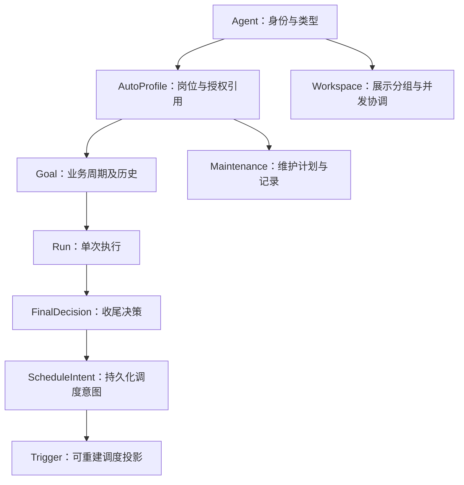

# Auto 数字员工：技术设计与分阶段开发方案

日期：2026-09-08。状态：待开发的设计基线，不代表已实现。负责人：主 Agent 负责产品取舍、接口评审和验收；Luna 负责具体编码。本文承接 [产品方向评估](../comparative-analysis/2026-09-08-normal-and-auto-product-assessment.md)，在后续阶段替代 [初版 Auto 模型](2026-09-08-auto-agent-product-model.md) 中“一个 Agent 只能使用一个终态不可复用任务”的限制；历史验收记录仍按当时实现解释。

## 1. 决策与范围

| 问题 | 本方案决策 |
| --- | --- |
| 普通与 Auto 的关系 | 两种显式 Agent 类型，共享聊天和工具基础设施；Auto 增加岗位、周期、主动唤醒与维护能力 |
| Auto 如何标识 | 主侧栏通过“自主智能体”分组标识，不重复添加 Auto 标签；其他页面采用低强调中性色类型文字与图标，运行状态另列，颜色不是唯一标识 |
| 是否单独分组 | 主侧栏固定“智能体 / 工作组 / 自主智能体”三个平级分组，不设显式搜索栏；设置中的 Agent 列表保留搜索和工作目录视图 |
| 是否合并同目录 Agent | 不合并实体、会话、记忆、权限和用量；支持可折叠目录分组，显示成员与忙碌数量 |
| 是否增加 Auto 总览 | 增加 Node 级 `/ui/auto`，面向成果、阻塞和下一次安排；不替代聊天或智能体设置 |
| 多个长期职责 | 首版每个 Auto 一个岗位计划、一个活动业务周期，历史周期无限制保留；多并行业务目标后置 |
| 同目录并发 | 首版 Auto 写操作按已识别工作区串行；读操作可并行；目录分组本身不等于锁或安全边界 |
| 多 Node 管理 | 首先完成 Node 闭环；Manage 先做有权限的汇总和跳转，远程控制后置 |
| 开发规模 | 不在第一阶段加入任意脚本、无限自主授权、多租户 Node 或模型权重训练 |

普通 Agent 的现有手动调用、对话和显式配置触发器能力保持兼容；没有持续岗位和自动维护循环。Auto 的差异是受控的持续执行生命周期，不是默认拥有更多工具权限。

## 2. 当前代码基线

本节描述方案制定时的基线，不作为当前完成度声明。后续开发及独立验收以 [实施进度记录](2026-09-08-auto-employee-implementation-progress.md) 为准；存储、接口、前端分别完成，不等于自主执行链路已闭环。以下所有阶段的交付仍须满足第 10 节验收标准。

- `node/internal/tools/tool_triggers.go` 已按运行时 Agent ID 过滤触发器，创建绑定自身；目标管理的触发器禁止模型直接修改。归属目前使用 TargetAgentID。
- `node/internal/triggers/models.go`、`store.go` 持久化触发器。工具层检查和存储修改分开，需补原子授权和版本检查。
- `node/internal/goals/models.go`、`store.go`、`run_lifecycle.go` 已包含 Goal、Run、Checkpoint、预算和完成判断。Goal 存储使用文件写入与 rename，不能假定与 Trigger 跨文件事务原子。
- `goal_checkpoint` 已支持 next_wake_at；新设计扩展结果语义，不另建一套无预算自动聊天通道。
- 公共创建入口为 `/v1/agents/{agent_id}/autonomy`；旧 POST `/v1/goals` 已关闭。保留此边界。
- 前端已有 `AgentAutonomyPanel.vue`、`GoalsView.vue`、Agent 设置、`router/index.js`、`stores/agent.js`。渐进改造这些入口，避免平行维护两套任务设置。

开发前再次核对当前分支及已有测试。本文新增名称、字段和路由均为拟定契约，必须同步 OpenAPI、类型与测试后才视为实现。

## 3. 核心模型和所有权

### 3.1 对象关系



保持 Goal ID 作为周期 ID，不新增重复的 Cycle 存储。AutoProfile 引用当前 Goal；创建新周期不会覆写已完成周期，也不清零 Agent 级消耗。

| 对象 | 新增/明确字段 | 约束 |
| --- | --- | --- |
| AutoProfile | agent_id、revision、enabled、role_objective、role_boundaries、plan_mode(one_shot/recurring)、timezone、work_schedule、current_goal_id、authorization_ref、maintenance_policy | 岗位职责和权限上限由用户控制；模型只能在授权内改计划 |
| Goal | profile_revision、cycle_sequence、origin、previous_goal_id、revision | 同 Agent 最多一个非终态业务周期；验收条件按周期冻结 |
| Run | decision、config_revision、policy_revision、run_generation | 每次运行使用明确快照；历史不可被新配置改写 |
| Trigger | owner_agent_id、controller(user/goal/maintenance)、controller_id、revision、created_by | owner 不通过普通更新转移；Agent 默认只能调度自身 |
| ScheduleIntent | id、agent_id、goal_id或maintenance_id、purpose、generation、decision、due_at、event_filter、state | 同一控制器/用途一个有效意图；替换必须检查版本 |
| WorkspaceRef | id、node_id、display_name、canonical_path、filesystem_identity(可用时) | Node 范围内标识；名称可修改，身份不随 UI 排序改变 |
| AgentUsage | agent_id、window_start/end、business_usage、maintenance_usage、unknown_usage | 跨周期累计；不得通过新周期或修改时区重置额度 |

跨 Node 使用 `(node_id, agent_id)`，不拿 Agent 名字或目录字符串作为全球唯一标识。记忆和手册仍归 Agent；同目录不自动共享私有上下文。

### 3.2 权限矩阵

| 操作者 | 自己普通 trigger | 自己系统管理 trigger | 他人 trigger | 岗位/授权 |
| --- | --- | --- | --- | --- |
| 普通 Agent | 按已有工具授权读写 | 不适用或只读 | 拒绝 | 无 Auto 配置权 |
| Auto Agent | 授权内读写 | 读；通过收尾/配置协议申请调整 | 拒绝 | 授权内调整计划；不能提高限制 |
| Node 管理员 | 读写并审计 | 经控制器接口调整 | 读写并审计 | 配置与撤销 |
| 内部调度器 | 仅受限内部操作 | 匹配控制器和版本后更新 | 无通用管理员能力 | 不扩大权限 |

服务入口构造可信 Principal，存储方法接受 actor、resource ID、expected revision；在同一锁/事务内检查归属、控制器和版本再写入。覆盖 list/get/update/delete/fire/recover/history/SSE。跨归属读取返回统一 not_found，已授权资源的版本冲突返回 conflict。列表过滤与授权同时发生，禁止“先返回再前端隐藏”。

禁止 Agent 自报 owner 或使用管理员 token。清点通用命令、HTTP、浏览器能力访问本地管理接口的路径；未建立进程/凭证隔离时，不宣称强租户隔离。第一阶段允许 Node 作为单用户可信宿主，但不能因此省略服务端 Agent 归属检查。

## 4. 生命周期与调度协议

### 4.1 状态层次

Agent 类型、岗位开关、Goal 状态和当前运行分别保存，不把所有含义塞进一个 status。UI 由服务端投影统一展示：未配置、待命、执行中、等待事件、待审批、已暂停、需处理、已停用；最近周期“已完成”作为成果，不把仍在岗员工永久标记完成。

收尾 outcome：progress / no_change / completed / blocked。next_action：at / event / none / needs_input。合法组合由运行时校验：completed 的业务 Goal 只能 none；常驻岗位的下一周期安排由 Profile 控制器另行生成，不能复活该 Goal。

```json
{
  "outcome": "progress",
  "summary": "已生成初稿，等待明日数据",
  "evidence": ["artifact:report-draft-17"],
  "next_action": "at",
  "next_wake_at": "2026-09-09T01:00:00Z",
  "reason": "数据源每日北京时间九点更新",
  "expected_progress": "补齐新数据并校验报告"
}
```

事件决策引用已注册 source_id 与受限条件结构，不能提交任意可执行代码。证据非空不等于业务成功已验证：保留现有完成判断兼容性，同时对可验证产物检查存在性/权限；高影响交付以实际操作结果为准，不能用模型自述代替。

### 4.2 正常路径

1. 调度器读到到期意图，校验 Profile 开关、Agent 类型、版本、授权、预算和期限。
2. 获取 Agent 执行槽及必要 Workspace 写租约，创建带唯一 delivery ID 的 Run；主聊天忙时排队并可见，不并发挤入同 Agent。
3. 加载岗位、周期快照、证据、当前版本手册及增量上下文，执行已有受控 turn。
4. 模型在本轮提交收尾决策；中途 checkpoint 只保存候选，不能提前发布下一次唤醒。
5. turn 成功结束后验证决策、实际用量和停止版本，原子保存 Run 终态、Goal 变化及 ScheduleIntent。
6. 投影器幂等更新 managed Trigger；发布 UI 事件。投影失败保留 pending，重启恢复。

已有 Goal 文件存储阶段，把意图与 Goal/Run 放入同一持久化快照：一次保存只提交一个事实来源。Trigger 是可重建投影，不进行两文件“伪事务”。写入失败回滚内存；投影器采用固定锁顺序，避免 Goal 与 Trigger 相互持锁调用。以后迁移数据库仍保持同一提交语义。

投影幂等键为 controller + controller_id + purpose；generation 单调递增。Trigger 投递必须回查当前意图版本及状态，已撤销、旧版本或旧 Run 回调不能执行。此设计保证本地调度去重，不承诺外部副作用 exactly-once；外部写操作另用幂等键或结果对账，结果未知时暂停处理。

### 4.2.1 recurring 周期控制器契约（实施接缝）

`one_shot` 与 `recurring` 是 Profile 的计划模式，不能通过把 `next_wake_at` 设成固定间隔来互相模拟。`one_shot` 周期在合法 `completed + none` 收尾后保持终态，不产生下一周期；`recurring` 也先将本周期永久收尾，再由周期控制器创建新的 Goal，旧 Goal 的证据、Run、用量和状态永不覆写。下一周期的验收目标、限制和授权快照在创建时冻结，默认沿用 Profile 当前已授权模板；本轮运行中暂存的配置只影响下一周期，不能反向改变已完成周期。

周期控制器只在以下条件全部成立时创建下一周期：Profile 仍启用且 `plan_mode=recurring`；当前 Goal 已完成并且没有活动或未知 Run；Agent 用量没有 `Unknown`、业务/维护/总预算仍有余量；Goal 没有人工暂停或停止标记；授权引用和模板版本仍有效。条件不满足时只保留已完成历史并撤销当前业务意图，状态投影显示原因（例如 `budget_exhausted`、`recovery_required`、`user_paused` 或 `authorization_expired`），不得把旧 Goal 重新置为 active。用户随后可以显式创建周期，必须重新提交目标限制和幂等键。

Store 增加一个持锁的“完成后创建周期”接缝，输入至少包括 `agent_id`、`previous_goal_id`、完成 Run ID、Profile revision、模板/授权 revision、用户幂等键和当前 UTC 时间；它在同一 Goal 快照事务中校验旧周期终态、Profile 当前绑定和预算，再写入新 Goal 并更新 `AutoProfile.current_goal_id`。幂等键按 `agent_id + purpose=cycle + user_idempotency_key` 唯一；重试返回同一新 Goal，幂等键 payload 不同返回冲突。并发请求只能有一个新周期，活动周期存在时返回 `agent_busy`。控制器只在收尾提交成功后调用该接缝，投影器仍只消费新 pending 意图，不能自行创建周期。

周期计算使用 Profile 的 IANA `timezone` 和 `work_schedule`。第一版 `work_schedule` 机器语法固定为 `daily HH:MM` 或 `weekly MON,TUE,... HH:MM`（24 小时制、分钟两位、星期使用大写三字母且不得重复）；空字符串表示未安排，其他字符串返回 `invalid_work_schedule`，不得猜测含义。纯日历函数 `ParseWorkSchedule`/`NextOccurrence(afterUTC)` 负责解析并保证结果严格晚于输入；持久化的 `DueAt` 始终为 UTC，并额外保存计算所用的时区与 schedule revision。夏令时回拨产生的重复本地时刻只生成一次；春季跳过的本地时刻顺延到当日第一个有效时刻。Node 离线恢复时以最后成功处理的日历游标计算，多个已错过时刻合并为一次检查并推进游标，不补跑多个周期；控制器为该次合并生成新的幂等键，避免恢复风暴。没有有效 `work_schedule`、没有下一次已授权安排或 Profile 未启用时，周期不创建意图，UI 显示“未安排”并给出原因，不从上次 Run 时间推算倒计时。

周期创建与调度的最小可测试接缝是：完成 one-shot 后无新 Goal；完成 recurring 后恰好一个新 Goal 且旧证据不变；重复请求返回同一周期；预算不足、未知用量、人工暂停、授权版本变化和活动 Run 均不创建；DST 重复/不存在时刻各只触发一次；离线错过多个安排只产生一次合并检查。上述规则由 Store 的 CAS/事务测试和控制器的日历测试共同固定，不能只用间隔秒数测试。

### 4.3 边界规则

- 无有效收尾：标记 needs_input/decision_missing；可在本轮余量内补一次结构化收尾，禁止无限补问。只有用户配置的固定岗位周期可按既定规则有限兜底。
- no_change：记录最后检查和游标，不算业务进展，也不直接等同失败；转事件等待或退避检查。相同动作反复无进展仍受次数、时间和预算限制。
- 待审批：保存依赖阻塞；首版不启动同 Agent 的另一业务 Run。多待办独立推进必须另行实现依赖队列后开放。
- 暂停目标：撤销目标意图，保留维护；停用 Auto：撤销所有自主意图。执行中的停止通过现有取消机制完成；不能撤回已发生的外部动作。
- 完成 one_shot：不再自动唤醒。完成 recurring：按已授权模板新建周期；若额度不足、存在未知结果或人工暂停则不新建。
- 人工可在终态后新建周期，沿用员工身份与历史；显式指定目标和限制，不隐式复制已失效授权。
- 聊天修改计划使用 expected_revision；执行中暂存下周期/下轮配置，不改变本轮验收依据。暂停和撤权立即生效，界面回显实际生效范围。
- 时间按 UTC 持久化，岗位日历使用 IANA 时区；夏令时重复时刻只触发一次，不存在时刻顺延到当日首个有效时刻。离线错过多个周期默认合并一次检查，不集中补跑。
- Agent 转普通或归档前，停用所有自主意图并处理活动/未知运行；历史保留。重启恢复不得自动重新启用。

## 5. 审批、触发渠道与每日维护

### 5.1 工具授权

第一阶段采用确定性策略和受限岗位授权：资源路径/域名、操作类别、参数范围、版本、有效期、额度。执行前检查，批准后执行仍检查实际参数与授权版本；撤销即时阻断后续动作。文件路径解析需处理符号链接和真实目标，shell 复合命令不能只看首个词。

LLM 风险审查先影子运行，记录与人工/规则分歧，不改变放行结果。以后只对规则允许进入灰区的操作提供建议；显式拒绝、无法解析命令或权限扩大不能被模型降级放行。首版 UI 只提供已实际支持的授权选项。

### 5.2 感知与唤醒

统一 EventEnvelope：event_id、source_id、owner_agent_id、occurred_at、received_at、cursor、payload_ref、dedupe_key。验证来源、归属、大小、有效期，事件内容作为不可信任务输入，不作为系统指令。重复事件合并，游标持久化，限流/退避并有失败队列。

先支持日历、间隔、目录变更/数据摘要探针；后续再接 Webhook 与业务渠道。任意 condition.cmd 保持禁用。自定义探针需注册版本和运行权限，改脚本导致旧授权失效；探针失败显示健康异常，不被解释成“没有变化”。

### 5.3 维护与改进

每日维护读取上次游标后的日志，输出记忆/手册候选差异、证据、验证记录、版本与回滚点。无新增信息跳过 LLM；模型不可改写职责上限、授权、预算、验收记录或核心指令。将“事实记忆”“经验手册”“岗位约束”分层加载。

低风险候选通过固定案例与来源校验后激活，失败保留旧版；运行固定使用启动时版本。维护单独记录消耗且计入 Agent 总额度，与业务运行共享执行槽，业务优先。首版只支持记忆整理和手册修订，不支持自行安装工具或修改运行时代码。

落地时复用 `node/internal/memory` 的 CandidateExtractor、Consolidate、条目 revision 与不可变 Snapshot，不另建平行记忆库。现有 `maintenance.go` 只做过期统计和 Core 超限降级，不能作为每日模型复盘已经实现的证据。新增维护控制器负责增量日志游标、执行安排、候选验证、维护用量及运行记录；版本化手册负责可审阅差异与回滚。跨 Goal 文件和 memory SQLite 的更新使用持久化维护操作 ID 去重与恢复，不声称跨存储原子事务。

默认维护只写自己的 Agent scope。现有记忆服务同时可访问 global scope，不能因为服务支持全局记忆便让 Auto 维护自动改写它。手册和记忆存于已有 `EnsureWorkspaceState` 的 Agent 私有命名空间；同目录员工仍分别维护。回滚生成新版本并记录来源，不能删除原审计记录或回退已经发生的业务副作用。

## 6. UI 信息架构

### 6.1 导航与分组

主导航保留聊天/Agent 列表、工作组、设置，新增“Auto 总览”。普通用户不需要从触发器列表理解 Auto。旧 `/ui/goals` 保留历史入口和深链接，提供前往对应 Auto 的引导，不直接删路由。

主侧栏按 2026-09-09 用户确认的方向，固定“智能体 / 工作组 / 自主智能体”三个平级可折叠分组，顺序不变；普通 Agent 和 Auto 分别只出现在自己的分组。不设显式搜索栏和筛选下拉框，组内以名称和最近交互时间为主，使用柔和选中背景，操作按钮在悬停或键盘聚焦时出现。自主智能体组内不重复显示 Auto 徽标；其他页面的类型标识采用低强调中性色，避免抢占名称与状态的视觉层级。

设置中的 Agent 列表保留“全部 / Auto / 普通”筛选和“按类型 / 按工作目录”互斥分组选择及搜索，避免类型×目录多层嵌套。同一 Agent 同一列表只出现一次；筛选、分组和折叠状态按 Node 保存，不修改服务端实体归属。

按目录视图：组头显示名称、短路径、Agent 数和执行中数量。无目录单独一组；远程相同路径字符串不跨 Node 合组。Windows 路径由后端规范化并遵循实际文件系统大小写语义；符号链接/网络盘无法确定同源时不擅自合并。Git 不同 worktree 保持不同工作区，可另显示仓库关联。

目录聚合是组织方式，不代表成员可以互改 trigger 或共享授权。首版不提供“一键合并 Agent”。

### 6.2 Auto 总览 `/ui/auto`

采用紧凑列表/表格，不做大量不同高度的卡片。顶部展示总数、执行中、需处理三个可筛选计数，离线时明确标注快照时间。

主要列：员工（名称 + Auto 标识）、岗位/当前任务、工作目录、状态与原因、最近成果、下次安排、用量。默认先显示需处理，再执行中，再其余；稳定使用 ID 作排序兜底，不因实时更新时间不断跳行。支持名称/职责搜索、状态/目录筛选、分页；服务端聚合，禁止逐 Agent N+1 请求。

每行主操作“打开”，进入员工工作页；次操作“对话”“设置”，暂停/停用放更多菜单并写清影响。首版不做批量危险操作。“下次安排”显示时间及原因；等事件显示事件名；已停用不显示误导性倒计时。

```text
Auto 总览                     全部 12  执行中 2  需处理 1
搜索员工/职责…     状态 ▾     工作目录 ▾
名称 / 岗位       当前工作       状态       最近成果       下次安排
Auto 日报助理     今日报告       待审批     草稿已生成     等待外发批准
Auto 数据巡检     检查新增数据   等待事件   09:10 无变化   数据目录变化
```

### 6.3 单个 Auto 工作页 `/ui/auto/:agentId`

顶部：名称、Auto 类型、岗位状态、工作目录，以及“对话 / 设置”。内容顺序：需处理事项 → 当前周期目标和下一步 → 最近成果 → 执行时间线。页签为“工作 / 历史 / 改进”；历史按周期展开 Run，运行会话作为证据入口。

聊天仍使用 `/ui/agents/:agentId`，不复制聊天组件。聊天头部显示 Auto 与当前状态，执行中解释排队原因；对话提交配置修改后显示字段差异、生效时间和配置入口，必须来自工具执行结果。空闲时正常聊天；不把普通闲聊自动当新岗位指令。

### 6.4 智能体设置

保留 `/ui/settings/agents/:agentId`，页内按顺序设置：基本信息、能力与角色、岗位与目标、触发与工作安排、授权与预算、记忆与改进。普通类型不显示 Auto 配置区，并有明确转换入口。

一项配置一行：左侧标题和说明，右侧控件。工具能力、可见技能分别占行。目标/验收等长文本在自身行内展开，不与其他配置拼排。桌面标签区约 32%，控件区占剩余空间并限制过长输入宽度；移动端同一行块内上下排列。复用现有设计 token 和 Settings 组件，避免另起颜色、圆角与间距体系。

“触发与工作安排”显示人可读安排，不暴露内部 controller/generation；高级诊断才显示技术 ID。自动续跑和每日维护标明来源，点击进入对应配置，不开放绕过控制器的编辑框。

创建 Auto 后先进入岗位配置草稿，不自动开始运行；配置有效且用户启用后才显示下次安排。保存与启用分开表达，失败保留输入。类型、启用状态和正在执行是三个不同概念。

### 6.5 Manage

后续新增“Auto 员工”聚合页：Node、员工、岗位、状态、最近成果时间、待处理数量、上报时间。断连显示“离线/状态过期”，不把最后 running 当实时运行。按现有管理员权限限制 Node 范围；只上传必要摘要，不默认同步完整提示词、聊天、目录绝对路径或产物正文。

首版只读汇总和受控跳转，远程暂停/授权待认证指令、版本校验、回执和审计链齐备后开放。Manage 不成为第二个调度器；Node 始终执行最终权限检查。连接失败不得中断已授权本地职责。

### 6.6 视觉与可用性验收

覆盖 Node 聊天、Agent 列表、Auto 总览/详情、所有设置页和 Manage 列表/详情。至少检查 1440、1024、390 像素宽度，长中文名称、长路径、0/1/100 个员工、加载/空/失败/过期/权限不足状态。移动端表格变为固定字段行卡，不产生整页横向滚动。

类型与状态均有文字；键盘可操作筛选、菜单和折叠；焦点可见；颜色对比按项目可访问性要求检查。不得用闪烁动效表示持续运行。所有状态、用量和成果来自真实接口，不能用演示数字替代。

### 6.7 页面职责与交互交付清单

| 页面 | 用户要回答的问题 | 必须交付的行为 |
| --- | --- | --- |
| Agent 列表 | 我有哪些助手和员工？ | 固定 Auto 徽标；类型/目录分组切换；搜索后保留分组上下文；折叠不影响搜索结果可达性 |
| Auto 总览 | 谁在工作、谁需要我处理？ | 状态计数可筛选；最近成果和下一次安排可读；进入工作页、聊天和设置；加载失败不得显示为零员工 |
| Auto 工作页 | 这个员工做了什么、下一步是什么？ | 无当前周期也可聊天和设置；历史分页和失败重试；切换员工后旧请求不得覆盖新页面 |
| Auto 聊天 | 我能否临时协作或调整任务？ | 空闲正常对话；忙碌明确排队；修改计划后展示实际保存差异及生效范围；失败保留原配置 |
| Agent 设置 | 岗位如何定义、何时工作、能做什么？ | 每项一行；保存草稿与启用区分；暂停业务与停用 Auto 区分；终态可创建下一周期 |
| Manage 总览 | 各 Node 的员工是否健康？ | Node 范围权限；快照时间和离线标识；只读摘要；无权限或不可达的跳转给出明确说明 |

总览计数、工作页状态和聊天头部统一消费服务端摘要。状态优先级为停用、需处理/待审批、执行中、暂停、等待事件/定时、待命、未配置；实现时用显式条件表和测试固定，不依赖前端文案判断。暂停业务仍可运行已授权维护，页面须同时显示这一事实；没有排程时显示“未安排”，不从上次执行时间推算下次唤醒。

操作反馈采用提交中禁用重复操作、成功后读取服务器版本、失败保留输入并提供重试。冲突时提示配置已变化，允许重新加载和比较差异，禁止静默覆盖。历史列表分页切换、网络失败重试和员工路由切换都要测试真实交互，不能只断言按钮存在。

第一版不提供目录组级启停，也不因同目录而合并聊天入口。目录分组解决查找问题，Auto 总览解决运行管理问题；两者可共存，避免把目录当作员工身份或团队权限。

### 6.8 首次使用与设置页交互规格

首次创建流程为“选择类型 → 配置身份和模型 → 保存”；选择 Auto 后继续配置岗位、工作安排和授权范围，最终由用户显式启用。普通 Agent 的快捷创建不因新增 Auto 而增加必填项。已有普通 Agent 转换前须展示新增行为及已有触发器处理结果；存在运行中的任务时禁止直接切换类型，先结束或暂停并完成状态核对。

设置页使用统一行组件表达标题、辅助说明、控件、校验错误和保存状态。布尔项用开关，互斥选择用下拉或单选；多项技能选择可在本行展开。长文本占一整行的内容区，错误放在对应控件下方。帮助与反馈沿用相同内容宽度、分组标题和行间距；反馈描述、联系方式、提交操作分别成行，提交对象明确显示当前连接的 Manage。

Auto 设置的最小交付清单：

| 分组 | 配置及交互 | 保存后可观察结果 |
| --- | --- | --- |
| 岗位 | 职责、边界、一次性/常驻岗位 | 工作页读回实际保存内容和版本 |
| 工作安排 | IANA 时区、每天/每周、当地时间、单周期时长 | 显示带时区的下一次合法运行时间；无效安排禁止启用 |
| 权限与预算 | 工具授权范围、有效期、总额度及单轮限额 | 明确哪些动作可自主执行，哪些仍需审批；权限变化使旧授权失效 |
| 记忆与改进 | 每日维护开关、时间、维护额度 | 可进入维护历史、查看差异及回滚；未实现的选项不显示为可用 |
| 运行控制 | 暂停当前工作、停用 Auto | 前者解释维护是否继续；后者明确停止新的业务与维护唤醒 |

首版总览不增加常驻图表墙。只有已有数据能够支持趋势判断时再增加趋势图；优先把“需要我处理什么、最近完成什么、下一次何时做什么”放在一屏内。桌面保留可比较的行，窄屏按相同字段顺序折叠成列表块。验收同时检查字段正确性与视觉一致性，不能用漂亮空态替代真实运行状态。

## 7. API 与前端数据契约

沿用 Agent autonomy 路由，旧响应字段暂保留，新增 schema_version/profile/current_cycle；兼容适配层有测试后再删除。以下路由为新增建议，路径最终以同阶段 OpenAPI 为准。

| 接口 | 用途/约束 |
| --- | --- |
| GET /v1/auto/overview | Node 管理用户聚合查询；分页、状态/目录筛选，返回 counts、items、as_of、revision |
| GET /v1/agents/{id}/autonomy | Profile、当前周期、运行摘要、next_action、usage、权限能力 |
| PUT /v1/agents/{id}/autonomy | 保存草稿/配置，expected_revision；保留现有显式 Auto 检查 |
| POST /v1/agents/{id}/autonomy/cycles | 人工创建新周期；幂等键；活动周期存在返回 conflict |
| POST /v1/agents/{id}/autonomy/actions | pause_goal/resume_goal/disable_auto/enable_auto；版本与权限校验 |
| GET /v1/agents/{id}/autonomy/cycles | 分页历史，终态不被覆盖 |
| GET /v1/agents/{id}/autonomy/maintenance | 维护记录、版本差异、验证和用量 |
| POST /v1/agents/{id}/autonomy/maintenance/{version}/rollback | 管理员或明确授权者回滚，版本校验和审计 |

错误使用稳定 code：revision_conflict、agent_busy、policy_denied、budget_exhausted、recovery_required、invalid_decision；跨归属资源 not_found。错误返回可恢复动作，不泄露密钥或他人资源。

SSE 增加 Auto summary、cycle、decision、maintenance 变化事件，携带 entity ID/revision；断线重连后全量重取快照，不依赖完整事件历史。前端按版本丢弃旧事件；API 回应成功前不显示配置已生效。后端统一计算 next_action/status，避免列表、聊天和设置各自猜测状态。

新增 AutoOverviewView、AutoDetailView、AutoStatusBadge、AgentGrouping 控件；API 封装放现有 api/node.js，复用现有 store/SSE 架构。仅公共样式抽组件，不为一次性静态行过度抽象。

## 8. 迁移、恢复与上线

1. 启动前备份现有 Goal/Trigger 状态文件，迁移带 schema_version 和可重复执行标识；迁移期间不调度。
2. Trigger owner 从有效 TargetAgentID 回填，ManagedGoalID 映射 controller；归属缺失/关联冲突记录禁用并报告，不猜测归属。
3. 仅明确 Auto 的有效 managed Goal 创建 Profile 关联；多候选或历史非 managed Goal 留在只读历史等待人工选择。普通 Agent 不自动变 Auto。
4. 已完成/停止周期保持终态，不因支持多周期而自动续跑；已有活动任务按原限制恢复，原用量完整迁移。
5. 为现有运行生成恢复标记，不能证明未执行的副作用进入 recovery_required。投影重建完成后才开放调度。
6. 功能开关分离归属校验、周期模型、收尾协议、UI 总览、维护；关闭新调度功能停止新意图消费，不删除历史。归属安全修复不作为可绕过开关。
7. 回退旧版本前停止运行并备份新状态；旧程序不认识新 schema 时必须拒绝启动。禁止直接用旧二进制覆盖新数据运行。

## 9. 分阶段工作包与依赖

| 阶段 | 编码范围（Luna） | 主 Agent 验收门槛 |
| --- | --- | --- |
| A / P0 | Principal 与 Trigger owner/controller/revision；原子授权；迁移与审计 | 跨 Agent 全入口隔离、并发重定向、未知归属隔离、原功能回归 |
| B / P1 | Profile + 多周期 + Agent 总用量；新建周期与停止语义 | 同身份完成后可新周期、旧历史不变、额度不重置、类型转换安全 |
| C / P1 | 结构化收尾、持久化意图、幂等投影、恢复 | 重启/重复投递/迟到回调不重复执行；无效决策不失控 |
| D / P1 | Auto 标识、列表分组、总览/详情、设置行布局、真实接口 | 桌面/移动视觉验收、真实 LLM 闭环、权限与状态一致 |
| E / P2 | 工作区写租约、事件/探针、退避与健康状态 | 同目录写冲突受控、重复事件合并、无变化不唤醒 LLM |
| F / P2 | 受限岗位授权完善、维护版本/回滚；LLM 风险影子评估 | 撤权及时、维护不越权、错误改进可回滚、用量可追踪 |
| G / P2 | Manage 摘要上报与只读总览 | 身份权限正确、断连状态明确、敏感信息不默认上报 |

A → B → C 是串行基础；D 可在 B 的 API 契约冻结后开发静态状态和组件，但完成必须集成 C。E 的工作区写租约在允许同目录多 Auto 自动写入前必须上线；尚未上线时 UI/服务端限制这类并发。F 的基础权限约束不是等待阶段 F 才做，A–C 已必须沿用现有 policy；F 扩展岗位授权产品体验。G 不阻塞 Node 单机发布。

每阶段提交包含实现、适用测试、OpenAPI/文档和验收说明；不按修改文件数判断完成。不在契约未定时让多个编码任务同时改同一核心状态机。主 Agent 审查差异、独立验证失败边界，再决定下一阶段。

## 10. 验收用例与完成标准

| 编号 | 场景 | 必须观察到的结果 |
| --- | --- | --- |
| T01 | A 猜到 B trigger ID，尝试详情/改删/fire/recover/history | 全部拒绝且不泄露内容；管理员可按授权访问 |
| T02 | 管理调整与 Agent 更新竞争 | 版本/归属原子检查，不写入已失去控制权的资源 |
| T03 | Run 完成后投影失败，重启并重复送达 | 单一有效意图；外部不确定副作用需对账而非盲重跑 |
| T04 | 收尾时用户停用 Auto 或改计划 | 停用优先；旧决策不能覆盖新版本或恢复唤醒 |
| T05 | 一次任务完成；常驻岗位周期完成 | 前者停止；后者按授权生成新周期，历史和用量保留 |
| T06 | 等事件、探针无变化/失败、离线错过周期 | 无变化不调用模型，故障可见，恢复不形成补跑风暴 |
| T07 | 主聊天忙、同目录两个 Auto 写文件 | 排队原因可见，无同 Agent 重入及已受控工作区写冲突 |
| T08 | 对话修改下次计划、工具被拒绝/版本冲突 | UI 只回显已落地配置；失败不声称保存成功 |
| T09 | 维护产生错误手册，回滚；预算不足 | 旧有效版本可恢复；维护不能绕过 Agent 总预算 |
| T10 | Auto 列表分组、目录切换、Manage 断连 | Agent 不丢失/重复；私有信息不因分组共享；状态标明过期 |

执行受影响 Go 单测与并发测试、Node 前端测试/lint/build；Manage 改动执行相关 Python 与 Console 检查；接口改动通过 OpenAPI 同步与契约检查。Go 嵌入资源构建前先构建前端。纯文档阶段只核对路径、链接和 diff，不伪称运行测试。

真实验收使用已配置 LLM 的 Agent，在隔离任务目录跑“生成草稿 → 等待数据 → 再次唤醒 → 完成 → 下一周期”和“对话改计划 → 设置读回”两条链。记录 Agent/Goal/Run ID、时间、实际用量、产物、状态截图和调度记录，不记录密钥；清理验收触发器，避免后台残留。未配置外部渠道时用本地真实事件验证，不把 mock 响应算真实 LLM 验收。

发布前安排持续运行与故障注入：跨至少两个岗位周期和一次每日维护，包含 Node 重启、投影写失败、重复事件与人工停用。验收报告明确哪些已通过、哪些仍受宿主机隔离或外部系统幂等能力限制。正式服务更新是独立操作，代码提交不代表运行中的 Node 已更新。
