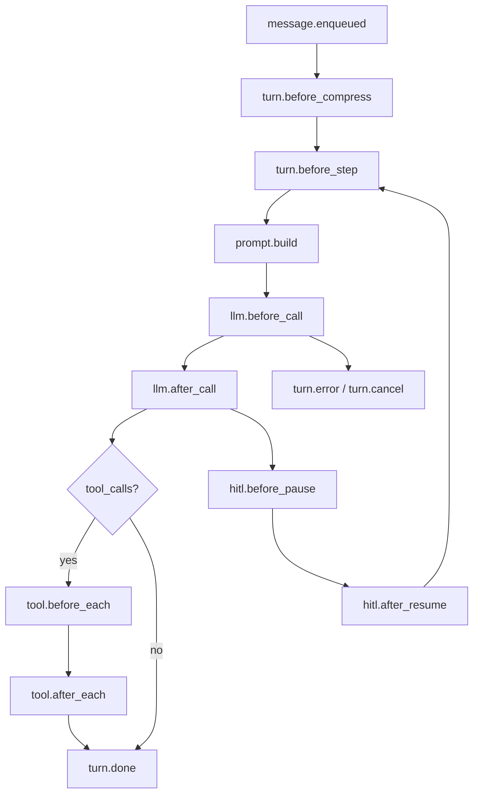

# Agent Hook 扩展点设计方案

本文描述 **Go Agent Node** 在 turn 全链路中引入 **统一 Hook 框架** 的目标边界、阶段锚点、核心接口、配置形态与落地顺序。实现以本文件为设计基线；与代码冲突时以 **Git / CHANGELOG** 为准。

**状态（v0.10.4）**：**Hook 统一 in-process 插件栈已落地** — 内置 Hook、全局 `hooks.plugins`、skill `hooks/*.so` 共用 `Hook.Run(ctx, *Context, Host)`；`tool.before_each` / `tool.after_each` / `prompt.build` / `llm.before_call` / `llm.after_call` / `turn.done` 及多数 phase 已接线。已**废弃** command/http YAML 外部 Hook。

**首版落地候选**：[tool-before-hook-duplicate-approval.md](./tool-before-hook-duplicate-approval.md)（`tool.before_each` + policy 三档收敛；**duplicate 仅 `rule`+auto** + 三选项审批）。

**相关索引**：[architecture/go-node-internals.md](../architecture/go-node-internals.md)（runtime 与 Orchestrator）、[node/internal/triggers/README.md](../../node/internal/triggers/README.md)（外部触发 turn）、[handbook/04](../handbook/04-能力与策略.md)（审批与策略）。

---

## 1. 问题陈述与目标

### 1.1 现状

Go Node 已具备若干 **「类 Hook」** 扩展点，但缺少统一命名、顺序、可配置与可审计模型：

| 环节 | 现有机制 | 代码位置 |
|------|----------|----------|
| System prompt | `SetSystemPromptBuilder` | `node/internal/turn/orchestrator.go` |
| 工具审批 | `policy.Engine` | `node/internal/turn/tool_router.go` → `processToolCalls` |
| 上下文压缩 | `compression.Coordinator.MaybeHandle` | `node/internal/session/runtime_turn.go` → `runTurnStep` |
| 外部触发 turn | `triggers` + 队列 | `node/internal/session/` + `node/internal/triggers/` |
| 可观测 | SSE `stream.Hub` | `node/internal/stream/hub.go` |
| 子 Agent | `childagent.Manager` | turn 内工具分支 |
| 原始消息审计 | `history.Journal` | `node/internal/history/` |

缺的是：**统一 Registry、阶段语义（只读 / 可改 / 可阻断）、配置驱动注册、幂等与 fail-open / fail-closed 策略**。

### 1.2 目标

1. 在 **Go Node（本地助手栈）** 提供进程内 Hook 框架，覆盖 message 入队 → turn 步进 → LLM → 工具 → HITL → turn 结束全链路。
2. 支持 **观测**（日志 / JSONL / 指标）、**干预**（改 prompt / 参数 / 结果）、**阻断**（拒绝入队 / 拒绝工具 / 中止 turn）。
3. 与现有 **`policy`、`compression`、`SystemPromptBuilder`** 收敛，避免 Orchestrator 上继续堆 ad-hoc `SetX` 回调。
4. **Manage** 仅做 fleet 级配置下发与只读 webhook；**不在 Manage 内同步执行单 turn 内的 tool hook**（延迟与故障域过大）。

### 1.3 非目标（首版明确不做或降级）

- **不在 Client TUI / Python CLI** 实现业务 Hook（最多展示层 filter）。
- **不在 `app/core/main_agent/`** 复制一套（Python 栈仅 API 参考）。
- **不做** command/http shell hook；扩展仅通过 **Go in-process plugin**（`.so` + `Register` 符号）。
- **不把 SSE 当作唯一扩展点**；Hook 是执行链组成部分，SSE 是副作用 / 展示。
- **首版不承诺** Manage 实时改写正在执行的 turn（仅配置热更新 + 异步审计）。

---

## 2. 设计原则

1. **Hook 落在 Go Node** — 与仓库开发约定一致；Manage 做 fleet 观测 / 策略，不替代单 turn 细粒度 Hook。
2. **分三层，避免一开始做万能插件**：
   - **L1 进程内接口**（同步、低延迟、可改 context）
   - **L2 配置驱动**（YAML 注册 `hooks.plugins` 全局 `.so`；skill `hooks/*.so` 随 load_skills 加载）
   - **L3 控制面**（Manage webhook / 审计，只读或异步策略）
3. **Hook 必须声明语义**：只读观测 vs 可修改 vs 可阻断；默认 **观测类 fail-open**，**安全 / 合规类 fail-closed**。
4. **与 SSE 解耦**：Hook 在执行链内同步或受控异步运行；`stream.Hub.Publish` 仍独立推送 UI。
5. **子 Agent 边界清晰**：`HookContext` 带 `parent_session_id`；默认子 session **不继承**父 hook，或 YAML 显式 `inherit: true`。
6. **幂等与 HITL 重入**：`TurnID + Phase + HookName` 写 journal，避免 resume / 重试重复副作用；`hitl.after_resume` 必须可重入且与 `PendingHITL` 一致。

---

## 3. 推荐架构：`HookRegistry` + 分阶段 `HookContext`

在 **`node/internal/hooks/`**（新包）定义稳定契约，由 `session/runtime` 与 `turn/orchestrator` 在固定锚点调用。

```text
session.Manager.EnqueueMessage
  └─ hooks.Run(message.enqueued)
session.runtime.enqueue / consumeLoop
  └─ hooks.Run(turn.before_step)        // 可选：按 envelope 类型细分
session.runtime.runTurnStep
  └─ hooks.Run(turn.before_compress) → compression.MaybeHandle
turn.Orchestrator.runOneStep
  └─ hooks.Run(prompt.build)           → buildSystemPrompt / SystemPromptBuilder
  └─ hooks.Run(llm.before_call)      → llm.StreamChat
  └─ hooks.Run(llm.after_call)
  └─ hooks.Run(tool.before_each)       → policy.Engine + tools.Executor
  └─ hooks.Run(tool.after_each)
  └─ hooks.Run(hitl.before_pause)      → processToolCalls 返回 PendingHITL 前
turn.Orchestrator.ContinueAfterResume
  └─ hooks.Run(hitl.after_resume)
  └─ hooks.Run(turn.done | turn.error | turn.cancel)
  └─ hub.Publish(...)                  // 仍走 SSE，Hook 不替代
```

---

## 4. Hook 阶段（首版 12 个锚点）



| Phase | 典型用途 | 能否改数据 | 能否阻断 | 建议 fail 策略 |
|-------|----------|------------|----------|----------------|
| `message.enqueued` | 审计、限流、打标 | metadata | 可拒绝入队 | 观测 continue；限流 abort |
| `turn.before_compress` | 压缩策略、采样 | 压缩参数 | 跳过压缩 | continue |
| `turn.before_step` | turn 级 trace id、配额 | metadata | 跳过本步 | continue |
| `prompt.build` | 注入企业策略、RAG 片段 | system prompt | — | continue |
| `llm.before_call` | 模型路由、脱敏 | messages / tools | 取消本次 LLM | 合规 abort |
| `llm.after_call` | 输出审查、PII 扫描 | assistant 文本 | 转 error / HITL | 合规 abort |
| `tool.before_each` | 参数校验、替换 | args | 拒绝执行 | **policy：abort** |
| `tool.after_each` | 结果清洗、截断 | result | — | continue |
| `hitl.before_pause` | 自动审批规则补充 | approval 包 | — | continue |
| `hitl.after_resume` | 审计 resume | resume payload | — | continue |
| `turn.done` | 指标、异步回调 | — | — | continue（可异步） |
| `turn.error` / `turn.cancel` | 告警、补偿 | — | — | continue |
| `session.lifecycle` | 创建 / 销毁 | — | — | continue |

### 4.1 与现有代码的映射（插入点）

| Phase | 当前代码锚点 | 文件 |
|-------|--------------|------|
| `message.enqueued` | `Manager.EnqueueMessage` 入队前 | `node/internal/session/manager.go` |
| `turn.before_compress` | `runtime.runTurnStep` 内 `MaybeHandle` 前 | `node/internal/session/runtime_turn.go` |
| `turn.before_step` | `handleHumanMessage` / `handleToolResult` / `handleResume` 调用 `runTurnStep` 前 | `node/internal/session/runtime.go` |
| `prompt.build` | `Orchestrator.buildSystemPrompt` | `node/internal/turn/orchestrator.go` |
| `llm.before_call` / `llm.after_call` | `runOneStep` 内 `StreamChat` 前后 | `node/internal/turn/orchestrator.go` |
| `tool.before_each` / `tool.after_each` | `processToolCalls` 内各 tool 执行前后 | `node/internal/turn/tool_router.go` |
| `hitl.before_pause` | `processToolCalls` 返回 `PendingHITL` 前 | `node/internal/turn/tool_router.go` |
| `hitl.after_resume` | `ContinueAfterResume` 入口 | `node/internal/turn/orchestrator.go` |
| `turn.done` | `publishDone`（finish_reason 为 stop 时） | `node/internal/turn/sse_publish.go` |
| `turn.error` / `turn.cancel` | `runOneStep` 错误 / cancel 分支 | `node/internal/turn/orchestrator.go` |
| `session.lifecycle` | `Manager` 创建 / 删除 session | `node/internal/session/manager.go` |

**收敛建议**：

- `prompt.build` → 将现有 `SystemPromptBuilder` 注册为内置 `BuiltinHook`
- `tool.before_each` → **`policy.Engine` 作为最高优先级内置 hook**，而非并行两套审批逻辑
- `DuplicateToolCallHook` → 仅 **`toolMode==rule` 且 `ResolvedAction==auto`**（见 [tool-before-hook-duplicate-approval.md](./tool-before-hook-duplicate-approval.md)）
- `turn.before_compress` → 在 `compression.MaybeHandle` 外包一层 `hooks.Run`

---

## 5. 核心接口（Go 约定）

```go
package hooks

type Phase string

const (
    PhaseMessageEnqueued    Phase = "message.enqueued"
    PhaseTurnBeforeCompress Phase = "turn.before_compress"
    PhaseTurnBeforeStep     Phase = "turn.before_step"
    PhasePromptBuild        Phase = "prompt.build"
    PhaseLLMBeforeCall      Phase = "llm.before_call"
    PhaseLLMAfterCall       Phase = "llm.after_call"
    PhaseToolBeforeEach     Phase = "tool.before_each"
    PhaseToolAfterEach      Phase = "tool.after_each"
    PhaseHITLBeforePause    Phase = "hitl.before_pause"
    PhaseHITLAfterResume    Phase = "hitl.after_resume"
    PhaseTurnDone           Phase = "turn.done"
    PhaseTurnError          Phase = "turn.error"
    PhaseTurnCancel         Phase = "turn.cancel"
    PhaseSessionLifecycle   Phase = "session.lifecycle"
)

type Action string

const (
    ActionContinue   Action = "continue"
    ActionSkip       Action = "skip"        // 跳过本 phase 剩余 hook
    ActionAbortTurn  Action = "abort_turn"
    ActionAbortTool  Action = "abort_tool"
    ActionRejectEnqueue Action = "reject_enqueue"
)

// Context 按 Phase 填充子结构（UserMessage / LLMRequest / ToolCall / …）。
type Context struct {
    Phase           Phase
    SessionID       string
    AgentID         string
    TurnID          string // 每次 human_message 或 trigger 一条
    ParentSessionID string
    // Phase-specific payloads (typed accessors)
}

type Result struct {
    Action    Action
    Mutations map[string]any // 结构化 patch，由 registry 应用到 context
    Error     error          // Abort 时原因
}

type Hook interface {
    Name() string
    Phases() []Phase
    Run(ctx context.Context, hc *Context, host Host) (Result, error)
}

func (r *Registry) RunPhase(ctx context.Context, phase Phase, hc *Context, host Host) (Context, error)
```

**设计要点**：

- **顺序执行**：`RegisterOpts.Priority` 升序（数值越小越先）
- **超时**：每个 hook 单独 `context.WithTimeout`（默认 500ms，plugin 可配置 `timeout_ms`）
- **幂等**：`TurnID + Phase + HookName` 写入 ExecutionJournal，resume 不重复副作用
- **Cancel**：hook 须 respect `ctx.Done()`
- **Host**：plugin 经 `Host` 读写 `hook_store`、调用 `LLMComplete`（turn 级配额）

---

## 6. Plugin 加载（唯一扩展方式）

### 全局 plugin

Node 启动时读取 `config.yaml`：

```yaml
hooks:
  plugins:
    - path: .runtime/plugins/redact.so
      phases: [tool.after_each]
      priority: 100
      timeout_ms: 2000
      on_error: continue
  host:
    max_llm_calls: 2
    # history_window: 100  # 可选；省略或 ≤0 时不截断
```

`plugin.Open(path)` → 查找 `Register` → `PluginRegistrar.Register(hook, opts)`。

### Skill plugin

- 路径：`skills/<name>/hooks/*.so`
- 时机：`load_skills` 成功后加载；`unload_skills` / clear-context 时按 `skill/<name>/` 前缀从 Registry 移除
- Go `plugin` 无法 unload 已加载 `.so`；仅停止调用

### 导出约定

```go
func Register(reg *hooks.PluginRegistrar) error
```

编写指南见 **`packaging/runtime/skills/write-hook/SKILL.md`**。

---

## 7. 观测 vs 干预：选型指南

| 需求 | 建议 |
|------|------|
| 改 prompt / 工具参数 / 结果 | Go plugin，`prompt.build` / `tool.*` phase |
| 合规拦截 bash | 内置 `policy` + `tool.before_each`（priority 最高之一） |
| session 跨 turn 状态 | `Host.SessionStoreSet` → SQLite `hook_store` |
| Hook 内二次 LLM | `Host.LLMComplete`（`reuse_system_prompt`） |
| 跨系统编排 | A2A / triggers（已有）；不在 Hook 内做 HTTP 代理 |

---

## 8. 风险与约束

| 风险 | 缓解 |
|------|------|
| 同步 hook 过多拖慢首 token | LLM 前后只放轻量 hook；重组件放 `turn.done` |
| HITL 重入状态不一致 | `hitl.after_resume` 与 `PendingHITL` 单一路径；单测覆盖 double-resume |
| plugin 与 Node Go 版本不一致 | 同版本编译 `.so`；文档与 `write-hook` skill 强调 |
| `hook_store` key 冲突 | 约定命名空间前缀（`skill/<name>/…`、`global/…`） |
| 与 policy 双轨审批 | policy 作为 `tool.before_each` 内置 hook，禁止并行 ad-hoc 审批 |

---

## 9. 验收标准

1. 全局 `.so` 与 skill `.so` 均为 `Hook.Run(ctx, hc, host)` 同一调用栈。
2. plugin 可在 `tool.after_each` 读 `Context.History`、写 `hook_store`，reload session 后仍在。
3. `Host.LLMComplete(reuse_system_prompt=true)` 受 `hooks.host.max_llm_calls` 限制。
4. clear-context / unload skill 后对应 plugin 或 store 行为符合预期。
5. 内置 policy/duplicate 回归通过。

---

## 10. 变更记录

| 日期 | 说明 |
|------|------|
| 2026-06-11 | 初稿：HookRegistry、14 phase、分层设计 |
| 2026-06-22 | 统一 in-process plugin 栈；废弃 command/http YAML；落地 Host / hook_store |
