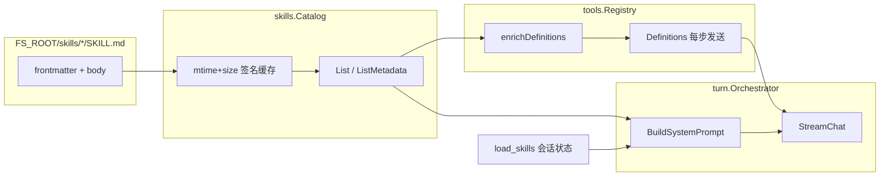

# Skills 上下文成本分析（WS4 存档）

> **状态**：**搁置** — 不改动 skills 现网机制（成本评估见本文 §4、§9）。  
> 分支：`feat/tool-context-cost-optimization`  
> 总览：[tool-context-cost-analysis.md](./tool-context-cost-analysis.md) · 实录：[handbook/附录/重大设计变更实录.md](../handbook/附录/重大设计变更实录.md)

> **现网注记（2026-08-20）**：本文保留历史分析口径；现网已将可用 skills 目录从
> `load_skills` 工具描述移到启用 `skills` 工具组时的 system prompt 尾部，并按 Agent
> snapshot / Catalog revision 在下一个 human turn 边界更新。下文关于“catalog 不写入 system”
> 和 `registry_enrich.go` 的描述属于历史状态。

---

## 1. 背景：Skills 在账单里的位置

### 1.1 计费模型（沿用总览 §1.2）

以 [DeepSeek-V4-Pro](https://api-docs.deepseek.com/zh-cn/quick_start/pricing) 为例：

| 计费项 | 单价 | 相对 cache 命中 input |
|--------|------|----------------------|
| 输入（缓存命中） | 0.025 元 / M tokens | 1× |
| 输入（缓存未命中） | 3 元 / M tokens | **120×** |
| 输出 | 6 元 / M tokens | 240× |

Agent 每步 `StreamChat` 都会 replay **前缀**（system + 全量 messages 已有 tail + **全量 tools schema**）。Prompt Cache 只降低「与上一轮相同前缀」的单价，**不减少** tool loop 轮数，也**不减少** load/unload 后必须出现的新增 tail。

Skills 相关成本分 **两条通道**（见 §2），对 cache 的影响不同：

| 通道 | 注入位置 | 内容 | 会话内是否易变 |
|------|----------|------|----------------|
| **A. Catalog 元数据** | `load_skills` 的 **tool description**（`enrichDefinitions`） | `name: description` 列表 | 磁盘 catalog 变则变；**同会话逐步 tool loop 通常不变** |
| **B. Loaded 正文** | **system prompt** `## 已加载 skills` | 最多 `max_in_prompt` 份 SKILL.md 正文 | `load_skills` / `unload_skills` / `clear_skills` 或磁盘正文变更 |

**设计原则（现网已遵守）**：catalog **不**写入 system；正文 **不**写入 tools schema — 避免「同一份大正文进两处前缀」。WS4 要巩固的是 **通道 A 的稳定性与体积**，并量化 **通道 B** 的预期断档。

### 1.2 用户可观测信号

| 信号 | 来源 | 含义 |
|------|------|------|
| `skills_catalog_estimated_tokens` | `GET /v1/agents/{id}/context` | 磁盘 catalog **全文**粗算（含 SKILL.md body） |
| `skills_catalog_bloat_threshold` | 固定 `4000`（`CatalogBloatTokenThreshold`） | 超过则 TUI 提示精简 skills 目录 |
| `system_prompt_estimated_tokens` | 同上 | 含 loaded 正文后的 system 体积 |

注意：`EstimateCatalogTokens` **含正文**，但 **仅元数据**进入 tools enrich；TUI 膨胀警告反映的是 **磁盘维护成本** 与 **潜在 loaded 正文上限**，不等于当前 tools 前缀体积。

---

## 2. 现网机制

### 2.1 数据流



### 2.2 关键代码路径

| 步骤 | 文件 | 行为 |
|------|------|------|
| Catalog 扫描 | `skills.go` `List()` | 签名 `dir\|mtime\|size` 未变则内存命中，避免每步读盘 |
| Tools enrich | `registry_enrich.go` | 仅 `load_skills`：`Description += "\n\n可用 skills（name: description）：\n" + RenderMetadataSection()` |
| 每步发送 | `orchestrator.go` `runOneStep` | `toolDefs := ToolDefinitions()` → `StreamChat{Tools: toolDefs}` |
| Loaded 正文 | `prompt.go` | `RenderLoadedSection(in.Loaded)` → `## 已加载 skills` |
| 加载工具 | `tool_router.go` `executeSkillTool` | 更新 session `loaded_skills`；tool 结果为小 JSON |

`load_skills` 静态 description（`tool_skills.go`）已要求模型「任务匹配 description 时必须先加载」；catalog 列表附在其后，形成 **单工具字段内的动态尾缀**。

### 2.3 配置

| 配置 | 默认 | 对成本的影响 |
|------|------|----------------|
| `skills.enabled` | `true` | 关闭则无 enrich、无 skill 工具 |
| `skills.max_in_prompt` | `3`（example 常为 `5`） | 上限 **通道 B** 正文 token |
| `tools.enabled_groups` | 未配置=全开 | 不含 `skills` 组则无 `load_skills`、无 enrich |

### 2.4 与压缩侧车对齐

`compression.SidecarPrefix` 由 runtime 注入 **与主 turn 下一步相同的** `SystemPrompt` + `ToolDefinitions()`。catalog 变更导致 tools 漂移时，**主 turn 与压缩侧车同步 miss** — 与总览 §1.2.2 「schema 漂移」同构。

---

## 3. Cache 前缀拆解

### 3.1 请求结构（DeepSeek OpenAI 兼容）

```text
POST /chat/completions
  messages[0]  = system  （BuildSystemPrompt）
  messages[1..]= history tail
  tools        = 全量 ToolDef[]（含 enrich 后的 load_skills）
```

[Prompt Cache](https://api-docs.deepseek.com/zh-cn/guides/kv_cache) 对**连续请求**做最长公共前缀匹配。实践中：

1. **history 每步增长** → 新增 tail 恒为 miss（预期）。
2. **system 或 tools 任一字节变化** → 从变化点起后续前缀（含已存在的 history）在「与上一轮比」时无法延续命中；**首次变化后的第一步**整段 replay 按 miss 计价权重更高。
3. **tools 与 messages 并列**；provider 内部序列化顺序对开发者不透明，但观测与压缩专题一致：**system 漂移 ≡ 整段前缀断档**。tools 中 **任一** `ToolDef` 变化（含单字段 `description`）应视为 **整段 tools JSON 失效**（保守估计，用于 WS4 设计）。

### 3.2 通道 A：catalog enrich 何时导致 miss

| 场景 | tools 前缀 | 典型频率 |
|------|------------|----------|
| 会话内多步 tool loop，**磁盘 catalog 不变** | `load_skills.description` **字节级稳定** → tools 段可跨步 hit | 高 |
| 新增/删除 skill 目录 | 元数据列表变 → **tools miss** | 低～中（开发期高） |
| 编辑某 `SKILL.md`（mtime/size 变） | 对应行 `description` 或排序变 → **tools miss** | 开发期高 |
| 仅改 SKILL **正文**、frontmatter 不变 | 元数据不变 → tools **仍稳定**；若已 loaded 则 **system 变**（§3.3） | 常见 |

**结论**：WS4 的首要经济动机不是「同会话逐步 enrich 在变」（多数时候不变），而是：

1. **开发/运维期 catalog 频繁变更**时，把 **整段 ~8k–12k tools 前缀** 从 0.025 拉到 3 元/M；
2. **enterprise catalog 变大**时，enrich 尾部膨胀（§4.2），即使稳定也抬高每步 **hit 仍计费** 的 token 量（命中价虽低，但量大时长会话仍可观）；
3. 与 **通道 B** 叠加时，一次 `load_skills` 同时引入 system 变 + 多一步 loop（§4.3）。

### 3.3 通道 B：loaded 正文何时导致 miss

| 场景 | system 前缀 |
|------|-------------|
| 调用 `load_skills` / `unload_skills` / `clear_skills` | `## 已加载 skills` 段变 → **预期断档** |
| 已加载 skill 的 SKILL.md **正文**被改 | 下一步 `RenderLoadedSection` 变 → **非预期断档**（无显式 reload） |
| 已加载 skill 被从磁盘删除 | 该段跳过，system 变 |
| 会话内未加载任何 skill | 无该段，system 较稳定 |

通道 B 的断档是 **功能正确性所需**（模型需看到正文）。优化方向是 **控制体积**（`max_in_prompt`、skill 作者控制 SKILL.md 长度），以及压缩专题 M5 的 **静/动分层** — **不在 WS4 硬删正文**。

### 3.4 Catalog 内存缓存 vs Prompt Cache

`Catalog.List()` 的 mtime 签名缓存只减少 **本地读盘**，**不**影响 LLM Prompt Cache。只要 `RenderMetadataSection()` 输出变，`enrichDefinitions` 即变。

---

## 4. 成本量化

符号：

- **P** ≈ 全量 tools schema token（未 enrich 基准 **~8k–12k**，视 `enabled_groups`）
- **M** = catalog 元数据 enrich token（仅 name + description 行）
- **L** = loaded 正文进入 system 的 token（≤ `max_in_prompt` × 单 skill 正文）
- **N** = 一次任务内 tool loop 步数（含 load 步）
- **‰** = /10⁶ tokens

### 4.1 元数据体积 M（通道 A）

`RenderMetadataSection` 每行约 `- {name}: {description}\n`。粗算 `len/4`：

| catalog 规模 | 平均 description 长度 | M（约） |
|--------------|-------------------------|--------|
| 5 | 80 字 | ~200 |
| 10 | 80 字 | ~315 |
| 20 | 80 字 | ~548 |
| 50 | 80 字 | ~1245 |

相对 **P≈10k**，catalog 10 个、80 字描述时 enrich 约占 **~3%** tools 体积 — 绝对值不大，但 **任何描述变更触发整段 P miss** 时，货币放大系数为 **120×**。

### 4.2 Catalog 磁盘膨胀 vs 前缀（易混淆）

`EstimateCatalogTokens` 对 **每个 skill** 计 `name + description + content`。示例：

| skill 数 | 正文约 1500 tok/skill | 目录估算 |
|----------|----------------------|----------|
| 10 | ✓ | ~15k |
| 20 | ✓ | ~30k |
| 50 | ✓ | ~76k |

这些正文 **不会**进入 tools enrich；仅当被 **load** 且落在 `max_in_prompt` 内才进入 **L**。TUI `skills_catalog_estimated_tokens > 4000` 提醒的是 **作者应控制 SKILL.md 体积**，而非当前请求一定带 76k 进 API。

### 4.3 一次 `load_skills` 的边际成本

除 cache 断档外，加载本身是一次 **完整 tool loop**：

```text
增量 ≈ 1 × (P + history_tail) 的 input replay
     + assistant 调用 load_skills 的 completion C_load（~100–300 tok）
     + tool 结果 JSON（~50–150 tok，进 history）
加载后各步 system 增加 L → 每步多 replay L（命中价 0.025/M，仍线性累积）
```

若模型 **重复** `load_skills` 相同 `skill_names`，**WS6** `tool.before_each` 可拦截（与 skills 正交）。

### 4.4 场景账单（V4-Pro 粗算）

设 **P = 10000**，**N = 12** 步，**L = 4000**（加载 2 个中等 skill 后），history tail 均摊每步新增 **H = 800** miss token，completion 均 **O = 200**。

#### 场景 S1：catalog 稳定，加载一次后不再变

| 项 | 估算 |
|----|------|
| tools 段 | 12 步均可 hit（相对首步后） |
| system | 第 1–2 步无 L；第 3 步起带 L，**从 load 步起 system 变** |
| 货币量级 | 以 hit 价 replay 为主；load 步 +1 次 O + 小额 tail |

**要点**：现网在 **catalog 稳定** 时，enrich **不是**逐步漂移源；成本主要在 **L 的 replay** 与 **多一步 load**。

#### 场景 S2：开发期 catalog 每 2 步改一个 description（tools 漂移）

| 项 | 估算 |
|----|------|
| tools miss | 约 6 次整段 P 按 3 元/M |
| 粗算 tools 超额 | 6 × 10000 × (3 − 0.025) ‰ ≈ **0.18 元**（单任务 toy） |

长会话 × 多任务 × 更高 P → 线性放大。此为 **WS4 稳定 schema** 的核心动机。

#### 场景 S3：50 个 skill 的 catalog，稳定不变

| 项 | M≈1245 | P+M≈11245 |
|----|--------|-----------|
| 每步 hit 输入 | 11245 × 0.025 ‰ ≈ 0.00028 元 | vs P=10k 多 ~6% |
| 若一次 description 变更 | 整段 11245 miss → 11245 × 3 ‰ ≈ **0.034 元/步** |

#### 场景 S4：大正文 loaded（max_in_prompt=5，每 skill 2000 tok）

**L ≈ 10000**。加载后每步 system 多 10k token replay：

- 全 hit：12 × 10000 × 0.025 ‰ ≈ **0.03 元**（仅 L 增量部分）
- 对比不加载：省 L replay，但模型可能反复 `read_file` SKILL.md（WS3 spill 管结果体积，不省 turn）

**权衡**：加载是为减少「读 SKILL.md」的 tool 步；应用 `max_in_prompt` 与精炼 SKILL 控制 L。

### 4.5 Cache 命中率（操作化定义）

现网 **未**单独导出 skills 维度的 cache hit。建议在 WS5 延伸或 WS4 落地时增加 **代理指标**：

| 指标 | 定义 | 用途 |
|------|------|------|
| `skills_catalog_signature_changes` | 会话内 `listSignature` 变化次数 | 解释 tools miss 尖刺 |
| `load_skills_calls` / `unload_skills_calls` | 按名计数（可并入 `tool_calls_by_name`） | 加载步开销 |
| `loaded_skills_count` | done 时 loaded 数 | 关联 L |
| `tools_schema_estimated_tokens` | 对 `Definitions()` 做 `EstimateTextTokens` | 观察 P+M |
| （可选）`load_skills_description_bytes` | enrich 后 description 长度 | 验证瘦身 |

**命中率推断**：若 `catalog_signature` 会话内恒定且 `enabled_groups` 不变，tools 段 **应**随步 hit；若 API 返回 `prompt_cache_hit_tokens`（DeepSeek usage），可对比 **首步 vs 后续步** 差值验证。

---

## 5. 问题陈述（WS4）

| ID | 问题 | 严重度 | 根因 |
|----|------|--------|------|
| **SK1** | catalog 变更 → **整段 tools JSON** cache miss | **高**（开发期）/ 中（生产） | 元数据嵌入 `load_skills.description` |
| **SK2** | 大 catalog → **P+M** 每步 replay token 增 | 中 | 全量元数据 inline |
| **SK3** | loaded 正文 **L** 每步 replay | 中（预期） | 设计如此；靠 max_in_prompt + 写作规范 |
| **SK4** | 磁盘正文变更 → system 变但无 reload | 低 | `RenderLoadedSection` 每次读 catalog |
| **SK5** | 多余 `load_skills` 步 | 低～中 | 模型行为；WS6 可部分缓解 |

**WS4 范围**：优先 **SK1 + SK2**；SK3 与压缩 M5 协同；SK4/SK5 可选。

---

## 6. 方案选项

### 6.1 方案 A：enrich 瘦身为稳定指针（推荐基线）

**做法**：

- `load_skills.description` **不再拼接**全量 `RenderMetadataSection()`；
- 改为固定文案 + **稳定 catalog 指纹**，例如 `catalog_revision: <sig_hash>`（`listSignature` 的短 hash）；
- 新增轻量工具 **`list_available_skills`**（或 `load_skills` 空数组时返回元数据 JSON 进 **tool message**，不进 schema）。

| 优点 | 缺点 |
|------|------|
| tools 前缀 **会话内对磁盘变更免疫**（直到模型显式 list） | 首次选型多 1 次 list 调用 |
| 侧车 / 主 turn tools 对齐简单 | 模型须学会先 list（prompt 引导） |
| 改动面小（`registry_enrich.go` + 新工具或 load 行为） | |

**Cache**：catalog 编辑不再使 P miss；仅 list 结果的 **history tail** 增长。

### 6.2 方案 B：description 截断 + 排序稳定（过渡）

**做法**：enrich 保留，但每项 description 截断（如 60 字），仅 `name` 必填；排序已稳定（`sort.Slice` by name）。

| 优点 | 缺点 |
|------|------|
| 实现最快 | **SK1 未根治**：改 description 仍 miss |
| 降 M | 截断削弱模型选型质量 |

适合作为 **A 的前置减负**，不宜单独作为终点。

### 6.3 方案 C：catalog 移入 system 稳定段

**做法**：把元数据放进 `prompt_context` 或 system 固定段。

| 优点 | 缺点 |
|------|------|
| tools 绝对稳定 | catalog 变 → **system miss**（与压缩 M5 冲突） |
| | 违背现网「catalog 不进 system」原则 |

**不推荐**。

### 6.4 方案 D：按任务动态裁剪 enabled_groups

**做法**：无 skills 任务时禁用 `skills` 组，整段去掉 load_skills 与 enrich。

| 优点 | 缺点 |
|------|------|
| 直接减小 P | 需路由逻辑；任务中再启用仍 miss |

与 WS4 **互补**，非替代 enrich 稳定。

### 6.5 方案 E：Manage 同步 catalog 版本化

**做法**：Node 拉取 skills 包时 bump `catalog_version`；schema 只暴露 version id；详情经 sync API / list 工具。

| 优点 | 缺点 |
|------|------|
| 生产期 catalog 与版本绑定，变更可预期 | 依赖 Manage；本地 `.runtime/skills` 仍要 A |

面向远期 [manage-architecture.md](./manage-architecture.md)；本地 Node **先做 A**。

---

## 7. 推荐实施（T5 / WS4）

### 7.1 目标

1. **tools `Definitions()` 字节序列会话内仅因 `enabled_groups`/配置变更而变**，不因磁盘 catalog 编辑而变。
2. **M 有上限**（list 结果走 tool message，可 spill / 截断，复用 WS3 基础设施可选）。
3. **可观测**：§4.5 代理指标 + 文档化「加载后 L 预期断档」。

### 7.2 建议步骤

| 步骤 | 内容 | 风险 |
|------|------|------|
| **W4-1** | 移除 `enrichDefinitions` 全量拼接；description 改为静态 + `catalog_revision` | 模型短期不知可用 skill 名 |
| **W4-2** | 新增 `list_available_skills`（同步、返回 JSON 元数据）或约定 `load_skills([])` 返回 catalog | +1 tool schema 条目（体积远小于 inline 50 项） |
| **W4-3** | 更新 `tool_skills` / system 静态指引：「先 list 再 load」 | prompt 行为迁移 |
| **W4-4** | WS5 延伸：`tools_schema_estimated_tokens`、`catalog_revision` on done | 低 |
| **W4-5** | 单测：`Definitions()` 在 catalog 正文变更前后 **JSON 相等**（仅 list 工具结果变） | — |

**明确不做（本分支）**：

- 取消 `load_skills` 步或合并进 read_file（破坏产品语义）；
- 把 SKILL 正文塞回 tools schema；
- 用 `pathEncCache` 或审批信任表缓存 catalog（语义正交，见 [ux-agent-owned-file-approval.md](./ux-agent-owned-file-approval.md)）。

### 7.3 验收标准

| 验收项 | 标准 |
|--------|------|
| Schema 稳定 | 修改某 SKILL.md **正文**（frontmatter 不变）→ `Definitions()` 序列化不变 |
| Schema 稳定 | 修改某 **description** → `Definitions()` 仍不变；`list_available_skills` 结果变 |
| 功能 | 集成测试：list → load → system 含正文 → 任务可完成 |
| 成本 | 对比实验：固定任务 12 loop，catalog 频繁编辑场景，API `prompt_cache_hit_tokens` 上升（若可用） |

---

## 8. 相关代码索引

| 主题 | 路径 |
|------|------|
| Catalog 扫描 / 渲染 | `node/internal/skills/skills.go` |
| Tools enrich | `node/internal/tools/registry_enrich.go` |
| load/unload 工具定义 | `node/internal/tools/tool_skills.go` |
| 加载执行 | `node/internal/turn/tool_router.go` |
| System loaded 段 | `node/internal/turn/prompt.go` |
| 每步 tools 发送 | `node/internal/turn/orchestrator.go` |
| Context 视图 / 膨胀阈值 | `node/internal/session/context_view.go` |
| 配置 | `shared/config/config.go` `SkillsConfig` |
| WS5 度量 | `node/internal/turn/context_metrics.go` |

---

## 9. 结论

Skills 成本 **不是单一来源**：**通道 A**（catalog enrich）在 catalog 变更时以 **120×** 单价放大整段 tools 前缀 miss，是 WS4 的主靶；**通道 B**（loaded 正文）是 **有意**的 system 体积与预期 cache 断档，靠 `max_in_prompt` 与压缩 M5 治理。

**现网在 catalog 稳定的生产会话中**，逐步 tool loop **不会因 enrich 本身**而漂移；WS4 仍值得做，因为：(1) 开发期漂移昂贵；(2) 大 catalog 抬高 P；(3) 将元数据移出 schema 后 list 结果可走 WS3 spill，避免 history 膨胀。

**下一步**：按 §7.2 实施 **方案 A**（+ 可选 B 截断作为 list 结果防护），并回写 [tool-context-cost-analysis.md](./tool-context-cost-analysis.md) §3.3 状态为「设计就绪」。
