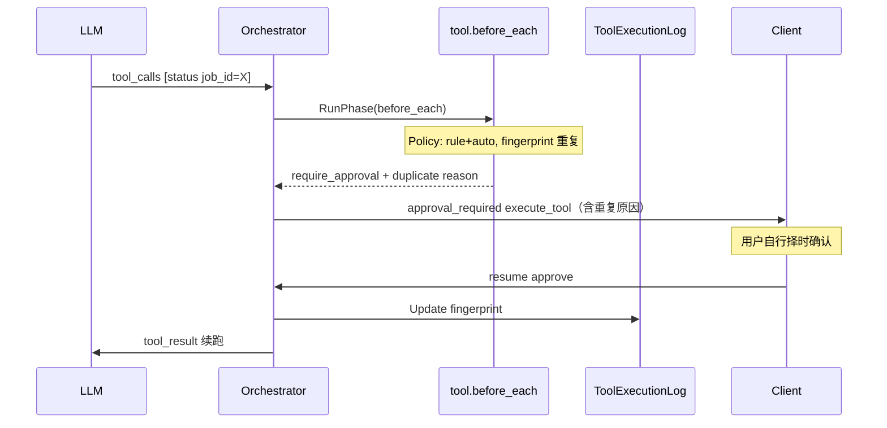

# Tool Before Hook 与重复调用审批方案

> 状态：**已落地**（WS6，`feat/tool-context-cost-optimization`）  
> 配置：`hooks.duplicate_tool_call`（`enabled`、`window_seconds`，默认 60）  
> 前置：[agent-hooks.md](./agent-hooks.md) · [tool-context-cost-analysis.md](./tool-context-cost-analysis.md)  
> 实录：[major-changes.md](./major-changes.md#3-tool-before-hook-与重复调用审批已落地-ws6)

---

## 1. 背景与目标

### 1.1 问题

1. **审批逻辑分散**：`policy.Engine.DecideTool` 硬编码在 `processToolCalls`（`tool_router.go`），与 [agent-hooks.md](./agent-hooks.md) 规划的 `tool.before_each` **未收敛**，后续扩展（重复调用检测、参数改写、审计）只能继续堆 if/branch。

2. **重复 tool_call 浪费上下文**（与 tool-context-cost **WS1** 同族）：模型在短时间内用 **完全相同** 的工具名 + 参数再次调用（典型：`background_job_status` 轮询、重复 `bash_run` 同命令）。每次仍走完整 turn，即使 Prompt Cache 命中，**assistant/tool tail + completion** 仍累积。

3. **现有 HITL 只有「批/拒」**：`approval_required` + `approve` / `reject` / `selection`（`client/internal/hitl/approval.go`），无法表达 **「稍后再执行」**，无法打断无意义的快速重试。

### 1.2 目标

| # | 目标 |
|---|------|
| G1 | 落地 **`tool.before_each`** 作为 tool 执行前 **唯一决策入口**（含原 policy 审批） |
| G2 | 对 policy 档位为 **`rule`** 且子策略结论为 **auto** 的 call，做 **重复调用检测**；窗口内 fingerprint 一致则 **三选项 HITL** |
| G3 | 命中 duplicate 时走 **现网 `execute_tool` 审批**（批/拒），在 `approval_reason` 中展示重复原因；用户自行决定何时确认 |
| G4 | 与现有 `PendingHITL` / SSE / resume 兼容；Python TUI 与 Go TUI **同契约** |

### 1.3 非目标（首版）

- 不做跨 session / 跨 Agent 的全局 dedupe
- 不把重复检测做成「静默跳过并返回缓存结果」（首版仍经用户确认）
- 不做 **定时/defer 自动执行**（用户自行在 Client 点确认即可）
- 不对 **`never`** 档位工具做 duplicate 拦截（与「完全免审批」语义一致；见 §2.3、§3.2）
- 不替换 `user_information` HITL 路径
- Manage 控制面不同步拦截单 turn（仍仅 Node 内 hook）

---

## 2. 现网行为（对照）

### 2.1 Tool 分发（`processToolCalls`）

```text
for each tool_call in assistant batch:
  publishToolCallSSE
  → child_agent / ask_user / skills 特殊分支
  → policy.DecideTool(name, args)
       deny          → appendDeniedTool
       require_approval → 加入 approvalCalls
       auto          → 加入 autoCalls
executeAutoBatch(autoCalls)
if approvalCalls → SSE approval_required → PendingHITL{Kind: approval}
```

锚点文件：`node/internal/turn/tool_router.go`。

### 2.2 Policy 审批 SSE

```json
{
  "type": "approval_required",
  "approval_type": "execute_tool",
  "approval_id": "appr-…",
  "execution_id": "exec-…",
  "message": "检测到工具调用，等待用户确认后继续执行。",
  "approval_args": { "tool_calls": [ … ] }
}
```

Resume（`hitl.ParseApprovalResume`）：`type=approve` | `reject` | `selection` + `approved`/`rejected` id 列表。

### 2.3 Policy 三档（`.runtime/policy/tool.approval.txt`）

| 档位 | 含义 | 编排结论 | 本方案行为 |
|------|------|----------|------------|
| **`always`** | 每次必须人工确认 | `require_approval` | 现网 **`execute_tool`** 审批（批/拒/勾选）；**不走** duplicate |
| **`never`** | 完全免审批 | `auto` | 直接执行；**不走** duplicate（显式放弃重复拦截） |
| **`rule`** | 走子策略 / fallback | `auto` 或 `require_approval` | 子策略为 **auto** 且窗口内 fingerprint 重复 → **标准审批 + 重复原因**；子策略为 require_approval → 现网审批 |

示例（用户 policy）：

```text
read_file=never          # 重复 read 不弹 duplicate
write_file=rule          # 写盘 fallback 审批；信任链可对 agentOwned 文件降为 auto
search_replace=rule      # 同上
bash_run=rule            # shell 子策略 + 重复同命令可弹 duplicate
# 未列出 → 默认 rule（走 decideToolRuleFallback）
```

`write_file=always` 可显式关闭信任链（每次强制审批）。`background_job_status` 未显式配置时为 **`rule`**，fallback 结论为 **auto** → **可** 命中 duplicate（若改为 `never` 则不再拦截）。**`write_file` / `search_replace` 不参与 duplicate 检测**（即使信任链降为 auto）。

### 2.4 与 Hook 设计稿的差距

[agent-hooks.md §4.1](./agent-hooks.md#41-与现有代码的映射插入点) 已建议：

- `tool.before_each` ← **`policy.Engine` 作为最高优先级内置 hook**
- 本方案在此基础上增加 **`DuplicateToolCallHook`**（**仅 `rule` 档**），并统一产出「需 HITL / 可 auto / deny」

---

## 3. 架构：`tool.before_each` Hook 链

### 3.1 调用时机

在 **每个** 待执行 tool call 进入 `autoCalls` 或 `approvalCalls` **之前**（skill/child 等特殊分支可配置是否纳入；首版 **仅治理进入 policy 分支的常规工具**）。

```text
processToolCalls
  for tc in calls:
    … 特殊工具分支 …
    decision := hooks.RunPhase(PhaseToolBeforeEach, ToolHookContext{tc, session, ToolMode, ResolvedAction, …})
    switch decision.Action:
      AbortTool / Deny     → appendDeniedTool
      RequireApproval      → approvalCalls (+ ApprovalReason / ApprovalSubtype 元数据)
      Auto                 → autoCalls
  … 后续 executeAutoBatch / approval SSE 不变 …
```

### 3.2 内置 Hook 顺序（首版）

| 优先级 | Hook | 职责 |
|--------|------|------|
| 10 | **`PolicyToolHook`** | 解析 `toolMode`（always/never/rule）+ `DecideTool` → `ResolvedAction`（deny / require_approval / auto） |
| 20 | **`DuplicateToolCallHook`** | **仅 `toolMode==rule` 且 `ResolvedAction==auto`** 时做 fingerprint；窗口内重复 → `RequireApproval`（subtype=`duplicate_tool_call`） |
| 30+ | （预留）YAML / HTTP 观测 hook | 只读 journal |

**决策矩阵**（Hook 链出口）：

| `toolMode` | `ResolvedAction` | 60s 内 fingerprint 重复 | 最终行为 |
|------------|------------------|-------------------------|----------|
| `always` | require_approval | — | 标准 `execute_tool` 审批 |
| `never` | auto | — | 直接 auto（**不检测** duplicate） |
| `rule` | require_approval | — | 标准 `execute_tool` 审批 |
| `rule` | auto | 否 | 直接 auto |
| `rule` | auto | **是** | **标准 `execute_tool` 审批**（`approval_reason` 标注重复） |
| 任意 | deny | — | appendDeniedTool |

`DuplicateToolCallHook` **不覆盖** `always` / `never` 的语义；`deny` 在 Policy 层已短路，不进入 duplicate。

### 3.3 Policy 与 Hook 上下文

`PolicyToolHook` 须在 `ToolHookContext` 中写入（供下游 hook 与 journal 使用）：

| 字段 | 来源 | 说明 |
|------|------|------|
| `ToolMode` | `Engine.toolMode(name)` | `always` / `never` / `rule`（txt 未列出 → `rule`） |
| `ResolvedAction` | `DecideTool(name, args)` | 含 bash shell 子策略、fallback 的最终结论 |
| `ApprovalSubtype` | Duplicate 层写入 | `""` 或 `duplicate_tool_call` |

实现注意：`DecideTool` 当前只返回 `Action`，需在 `PolicyToolHook` 内 **额外读取** `toolMode`，或扩展 `Engine` 暴露 `DecideToolWithMode` 避免二次查表。

### 3.4 包布局（拟）

```text
node/internal/hooks/
  registry.go          # RunPhase、Action 语义（与 agent-hooks 草案一致）
  tool_context.go      # ToolHookContext：SessionID, TurnID, ToolCall, ToolMode, ResolvedAction, LastExecuted*
  builtin_policy.go    # PolicyToolHook
  builtin_duplicate.go # DuplicateToolCallHook + fingerprint

node/internal/session/
  tool_execution_log.go  # 每 session 记录「上次成功执行」指纹（内存 + 可选 SQLite）
```

**收敛**：`turn.Orchestrator` 注入 `*hooks.Registry`；`processToolCalls` **删除** 直接 `o.policy.DecideTool` 调用。

---

## 4. 重复调用检测

### 4.1 「上一个工具」定义

指本 session 内 **最近一次写入 history 的、成功执行的 tool result**（`rejected: false`，非 `policy_denied` / `user_rejected`）。

记录字段（`ToolExecutionRecord`）：

| 字段 | 说明 |
|------|------|
| `tool_name` | 函数名 |
| `args_fingerprint` | 规范化参数哈希（见 §4.2） |
| `tool_call_id` | 上次 call id（审计） |
| `executed_at` | Unix 毫秒 |
| `result_preview` | 可选，前 200 字符（UI 展示「上次结果摘要」） |

**更新时机**：`tool.after_each` 或 `executeTool` 成功返回后（与 hook 框架一并落地；首版可在 `invokeTool` 返回且 `!rejected` 时更新）。

**不记录**：background 仅 ACK 的 `bash_run`（`[TOOL_BACKGROUND]`）是否算「执行成功」——首版 **算**（已提交后台任务）；仅 status 查询且 `running` 仍算成功执行记录（这正是重复检测要拦的场景）。

### 4.2 参数 fingerprint（完全一致）

```text
1. ParseToolCallArguments → 剥离 call_purpose、run_in_background
2. JSON 解析剩余字段 → 递归 key 排序 → canonical JSON 字符串
3. fingerprint = SHA256(tool_name + "\x00" + canonical) 或直接用 canonical 字符串比较
```

**必须一致**：`tool_name` + `args_fingerprint` 全等。

**时间窗口**：`now - last.executed_at <= duplicate_tool_call_window_seconds`（默认 **60**）。

配置：

```yaml
hooks:
  duplicate_tool_call:
    enabled: true              # 省略或 null 时默认 true
    window_seconds: 60         # 省略或 ≤0 时默认 60
```

### 4.3 典型命中场景

| 场景 | 是否命中 duplicate | 说明 |
|------|-------------------|------|
| 连续两次 `background_job_status` 同 `job_id`（默认 **rule** + auto） | ✅ | WS1 轮询主因 |
| `background_job_status=never` 后重复 status | ❌ | 用户显式放弃 duplicate guard |
| 同命令 `bash_run=rule`，shell 子策略 auto，30s 内重复 | ✅ | rule 档典型场景 |
| 同路径 `read_file=never` 在 30s 内重复 | ❌ | never 不进入 duplicate 链 |
| `write_file=rule` 信任链命中后连续编辑 | ❌ | 降为 auto，不弹审批；不参与 duplicate |
| `write_file=always` 连续两次相同参数 | ❌ | 走标准审批，不叠加 duplicate UI |
| 同工具但 `call_purpose` 不同 | ✅（若 otherwise 满足 rule+auto+重复） | purpose 不参与 fingerprint |
| `rule` 但子策略 `require_approval`（如 `bash_run` + `rm`） | ❌ | 走标准 `execute_tool` |
| 上次执行 rejected | ❌ | 不更新 last record 或标记无效 |
| 窗口外重复（>60s） | ❌ | 直接 auto |

**Policy 配置与 duplicate 的关系**（已确认策略）：

- 需要 duplicate guard → 工具保持 **`rule`**（或未列出走默认 rule），且子策略能落到 auto
- 需要完全免打扰 → 设为 **`never`**（接受重复 call 可能浪费 turn）
- 需要每次人工确认 → 设为 **`always`**

首版 **不做** 工具名 exclude 列表；误伤时优先改 policy 档位（P2 可再加 `duplicate_tool_call_exclude_tools`）。

---

## 5. HITL：复用标准审批 + 原因展示（已确认简化）

### 5.1 原则

**不做** 独立 `duplicate_tool_call` 类型、三选项 UI、defer 定时执行。duplicate 命中后：

- 仍走现网 **`approval_type: execute_tool`**
- Resume 仍用 **`approve` / `reject` / `selection`**（`ParseApprovalResume`）
- 差异仅在 **`approval_reason`**（人类可读）+ 可选 **`duplicate_meta`**（结构化，供 Client 高亮）

用户自行决定何时点确认；Node **不** 挂定时器。

### 5.2 SSE 载荷（与现网兼容）

```json
{
  "type": "approval_required",
  "approval_type": "execute_tool",
  "message": "检测到工具调用；部分为短窗口内与上次完全相同的重复调用，请确认后再执行。",
  "approval_args": {
    "tool_calls": [{
      "id": "call-xyz",
      "name": "background_job_status",
      "arguments": { "job_id": "…" },
      "approval_reason": "【重复调用】background_job_status 与 12 秒前（60 秒窗口内）参数完全一致，上次 call_id=call-abc；上次结果摘要: status=RUNNING",
      "risk_level": "low",
      "duplicate_meta": {
        "window_seconds": 60,
        "previous_tool_call_id": "call-abc",
        "seconds_since_previous": 12
      }
    }]
  },
  "display_type": "normal_text"
}
```

### 5.3 Client

Go TUI / Python TUI **无需新面板**：现有审批 UI 已展示 `approval_reason`（「原因: …」行）。可选后续对 `duplicate_meta` 做样式高亮（P2）。

---

## 6. 端到端流程



---

## 7. 与 tool-context-cost 的协同

| 手段 | 作用 |
|------|------|
| WS1 文案（已落地） | 降低模型 **主动** 重复 status 的概率 |
| **本方案 duplicate hook（已落地）** | 模型仍重复时 **人机环路拦截**，避免无意义 turn |
| status long-poll | **bash job 不实施**；子 Agent 见 WS2（可选） |

---

## 8. 实施路线

| 阶段 | 内容 | 依赖 |
|------|------|------|
| **H0** | `node/internal/hooks` 最小 Registry + `ToolHookContext` + 单测 | — |
| **H1** | `PolicyToolHook` 迁入；`processToolCalls` 删 direct policy | H0 |
| **H2** | `ToolExecutionLog` + fingerprint + `DuplicateToolCallHook` + 标准审批原因 | H1 |
| **H3** | YAML 配置（`hooks.duplicate_tool_call`） | H2 |
| **H3+** | metrics、Client 高亮 `duplicate_meta`（可选 P2） | H3 |

**验收**：

- `background_job_status`（默认 **rule** + auto）：60s 内相同参数 → 标准审批，`approval_reason` 含「【重复调用】」
- 选 approve → 正常执行；reject → `user_rejected`
- `agent-hooks.md` 中 `tool.before_each` 插入点与实现一致

---

## 9. 风险与开放问题

| 项 | 说明 | 首版策略 |
|----|------|----------|
| 并行 tool batch 两条相同 call | 指纹在 batch 内未执行前相同 | batch 内 **顺序** before_each；第一条 rule+auto 执行后第二条命中 duplicate |
| `never` 与 duplicate 取舍 | 用户设 never 即放弃 guard | **已确认**：仅 `rule` 走 duplicate；文档与 policy 注释写清 |
| defer 期间用户发新 message | — | **已取消 defer 方案** |
| Client 旧版 | 不识 `duplicate_meta` | 仍可读 `approval_reason` 文本 |

### 已决（评审确认）

| 项 | 结论 |
|----|------|
| duplicate 适用范围 | **仅 `toolMode==rule` 且 `ResolvedAction==auto`** |
| HITL 形态 | **复用 `execute_tool`**，原因写入 `approval_reason`；**无 defer/定时** |
| `always` / `never` | 不进入 duplicate；分别走标准审批 / 纯 auto |

---

## 10. 相关代码索引

| 主题 | 路径 |
|------|------|
| 现网 tool 分发 | `node/internal/turn/tool_router.go` |
| Policy | `node/internal/policy/engine.go` |
| HITL resume | `node/internal/hitl/`、`node/internal/turn/orchestrator.go` `ContinueAfterResume` |
| Client 审批 | `client/internal/hitl/approval.go`、`client/internal/tui/full/hitl_queue.go` |
| Hook 设计稿 | [agent-hooks.md](./agent-hooks.md) |
| 队列优先级 | `node/internal/queue/queue.go` |
| Pending 持久化 | `node/internal/store/runtime_state.go` |

---

## 11. 结论

首版 **Hook 落地**：**PolicyToolHook** + **DuplicateToolCallHook**（`rule+auto`、60s 指纹）；命中后走 **标准 tool 审批**，在 `approval_reason` 说明重复原因，由用户自行确认。**无 defer、无专用 Client UI**。`always` / `never` 语义不变。
