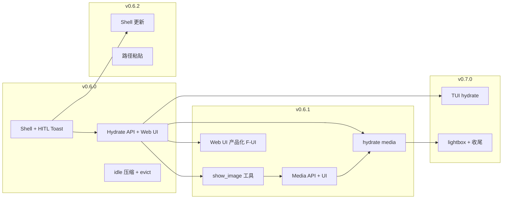

# v0.6 – v0.7 开发路径（总览）

**状态（2026-07）**：**`v0.6.0` 已发布**；**`v0.6.1` 已合入 dev**（待 Smoke / tag）；当前开发 **`v0.6.2`**（桌面体验 + Shell 自更新）。  
**基线**：**`v0.6.0`**（Windows Desktop Shell 闭环）。

本页为 **跨专题总路线图**；细节见：

| 专题 | 文档 |
|------|------|
| Windows Desktop Shell + Hydrate | [windows-desktop-shell.md](./windows-desktop-shell.md) |
| 图片 / `show_image` + Media API | [node-ui-media-display.md](./node-ui-media-display.md) |
| **Web UI 产品化重构** | [web-ui-redesign-v0.6.1.md](./web-ui-redesign-v0.6.1.md) |
| Shell 安装态更新 | [release-update-hub.md §10](./release-update-hub.md#10-windows-shell-路径例外) |

---

## 1. 版本主题一览

| 版本 | 主题 | 用户可感知价值 |
|------|------|----------------|
| **v0.6.0** | **Windows 默认 Client 闭环** | 自启 Shell、HITL Toast、Hydrate、idle 卸内存、可安装 |
| **v0.6.1** | **产品化 UI + 看图** | 聊天式布局、工具摘要、设置入口、截图/图片、Triggers 启停 |
| **v0.6.2** | **桌面体验 + 自更新** | 路径粘贴、Shell 检查/应用更新、Toast 抑制优化 |
| **v0.7.0** | **跨端与体验收尾** | TUI hydrate、图片 lightbox、Node update 迁移完成、A2A hydrate |

```text
v0.5.5 ──► v0.6.0 ──► v0.6.1 ──► v0.6.2 ──► v0.7.0
           Shell+HITL   UI重构+     更新+路径    TUI+ polish
           Hydrate      show_image   paste
           idle evict   + media
```

---

## 2. v0.6.0 — Windows Desktop Shell（Git tag `v0.6.0`）

**目标**：未开 Web UI 时也能收到 HITL 通知；打开 UI 可恢复历史与待办；长期 idle 会话不占内存。

### 2.1 必达功能 ID

| 轨道 | 功能 ID |
|------|---------|
| Shell 生命周期 | F-L1–5, **F-L8–L10, L12–L13, L15** |
| SSE / 待办 | F-E1–E4, **F-E10–E13** |
| 通知 / 打开 UI | F-N1–N3, **F-N10**, F-U1–U3 |
| Hydrate | **F-H1–H2, H7–H9, H12, H14, H17**, F-X1, F-X6 |
| Idle 维护 | **F-NM1–NM5, NM7** |
| 安装发布 | F-I1, F-I3, **F-I8–I10**, F-I2 |

完整说明：[windows-desktop-shell.md §4.1](./windows-desktop-shell.md#41-v060-发布范围)

### 2.2 实现顺序（8 步）

```text
① F-L15/L8/I8          dagents-shell.exe + Node 单实例 + CI
② F-L9–L10/L12–L13     ensure/stop Node、Shell 单实例、crash 恢复
③ F-H1/H2/H14          GET /hydrate + MessagesToTranscriptEntries
④ F-H7–H9/H17/X6       Web UI hydrate + evicted session
⑤ F-E1–E4/E10–E13      Shell SSE、待办表（含未读回复）、鉴权
⑥ F-N1–N3/N10/U1–U3    Toast + 托盘图标态 + 深链
⑦ F-NM1–NM5/NM7        idle 压缩 + Release
⑧ F-I1–I3/I2/I9–I10    Inno + 自启 + dagents.cmd shell
```

### 2.3 明确不含

- `show_image` / Media API（→ **v0.6.1**）
- Shell 更新 orchestrator 完整实现（→ **v0.6.2**；可先 stop/start 走 Shell）
- 路径粘贴 F-P*（→ **v0.6.2**）

### 2.4 Smoke 验收

完整检查表（含命令与记录模板）：[`v0.6.0-smoke-checklist.md`](./v0.6.0-smoke-checklist.md)

1. 安装 → 登录 → Shell 自启 → Node health OK  
2. UI 关闭时 HITL → 一条 Toast → 点击 → transcript + pending 可 resume  
3. UI 关闭时 Agent **正常回复完成** → Shell 待办 + **托盘图标特殊效果**（F-E13 / F-N10）  
4. 手工开 UI 处理 HITL / **阅读回复** → Shell 待办消除  
5. 退出 Shell → Node 停止；二次启动仅一个 Shell  
6. idle session 压缩 + 卸内存 → 再打开 Create + hydrate 正常  

---

## 3. v0.6.1 — 产品化 Web UI + 图片展示（Git tag `v0.6.1`）

**目标 persona**：**Windows 普通桌面用户**（Shell 安装 → Toast → Web UI）。  
**交付**：**「能看图的产品化 UI 1.0」** — 聊天优先布局 + Media + 关键 bugfix + Triggers 编辑/启停。

详见 [web-ui-redesign-v0.6.1.md](./web-ui-redesign-v0.6.1.md) 与 [node-ui-media-display.md](./node-ui-media-display.md)。

### 3.1 功能 ID

#### Media 轨道

| ID | 内容 |
|----|------|
| **F-M0** | 新工具 **`show_image`**（path + 可选 caption，policy auto） |
| **F-M1** | `MediaRegistry` + `GET /v1/sessions/{id}/media/{media_id}` |
| **F-M2** | `show_image` / `browser_*` / `read_image` 注册 + SSE `media[]` |
| **F-M3** | Web UI：`ImageResultPreview` + 工具/消息 media 渲染 |
| **F-M4** | Hydrate transcript 含 `media`（依赖 v0.6.0 的 F-H14） |
| **F-M5** | 用户发图落盘 + Hydrate 回放 |
| **F-H10** | 浏览器 F5 后 hydrate |
| **F-H11** | Context 迁入诊断/高级；与主 transcript 分工 |

#### UI 重构轨道（F-UI*）

| ID | 内容 |
|----|------|
| **F-UI0a–d** | SSE 旁路订阅、UserInfo 选项修复、会话未读 badge、deferred 可见 |
| **F-UI1** | **vue-router**：`/chat/:sessionId`、`/settings/*` |
| **F-UI2** | 三栏布局；**可折叠「诊断」**（替代常驻 Runtime 面板） |
| **F-UI3** | 产品化顶栏（连接点、设置、帮助） |
| **F-UI4** | 设置导航：通用 / 技能 / 定时任务 / 安全 / 关于 |
| **F-UI5** | Composer 简化；**Enter 发送 / Shift+Enter 换行** |
| **F-UI6** | 工具 **一行摘要 + 点击展开详情** |
| **F-UI7** | 活动记录折叠；system/compression 降级 |
| **F-UI8** | HITL sticky + 会话待审批 badge |
| **F-UI9** | 图片 lightbox（自 v0.7 F-M7 提前） |
| **F-UI10** | Triggers：**编辑、启用、禁用、新建、删除**（**不含**手动 fire） |
| **F-UI11** | 子 Agent 列表 + **cancel** |
| **F-UI12** | 主路径文案中文化；JSON 仅诊断/高级 |
| **F-UI13** | CSS 拆分（tokens / layout / components） |

### 3.2 实现顺序

```text
Phase 0   F-UI0*              旁路 SSE + UserInfo + 未读
Phase 1   F-M1                MediaRegistry + GET API
Phase 2   F-UI1–3             router + 布局 + 顶栏 + 诊断
Phase 3   F-M0/M2/M3 + F-UI6  Media + 工具摘要行 + 图片
Phase 4   F-UI4/5/8           设置 + Composer + HITL sticky
Phase 5   F-M4/M5 + F-H10     hydrate media + 用户图 + F5
Phase 6   F-UI10/11           Triggers + 子 Agent cancel
Phase 7   F-UI7/9/12/13       活动记录、lightbox、文案、CSS
```

### 3.3 依赖

- **硬依赖 v0.6.0**：F-H14、F-H7–H9、F-E13（ack / has_unread）  
- **无 Shell 依赖**：Media 与 UI 仍 Node ↔ Web UI 直连  

### 3.4 明确不含

- Triggers **手动 fire**、执行 history  
- Policy 新建规则向导、Manage 上传表单 UI  
- 暗色主题完整落地（→ v0.6.2 可选 F-UI15）  
- Shell 一键更新（→ v0.6.2）

### 3.5 验收

完整 Smoke 见 [`v0.6.1-smoke-checklist.md`](./v0.6.1-smoke-checklist.md)（摘要见 [web-ui-redesign-v0.6.1.md §10](./web-ui-redesign-v0.6.1.md#10-验收smoke-扩展tag-v061)）。

1. 两栏布局无 SSE/API 常驻；顶栏连接 + 设置  
2. 工具一行摘要，可展开；Enter 发送；hydrate 工具行合并  
3. `show_image` / browser 截图 + lightbox；F5 后仍在  
4. 会话未读/待审批 badge；UserInfo 选项正确  
5. trigger 旁路 deferred 消息可见  
6. 设置 › 定时任务：编辑、禁用、启用（无「立即运行」）  
7. 深链 `?session=` 与 `/chat/:id` 均可用  
8. 设置：思考过程、子 Agent 取消、上下文  

**v0.6.1 功能开发已完成**；打 tag 前跑上述 Smoke。

---

## 4. v0.6.2 — 桌面体验 + 自更新（Git tag `v0.6.2`）

**目标**：Windows 桌面能力补全；Shell 接管版本检查与应用更新。

### 4.1 功能 ID

| 轨道 | ID |
|------|-----|
| 路径粘贴 | F-P1–P3, F-X4 |
| UI focus | F-E9, F-U4, F-X5, F-H13 |
| Shell 更新 | F-U5–U6, F-N9, F-I11–I12, F-ND1, F-X8 |
| 通知增强 | F-N4, F-N8 |
| 文档 | F-I7 |
| 可选 | F-L11（退出确认） |

### 4.2 实现顺序

```text
① F-ND1                Node upgrade-readiness
② F-I11 + F-U5         shared/update + Shell poll Manage
③ F-U6 + F-I12         apply orchestration + dagents.cmd update → Shell
④ F-N9 + F-X8          Toast 新版本 + Web UI Update 面板
⑤ F-P1–P3 + F-X4       剪贴板/拖入路径 + Shell localhost API
⑥ F-E9 / F-X5 / F-H13  focus 抑制 Toast（可选加速）
```

### 4.3 验收

1. Manage 有新版本 → Shell Toast / 托盘提示 → 确认后升级成功重启  
2. Web UI 输入框粘贴资源管理器文件 → 绝对路径入框  
3. 已打开某 session UI 时不再弹该 session 新 HITL Toast（F-E9）  

---

## 5. v0.7.0 — 跨端与体验收尾（Git tag `v0.7.0`）

**目标**：TUI 与 Web 能力对齐；图片与更新链路收尾；运维体验。

### 5.1 功能 ID

| 轨道 | ID |
|------|-----|
| Media 体验 | F-M6（thumbnail）, F-M7（lightbox）, F-M8（TUI path 提示） |
| Hydrate 扩展 | F-H4（A2A relay pending）, F-H5–H6（Go/Python TUI hydrate） |
| 更新收尾 | F-ND2（Windows 下线 Node `/v1/agent/update`） |
| Shell 运维 | F-I5（shell.log）, F-E5（sessions 轮询兜底） |
| 其它 | F-P4–P5, F-N6, F-E7, F-S*, F-L6 |

### 5.2 实现顺序

```text
① F-H5–H6              TUI hydrate（复用 /hydrate API）
② F-M6–M7              缩略图 + lightbox
③ F-ND2                Node update deprecated（Windows+Shell）
④ F-H4                 A2A relay hydrate
⑤ F-E5 / F-I5 / 余项   运维与可选增强
```

### 5.3 验收

1. Go TUI / Python TUI 切换 session 后可 hydrate 历史 + HITL  
2. Windows 默认安装：`dagents version --check` 经 Shell，不再依赖 Node UpdateChecker  
3. 大图工具结果可 lightbox 全屏查看  

---

## 6. 跨版本依赖图



---

## 7. 并行开发建议（人力 ≥2 时）

| 泳道 A | 泳道 B |
|--------|--------|
| v0.6.0 Shell（desktop/shell） | v0.6.0 Hydrate（node API + webui） |
| v0.6.0 idle Release | v0.6.0 安装包 / CI |
| v0.6.1 可在 v0.6.0 ③ 完成后启动 | v0.6.1 UI 骨架（F-UI1–3）可与 Media Node 并行 |

**合并门槛**：每版本 tag 前跑 §2.4 / §3.4 / §4.3 / §5.3 对应 Smoke。

---

## 8. 变更记录

| 日期 | 变更 |
|------|------|
| 2026-07 | 初稿：v0.6.0–v0.7.0 四段路径；纳入 show_image（F-M0）于 v0.6.1 |
| 2026-07 | **`v0.6.0` 发布**；Smoke 清单见 [`v0.6.0-smoke-checklist.md`](./v0.6.0-smoke-checklist.md) |
| 2026-07 | F-I1/I3/I8–I10：Windows 安装包含 Shell、登录自启、`dagents.cmd shell` |
| 2026-07 | **v0.6.1 功能开发完成**；Smoke 清单见 [`v0.6.1-smoke-checklist.md`](./v0.6.1-smoke-checklist.md) |
