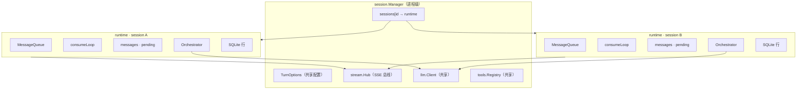
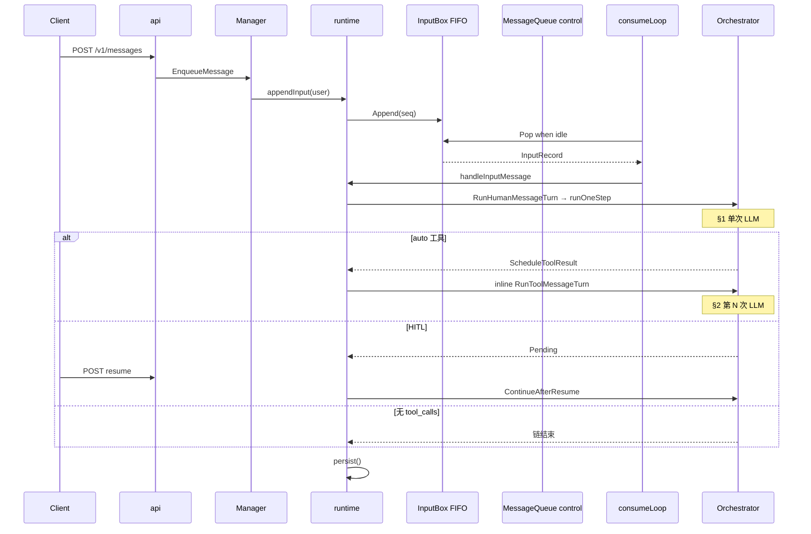

# 02 · Agent Node 核心

> **当前实现说明（2026-08）**：本章早期示例中的 `setState`、`toolLoopCount` 和 runtime `pending` 是历史写法。当前实现由 `turn.TurnCoordinator` 维护 Turn/Step 生命周期，`TurnExecutionContext` 向 Orchestrator 提供 StepIndex；旧字段仅保留为持久化迁移和 API 兼容镜像。迁移过程记录见 [`turn-step-runtime-implementation-status.md`](../archive/reports/turn-step-runtime-implementation-status.md)。

## 本章回答什么问题

读完本章，你应能（**按推荐顺序**）：

1. 跟读 **一次 LLM 调用**（`runOneStep`）里发生了什么  
2. 理解 **多步 LLM loop** 如何把多次调用串成一条 user 消息的处理链  
3. 说明 **多种消息来源** 如何经 **队列** 进入同一 session 的 consumer  
4. 解释 **session 隔离**：多 session 并存时，哪些状态共享、哪些独占  

---

## 阅读地图

Agent Node 运行时由外向内四层；**本章正文按「单次 → 循环 → 队列 → session」展开**，与代码认知顺序一致：

```text
§4 Session 隔离     Manager → runtime × N（每 session 独占队列 + history + orch）
       ↑
§3 队列与消息来源   consumeLoop 出队 → 调用 §2 的入口
       ↑
§2 LLM Loop         RunHumanMessageTurn / RunToolMessageTurn → 多次 §1
       ↑
§1 单次 LLM 调用    runOneStep → StreamChat → 可选 processToolCalls
```

进程装配（`main` → `api.NewServer`）见 **§4.5**；SSE Hub 见 **§4.6**；端到端时序见 **§5**。

---

## 1. 单次 LLM 调用

### 1.1 「一步」是什么

Node 里 **一步（one step）** = **一次** `llm.StreamChat` 请求 + 将其结果写入 `history` + **同步**处理本步产生的 `tool_calls`（执行、挂起 HITL，或调度下一步）。

**唯一入口**：`turn.Orchestrator.runOneStep`（`node/internal/turn/orchestrator.go`）。

上层 API（`RunHumanMessageTurn`、`RunToolMessageTurn`）最终都调用 `runOneStep`；差别在于**进这一步之前**是否往 `history` 追加 user 消息。

| 调用方 | 方法 | 进入 `runOneStep` 前 |
|--------|------|----------------------|
| 新 user 消息 | `RunHumanMessageTurn` | `appendHistory(user)` |
| 工具批已闭合 | `RunToolMessageTurn` | history 已含 `tool` 结果，不追加 user |
| HITL resume 后 | `ContinueAfterResume` | 写入审批/用户输入对应的 `tool` 消息后再 `RunToolMessageTurn` |

### 1.2 跟读 `runOneStep`（建议打开 `orchestrator.go` 对照）

```text
runOneStep(ctx, sessionID, history)
  │
  ├─ RepairUnrespondedToolCalls          // 修复 orphan tool_calls
  ├─ 从 TurnExecutionContext 读取 StepIndex
  ├─ Coordinator 检查 Step / budget / generation
  │
  ├─ buildSystemPrompt(sessionID)        → prompt.go
  ├─ ToolDefinitions() + ContextInjections()
  ├─ llm.StreamChat(system + context + history + tools)
  │     OnDelta            → SSE assistant
  │     OnReasoningDelta   → SSE reasoning
  │     OnToolCallDelta    → SSE tool_call（流式参数）
  │     OnUsage            → SSE usage（累计）
  │
  ├─ 错误 / cancel → persistCancelledStream、turn_finished、return Err
  │
  ├─ appendHistory(assistant)            // 整段 assistant 落库
  │
  ├─ len(ToolCalls)==0 ?
  │     └─ publishTurnFinished(stop)     → SSE turn_finished，return
  │
  └─ Coordinator 更新工具/交互状态
        processToolCalls                 → tool_router.go
          ├─ auto      → Execute，SSE tool_result
          ├─ HITL       → PendingHITL.Items[]，SSE hitl_required
          │               （ask_user + approval 同批；分步 resume）
          └─ childagent → HandleParentTool
        pending ? → turn_state(tool_waiting)，return Pending（可部分 resume 后仍 pending）
        否则 ScheduleToolResult=true，由 runtime 在同一 Turn 链内 inline 续跑
```

**要点**：单次调用结束时，要么 **没有 tool_calls**（模型直接回答），要么 **tool_calls 已在本步内处理完**（auto 执行）或 **挂起**（HITL）；auto 结果由 runtime 通过 `ScheduleToolResult` 在同一 Turn 链内 inline 续跑。

### 1.3 输入：system prompt 与 history

**System prompt**（`turn/prompt.go` → `BuildSystemPrompt`）每步重建，内容保持稳定边界：

1. 静态行为准则（**不含**各工具用法——用法在 tool schema）
2. 工作区目录约定与外部工具目录
3. context boundary 固定的 Skills 元数据（若当前 Agent 启用了 skills）

主机快照、`agent_id` / `session_id`、请求级 prompt context（soul / custom / long_term，用户称呼由 Node 的 `PreferredName` 提供）和已加载 skill 正文，都通过 request-only context 注入，不写入会话历史；旧 `user.md` 仅用于迁移。

**History**：`[]llm.Message`，由 **runtime** 持有；`runOneStep` 通过指针读写，步末由 runtime `applyStepOutcome` 写回。

**Tools**：本步可见的 function 列表来自 `Registry.Definitions()`；启用 skills 后会提供 `list_available_skills` 实时发现入口，模型再按需调用 `load_skills`，见 [04 §4.3](./04-能力与策略.md)。

### 1.4 流式与 SSE

流式阶段 `setState(StateModelStreaming)`。Hub 按 `session_id` 发布（见 §4.6）：

| 阶段 | SSE 事件 |
|------|----------|
| 正文流 | `assistant`（`display_type: delta`） |
| 推理流 | `reasoning` |
| 工具参数流 | `tool_call`（partial） |
| 用量 | `usage` |
| 本步结束 | `turn_finished`（终态；见 [附录/SSE事件速查](./附录/SSE事件速查.md)） |

Cancel：`context.Canceled` → `cancel_partial.go` 保留部分 assistant，补占位 `tool` 消息，再 `turn_finished(cancelled)`。

### 1.5 本步内的工具处理（预告）

`processToolCalls`（`tool_router.go`）在 **同一步** 内同步跑完 **auto** 工具批；需要人介入则返回 `PendingHITL`，**不会**在同一步内再次调用 LLM。

**下一步 LLM 调用** 属于 §2 的 loop——由 runtime 在同一 Turn 链内调用 `RunToolMessageTurn`，history 已闭合 `assistant(tool_calls) → tool(s)`。

### 1.6 源码索引（§1）

| 概念 | 文件 |
|------|------|
| 单步主函数 | `turn/orchestrator.go` → `runOneStep` |
| System prompt | `turn/prompt.go` |
| 工具分流 | `turn/tool_router.go` → `processToolCalls` |
| 流式 cancel | `turn/cancel_partial.go` |
| LLM 客户端 | `llm/client.go`、`llm/adapter*.go` |
| 步结果类型 | `turn/step.go` → `StepOutcome` |

---

## 2. 将单次 LLM 调用组合成 LLM Loop

### 2.1 为什么需要 loop

用户发一句「查日志并重启服务」，模型往往 **多次** 调用工具，每次工具结果又要 **再问一次模型**。  
因此：**一条 user 消息** 对应 **多步** `runOneStep`，直到：

- 某步 **无 tool_calls**（自然结束），或  
- **HITL 暂停**（审批 / `ask_user_information`），或  
- **出错 / cancel / 超循环上限**。

### 2.2 `StepOutcome`：一步的四种去向

**文件**：`turn/step.go`

```go
type StepOutcome struct {
    Pending            *PendingHITL   // 非 nil → 链暂停，等 resume
    StepIndex          int            // 当前 Turn 内的 Step 序号
    ScheduleToolResult bool           // true → runtime 在同一 Turn 链内 inline RunToolMessageTurn
    Err                error
}
```

| Outcome | 含义 | 下一步 |
|---------|------|--------|
| 无 Pending，无 Schedule，无 Err | 本步模型已给出最终回答 | `turn_finished(turn_complete=true)`，链结束 |
| `Pending != nil` | HITL | Client `resume` → §3 → `ContinueAfterResume` |
| `ScheduleToolResult` | auto 工具已执行，history 已闭合 | inline `RunToolMessageTurn` → 又一次 §1 |
| `Err != nil` | LLM/工具/cancel/超限 | `turn_finished` + 持久化，链结束 |

### 2.3 生产路径：单步执行 + Turn 链内续跑

**生产环境**（`runtime` + `consumeLoop`）每次只跑一步 Orchestrator API；工具结果返回后由 runtime 在同一个逻辑 Turn 内 inline 续跑：

```text
handleInputMessage
  → runTurnStep → RunHumanMessageTurn → runOneStep        // 第 1 次 LLM
  → ScheduleToolResult ?
        → runTurnStep → RunToolMessageTurn → runOneStep   // 第 2 次 LLM
  → … 直到无 ScheduleToolResult
```

`runTurnStep`（`session/runtime_turn.go`）是 runtime 侧脚手架：

- 可选步前 **压缩**（`compression.MaybeHandle`，仅父 session）  
- 设置当前 Step 的执行 context 与 `turnCancel`
- 调用传入的 `run` 闭包（内部是 `RunHumanMessageTurn` 等）  
- 步末由 Coordinator 写入 Step/Turn 终态

### 2.4 测试路径：内联多步

单测在 `orchestrator_test.go` 用 **`runMessageTurnInline`**（`RunHumanMessageTurn` + `RunToolMessageTurn` 循环）在 **同一 goroutine** 内跑完工具链，与生产 runtime 的 inline Turn 链一致。

读源码时：生产 turn 由 runtime 在当前 Turn 链内 inline 调用 `RunToolMessageTurn`；控制队列仅承载 resume、异步事实与恢复 continuation。

### 2.5 HITL 打断与 resume

| 场景 | 行为 |
|------|------|
| 新 user 消息到达且存在 `pending` | 进入 InputBox FIFO，保持 pending；不会自动打断当前链 |
| 审批 / 用户输入 | `handleResume` → `ContinueAfterResume`：写 `tool` 结果，`ScheduleToolResult` 或继续 loop |
| `turn_finished` 与 HITL | HITL 暂停时不发送 `turn_finished`；resume 后续跑，最终终态时再发送 |

**文件**：`turn/pending.go`、`session/runtime.go` → `handleResume`；Client 载荷见 [03 §2.3](./03-API与Client.md)。

### 2.6 Loop 上限与计数

- `StepIndex`：当前 Turn 内的 Step 序号，由 Coordinator 分配并通过 `TurnExecutionContext` 传递。
- 新 `handleHumanMessage` 时创建新的 Turn；不再由 runtime 归零和递增独立计数器。
- 超过 `maxToolLoops`（默认见 Agent `defaults.llm.max_tool_loops`，新建缺省 32）→ 对后续 tool_calls 写入 soft `tool` 结果（提示给出结论并询问是否继续），链以正常 `turn_finished` 结束；下一条 user 消息会重置计数。

### 2.7 源码索引（§2）

| 概念 | 文件 |
|------|------|
| Human / Tool 步入口 | `orchestrator.go` → `RunHumanMessageTurn`、`RunToolMessageTurn` |
| 单测内联多步 | `orchestrator_test.go` → `runMessageTurnInline` |
| Resume | `orchestrator.go` → `ContinueAfterResume` |
| runtime 脚手架 | `session/runtime_turn.go` → `runTurnStep` |
| 应用 outcome | `session/runtime.go` → `runInlineToolContinuationChain`、`finishTurnIdle` |
| HITL 状态 | `turn/pending.go` |

---

## 3. 多消息来源与队列设计

### 3.1 为什么需要队列

同一 session 上，turn 的触发来源 **不只** Client 的 user 消息：

| 来源 | 说明 |
|------|------|
| **Client** | `POST /v1/messages`（`request_type: message`） |
| **HITL resume** | `POST /v1/messages`（`request_type: resume`） |
| **工具续跑** | Orchestrator 返回 `ScheduleToolResult`，runtime 在同一 Turn 链内 inline 续跑 |
| **异步工具** | 后台 job 完成 → `async_tool_result` |
| **Trigger** | 调度器 fire → InputBox FIFO（`TriggerID` + `UserName=trigger`） |

外部输入需要稳定的 FIFO，并且在 pending HITL 时不能抢占当前 Turn；因此采用 **每 session 一个 `InputBox` + 一个控制 `MessageQueue` + 单 goroutine `consumeLoop`**。InputBox 只负责 user/trigger/A2A 的顺序与缓存，resume 和异步事实仍由控制队列驱动。

### 3.2 队列模型

**路径**：`node/internal/queue/`

```text
InputBox.Append(InputRecord) ──► FIFO seq ──► Pop when idle ──► consumeLoop
MessageQueue.Enqueue(control) ──► priority ──► Dequeue(ctx) ──► consumeLoop
```

- **无内嵌 consumer**：队列只负责存与取；**谁消费** 是 runtime 的 `consumeLoop`。  
- **FIFO 同优先级**；`seq` 单调递增。  
- `Dequeue` 阻塞直到有项或 ctx 取消。

### 3.3 `Envelope` 与 `RequestType`

**文件**：`queue/envelope.go`

| `RequestType` | 常量 | 典型来源 | consume 处理 |
|---------------|------|----------|--------------|
| `message` | `RequestTypeMessage` | Client user（兼容 envelope） | InputBox → `handleInputMessage` |
| `resume` | `RequestTypeResume` | Client HITL 提交 | `handleResume` |
| `async_tool_result` | `RequestTypeAsyncToolResult` | 后台 job | `handleSideEffectProduceAsync`（Produce） |
| `turn_continuation` | `RequestTypeTurnContinuation` | 恢复/重启补偿 | `handleTurnContinuation` |
| `side_effect_continue` | `RequestTypeSideEffectContinue` | Apply 后被动续跑 | `handleSideEffectContinue` |

`Envelope` 还携带：`Content`、`UserName`（trigger 等可非 human）、`ResumeValue`、`TriggerID`、`AsyncToolResult` 等。

### 3.4 优先级

出队顺序（数值越小越优先；同档 FIFO 按 `seq`）：

```text
turn_continuation / side_effect_continue > resume > async_completion > other
```

| 档位 | 整数值 | 典型 `request_type` |
|------|--------|---------------------|
| `continuation` | -1 | `turn_continuation` / `side_effect_continue` |
| InputBox | — | user / trigger / A2A，按 session seq FIFO |
| `resume` | 1 | `resume` |
| `async_completion` | 2 | `async_tool_result` |
| `other` | 10 | 预留 |

**设计意图**（与 `node/internal/queue/queue.go` → `priorityValue` 一致）：

1. **`continuation` 最高**：恢复或旁路 Apply 后尽快续跑；同步工具结果已经在当前 Turn 链内 inline 处理。
2. **InputBox 与控制队列分离**：新 user message 不参与 resume 的优先级竞争；pending HITL 时只留在 InputBox，显式 `CancelTurn` 或有效 `resume` 结束当前链后再消费。
3. **`resume` 高于 `async_completion` / `other`**：HITL 提交优先于后台 job 回灌。
4. **InputBox 不参与控制队列优先级**：普通输入在活动 Turn（包括 pending HITL）期间只缓存，显式 cancel 或有效 resume 后按 FIFO 消费。
5. **`other` 最低**：仅作预留。

### 3.5 `consumeLoop` 分流

**文件**：`session/runtime.go`

```text
consumeLoop(ctx)
  if control queue non-empty:
    env := queue.Dequeue(ctx) → resume / async / continuation / side-effect
  else if turn idle and InputBox non-empty:
    record := InputBox.Pop() → handleInputMessage
  else:
    wait for either wake signal
```
旁路条目 **Produce 时**不改 history；**Apply** 在 `runTurnStep` 步首或 `side_effect_continue` 前写入。InputBox trigger 在被消费并进入 `handleInputMessage` 后清除 pending delivery。

**串行保证**：同一 session 上任意时刻只有一个 handler 在跑；不会出现两个 `runOneStep` 并发写同一 `history`。

### 3.6 队列与 Orchestrator 的分工

| 层 | 职责 | 不负责 |
|----|------|--------|
| **InputBox** | 外部输入的 session seq/FIFO；pending 期间缓存 | 调 LLM、执行工具、resume |
| **MessageQueue** | 控制项何时处理；resume/异步事实/恢复项优先级 | 调 LLM、执行工具、外部输入排序 |
| **Orchestrator** | **这一步**跑什么（§1 单次调用） | 消费队列、session CRUD |
| **runtime** | 拥有 queue + orch + history；`consumeLoop` 桥接二者 | 进程级 session 表（Manager） |

工具结果由 runtime 在当前 Turn 内 inline 调用下一个 Step；只有恢复状态需要补偿时，才使用 `turn_continuation` 控制事件。

### 3.7 从 HTTP 到队列（Client 路径）

```text
POST /v1/messages
  → api/messages.go
  → Manager.EnqueueMessage(sessionID, content, …)
  → runtime.appendInput(InputRecord{Kind: user})
  → InputBox FIFO → consumeLoop（idle 时 Pop）→ handleInputMessage → §2
```

`POST resume` 同理，优先级 `PriorityResume`。

### 3.8 源码索引（§3）

| 概念 | 文件 |
|------|------|
| 队列实现 | `queue/queue.go` |
| 入队类型 | `queue/envelope.go` |
| Consumer | `session/runtime.go` → `consumeLoop`、各 `handle*` |
| 入队 API | `session/manager.go` → `EnqueueMessage`、`EnqueueResume` |
| HTTP 入口 | `api/messages.go`、`api/resume.go` |
| Trigger 入队 | `session/triggers.go` → `EnqueueTriggerMessage` |

---

## 4. 会话隔离（Session）
### 4.1 Session 是什么

**Session** = 一条独立对话上下文 + 其 **runtime**（队列 consumer + 内存状态 + Orchestrator 实例 + 可选 SQLite 行）。

**Manager**（`session/manager.go`）维护 `sessions map[string]*runtime`；对外 CRUD、入队、skills、子 Agent spawn。



### 4.2 每 session 独占 vs 进程共享

| 独占（每 runtime） | 共享（Manager 注入） |
|--------------------|----------------------|
| `MessageQueue` | `llm.Client` |
| `consumeLoop` goroutine | `tools.Registry` / `policy.Engine` |
| `messages`、Coordinator 生命周期投影 | `stream.Hub`（事件带 `session_id`） |
| `turn.Orchestrator` 实例 | `TurnOptions`（FS 根、压缩阈值等） |
| 父 session：`SQLiteStore` 持久化 | `agent_id`（单进程单 id） |

**隔离效果**：session A 的队列与 history **不会**被 session B 的入队直接修改；SSE 订阅方可按 `session_id` 过滤（Client 实现见 [03](./03-API与Client.md)）。

### 4.3 runtime 构造与生命周期

**父 session**：`Manager.Create` → `newRuntime` → `newRuntimeWithPublisher`

```text
newRuntimeWithPublisher
  ├─ queue.NewMessageQueue()
  ├─ compression.Coordinator（父 session）
  ├─ orch = turn.NewOrchestrator(..., hub, llm, tools, policy, ...)
  ├─ runtime inline tool continuation（恢复时使用 turn_continuation）
  ├─ orch.SetChildAgentManager(childMgr)          // 父 session
  ├─ orch.SetChildSession(true)                   // 子 session
  └─ go consumeLoop(ctx)
```

**删除**：`Manager.Delete` → 取消 ctx、关闭 queue、从 map 移除。

**恢复**：启动时 `store` 加载 messages / loadedSkills → 新建 runtime。

### 4.4 父 session 与临时子 Agent

子 Agent 是 **同一 Manager 下的另一条 runtime**，不是新进程、新端口：

| 项 | 父 session | 子 session（临时 Agent） |
|----|------------|--------------------------|
| 创建 | `Manager.Create` | `SpawnChild` |
| SSE | `*stream.Hub` | `*childagent.RelayHub` → 父 `session_id` |
| 工具 | 完整 `Registry` | `RestrictedRegistry` 白名单 |
| SQLite | 有 | `nil`（不持久化） |
| 压缩 | 有 | **跳过** |
| 队列 / consumeLoop | 有 | 有（**独立** queue 与 history） |

子 session 仍有 **完整 §1–§3 语义**，但事件 **relay** 到父 session 供 Client 展示；终态 `tryCompleteChildIfIdle` → `OnChildSettled`。

**跟读**：`manager_child.go`、`runtime_child.go`、`childagent/`。

### 4.5 进程启动与装配

**入口**：`node/cmd/dagents-node/main.go` → `api.NewServer`

| 步骤 | 对象 | 与 session 关系 |
|------|------|-----------------|
| `stream.NewHub()` | SSE 总线 | 所有 Agent 共用，按 id 区分 |
| `store.OpenSQLite` | 持久化 | 按 Agent 存 messages |
| `session.NewManager(...)` | Agent 运行时表 | 创建 §4 中 runtime |

路由：`api/server.go` → `registerRoutes`。

### 4.6 SSE Hub 与 agent 维度

**文件**：`stream/hub.go`

- Manager 级 **单例** Hub；Orchestrator 经 `stream.Publisher` 发布。  
- 每条事件带 Agent 维度 id，Web UI 只展示当前 Agent。  
- `Subscribe(afterSeq)`：断点续传。

### 4.7 源码索引（§4）

| 概念 | 文件 |
|------|------|
| Manager | `session/manager.go` |
| runtime | `session/runtime.go` |
| 持久化 | `store/` |
| 子 Agent | `session/manager_child.go`、`runtime_child.go` |
| Hub | `stream/hub.go` |
| 进程入口 | `cmd/dagents-node/main.go`、`api/server.go` |

模块 REFERENCE：`session/REFERENCE.md`、`turn/REFERENCE.md`

---

## 5. 端到端时序（串起 §1–§4）



### 5.1 建议跟读顺序

1. `turn/orchestrator.go` → `runOneStep`（**§1**）  
2. `turn/orchestrator.go` → `RunHumanMessageTurn`、`RunToolMessageTurn`（**§2**）  
3. `session/runtime.go` → `consumeLoop`、`handleInputMessage`、`handleResume`（**§3**）
4. `session/input_box.go`、`queue/queue.go`、`queue/envelope.go`（**§3**）
5. `session/manager.go`、`runtime.go` → `newRuntimeWithPublisher`（**§4**）  
6. `turn/tool_router.go` → `processToolCalls`（§1 工具分支）  
7. `api/messages.go`（HTTP → 队列）

### 5.2 相关测试

```bash
go test ./node/internal/session/... ./node/internal/turn/... ./node/internal/queue/... -count=1
```

---

## 6. 下一章

→ [03-API与Client](./03-API与Client.md)：HTTP/SSE 契约、HITL resume 载荷、双 Client 与转录展示。
