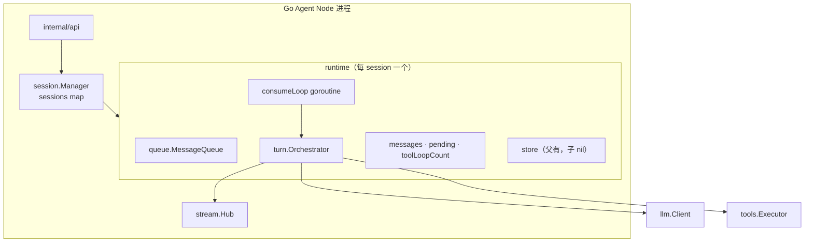
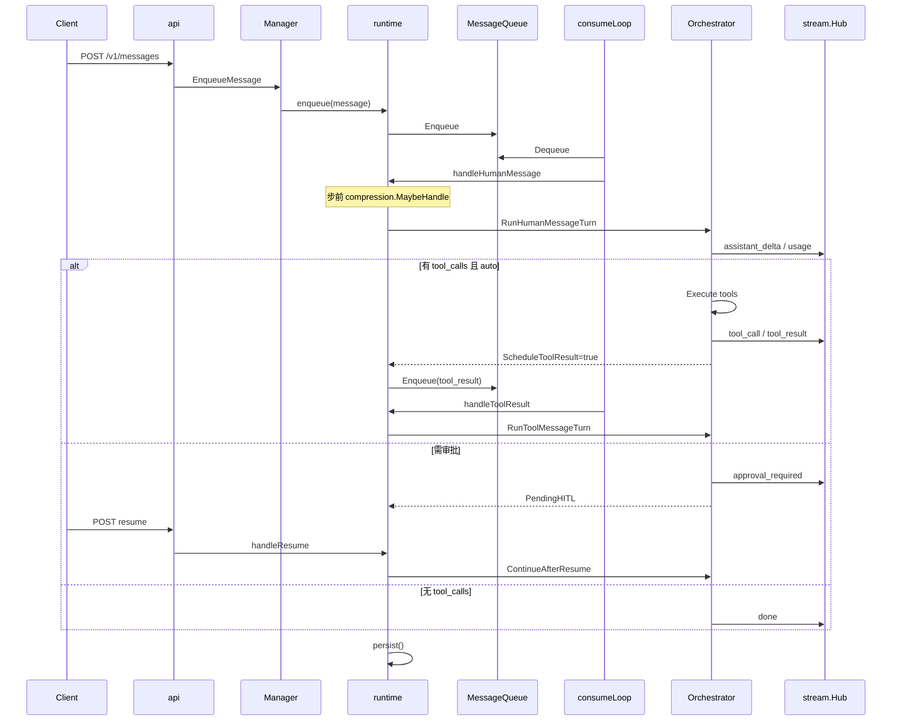

# 02 · Agent Node 核心

## 本章回答什么问题

读完本章，你应能：

- 从 `main.go` 跟到 `api.NewServer` 的装配链  
- 解释 Manager、runtime、MessageQueue、Orchestrator 的**拥有关系**与调用方向  
- 跟读一条 user 消息从 `POST /v1/messages` 到 `done` SSE 的完整路径  
- 区分父 session 与子 Agent runtime 的差异  
- 打开 `runtime.go`、`orchestrator.go`、`tool_router.go` 时知道当前在哪个阶段  

---

## 1. 进程启动与装配

### 1.1 入口

**文件**：`node/cmd/dagents-node/main.go`

```text
ResolveConfigPath → config.LoadFile → logx.NewLogger
  → api.NewServer(cfg, logger) → ListenAndServe(ctx)
```

信号：`SIGINT` / `SIGTERM` → `context` 取消 → 优雅关闭。

### 1.2 `api.NewServer` 装配顺序

**文件**：`node/internal/api/server.go`（`NewServer` 函数体）

| 步骤 | 创建对象 | 用途 |
|------|----------|------|
| 1 | `stream.NewHub()` | 进程级 SSE 总线 |
| 2 | `store.OpenSQLite(...)` | 会话持久化 |
| 3 | `llm.NewClient(...)` | 模型调用 |
| 4 | `tools.NewRegistry(...)` | 内置工具 + A2A |
| 5 | `policy.NewEngine(...)` | `.runtime/policy/*.approval.txt` |
| 6 | `session.NewManager(...)` | 会话表 + TurnOptions |
| 7 | `triggers.NewScheduler(...)` | 定时/日历触发 |
| 8 | `manage.NewRegistrar(...)` | Manage 注册/心跳 |
| 9 | `manage.NewInboxPoller(...)` | A2A inbox long poll |
| 10 | `session.NewA2ACallerHITLBridge(...)` | caller 侧 A2A 审批中继 |

`Manager` 构造时注入：Hub、LLM、Registry、Policy、`TurnOptions`（FS 根、压缩阈值、skills 等）。

### 1.3 源码索引

| 概念 | 文件 |
|------|------|
| HTTP 路由表 | `server.go` → `registerRoutes` |
| 入队 API | `messages.go`、`resume.go` |
| SSE 订阅 | `stream.go`（api 层）→ `stream.Hub` |

---

## 2. 组件层级（谁拥有谁）



**关键**：`runtime` **拥有** `Orchestrator`（字段 `orch`），不是反过来。Orchestrator **不**消费队列；`consumeLoop` 出队后调用 `RunHumanMessageTurn` 等。

---

## 3. session.Manager

**路径**：`node/internal/session/manager.go`

| 职责 | 方法 / 说明 |
|------|-------------|
| 会话 CRUD | `Create`、`Get`、`List`、`Delete` |
| 入队 | `EnqueueMessage`、`EnqueueResume` |
| skills | `LoadSkill`、`ListLoadedSkills` |
| 子 Agent | `SpawnChild`、`StopChild`（`manager_child.go`） |
| 上下文 API | `ContextView`（`context_view.go`） |

`TurnOptions`（Manager 持有，传入每个 runtime）：

| 字段 | 作用 |
|------|------|
| `FSRoot` | 工具沙箱根；prompt 不暴露绝对路径 |
| `MaxToolLoops` | 单条 user 消息内工具步上限（默认 16） |
| `SkillsRoot` / `SkillsEnabled` | skills 目录与 prompt 注入 |
| `CompressionSilent` / `CompressionBlocking` | 压缩 token 阈值 |
| `RuntimeDir` | `prompt_context/` 根 |

---

## 4. runtime 与 consumeLoop

**路径**：`node/internal/session/runtime.go`

### 4.1 构造

- **父**：`Manager.Create` → `newRuntime` → `newRuntimeWithPublisher`
- **子**：`SpawnChild` → `newChildRuntime`（`runtime_child.go`）

`newRuntimeWithPublisher` 内：

1. `skills.Catalog`、`compression.Coordinator`
2. `rt.orch = turn.NewOrchestrator(...)`
3. `rt.orch.SetToolResultEnqueuer(rt.enqueueToolResult)` — **生产路径必须**
4. 启动 `go rt.consumeLoop()`

### 4.2 内存状态（runtime 权威）

| 字段 | 说明 |
|------|------|
| `messages` | OpenAI 格式 history |
| `pending` | `PendingHITL`（approval / user_information） |
| `toolLoopCount` | 当前 user 链上已跑工具步数 |
| `state` | `idle` / `model_streaming` / `awaiting_tool` |
| `loadedSkills` | 已通过 `load_skills` 加载的正文 |

Orchestrator 经 `SkillAccess{Get, Set}` 读写 `loadedSkills`。

### 4.3 出队分流

**文件**：`runtime.go` → `consumeLoop`

| `Envelope.RequestType` | 处理函数 | 说明 |
|------------------------|----------|------|
| `message` | `handleHumanMessage` | 新 user；有 pending 则先 `InterruptPending` |
| `tool_result` | `handleToolResult` | 工具批后续跑 `RunToolMessageTurn` |
| `resume` | `handleResume` | HITL 恢复 → `ContinueAfterResume` |
| `async_tool_result` | `handleAsyncToolResult` | 后台 job 完成回灌 |

### 4.4 步前压缩与持久化

- **父 session**：`handleHumanMessage` / `handleToolResult` **步前** `compression.MaybeHandle`（见 [04 §4.6](./04-能力与策略.md)）
- **步末**：`persist()` 写 SQLite（子 session `store=nil` → no-op）

---

## 5. MessageQueue

**路径**：`node/internal/queue/queue.go`、`envelope.go`

每个 runtime **独占**一个队列；**无内嵌 consumer**（与旧 Python 约定一致）。

### 5.1 优先级

```text
tool_result > resume > human > async_completion > other
```

意图：尽快闭合 `assistant(tool_calls) → tool` 序列。

### 5.2 与 turn 的分工

| 层 | 负责 |
|----|------|
| **Queue** | 何时跑下一步 |
| **Orchestrator** | 这一步跑什么（一步 LLM + 工具批） |

生产路径：**单步执行 + 队列续跑**——一次 `handleHumanMessage` 通常只调一次 `RunHumanMessageTurn`；若 `ScheduleToolResult=true`，入队 `tool_result`，consumer 稍后调 `RunToolMessageTurn`。

---

## 6. turn.Orchestrator

**路径**：`node/internal/turn/orchestrator.go`、`tool_router.go`

### 6.1 公开 API（runtime 调用）

| 方法 | 场景 |
|------|------|
| `RunHumanMessageTurn` | 追加 user 后**单步** |
| `RunToolMessageTurn` | history 已含 tool 结果后**单步** |
| `ContinueAfterResume` | HITL resume 写入 tool 结果并调度续跑 |
| `InterruptPending` | 新 user 打断 pending tool calls |
| `RunMessageTurn` | **仅测试**：内联多步 |

返回 `StepOutcome`：`Pending`、`ScheduleToolResult`、`LoopCount`、`Err`。

### 6.2 单步主路径（`runOneStep`）

跟读顺序：

```text
buildSystemPrompt(sessionID)          → prompt.go
StreamChat(system + history)          → llm.Client
  → SSE: assistant_delta / reasoning / usage
processToolCalls                      → tool_router.go
  ├─ policy auto → executeAutoBatch → tools.Execute
  ├─ approval → PendingHITL → SSE approval_required
  ├─ user_information → SSE user_information_required
  └─ childagent 工具 → childagent.Manager.HandleParentTool
无 tool_calls → SSE done
```

### 6.3 System prompt 拼接

**文件**：`node/internal/turn/prompt.go` → `BuildSystemPrompt`

顺序：

1. `staticSystemPrompt`（行为准则；**不含**各工具用法——在 tool schema）
2. `hostsnapshot` + agent_id / session_id
3. 工作区子目录约定（`data/`、`memory/` 等）
4. `prompt_context` 稳定段（soul / user / long_term）
5. 已加载 skills 正文
6. `custom.md`

skills **目录**不再整段进 system prompt；启用时通过 **`load_skills` 工具 description** 暴露元数据（`Registry.SetSkillsCatalog`）。

### 6.4 HITL 暂停

**文件**：`pending.go`、`approval_payload.go`

`PendingHITL` 挂在 runtime；SSE 推送 `approval_required` 或 `user_information_required`；Client `POST /v1/messages`（`request_type: resume`）→ `handleResume` → `ContinueAfterResume`。

---

## 7. stream.Hub（SSE）

**路径**：`node/internal/stream/hub.go`

| 概念 | 说明 |
|------|------|
| Manager 级单例 | 所有 session 事件经 Hub 发布 |
| `CurrentSeq()` | 单调序号 |
| `Subscribe(afterSeq)` | 只收 `afterSeq` **之后**的事件（断点续传） |
| 子 Agent | `childagent.RelayHub` 转发到父 `session_id` |

**A2A inbox 注意**（v0.3.9 修复）：`RunInboxTurn` 须在入队**前**取 `afterSeq := hub.CurrentSeq()` 再订阅，避免 resume 时误收历史 `approval_required`。

**文件**：`node/internal/session/a2a_inbox.go`

---

## 8. 父 session vs 子 Agent runtime

| 项 | 父 | 子（临时 Agent） |
|----|-----|------------------|
| 创建 | `Manager.Create` | `SpawnChild` |
| SSE | `*stream.Hub` | `*RelayHub` → 父 session |
| 工具 | 完整 `Registry` | `RestrictedRegistry` 白名单 |
| SQLite | 有 | `nil` |
| 压缩 | 有 | **跳过** |
| `create_temporary_agent` | 父可用 | 子**禁止** |
| 终态 | 用户持久化 | `tryCompleteChildIfIdle` → `OnChildSettled` |

跟读：`manager_child.go` → `runtime_child.go` → `childagent/`

---

## 9. 端到端时序：一条 user 消息



### 9.1 建议跟读清单（按顺序）

1. `node/cmd/dagents-node/main.go`  
2. `node/internal/api/messages.go` — 入队入口  
3. `node/internal/session/manager.go` — `EnqueueMessage`  
4. `node/internal/session/runtime.go` — `consumeLoop`、`handleHumanMessage`  
5. `node/internal/session/runtime_turn.go` — `runTurnStep`  
6. `node/internal/turn/orchestrator.go` — `RunHumanMessageTurn`、`runOneStep`  
7. `node/internal/turn/tool_router.go` — `processToolCalls`  
8. `node/internal/tools/registry.go` — 具体工具 Execute  

### 9.2 相关测试

```bash
go test ./node/internal/session/... ./node/internal/turn/... -count=1
```

重点：`orchestrator_test.go`、`runtime_*_test.go`、HITL / cancel 相关用例。

---

## 10. 源码与配置索引

| 概念 | 路径 |
|------|------|
| Manager | `session/manager.go` |
| runtime / consumeLoop | `session/runtime.go` |
| 单步脚手架 | `session/runtime_turn.go` |
| 子 Agent | `session/runtime_child.go`、`manager_child.go` |
| Orchestrator | `turn/orchestrator.go` |
| 工具分流 | `turn/tool_router.go` |
| 队列 | `queue/queue.go` |
| SQLite | `store/` |
| 压缩 | `compression/coordinator.go` |
| A2A inbox turn | `session/a2a_inbox.go` |

模块 REFERENCE：`node/internal/session/REFERENCE.md`、`node/internal/turn/REFERENCE.md`

---

## 11. 下一章

→ [03-API与Client](./03-API与Client.md)：HTTP/SSE 契约、HITL resume 载荷、多 Client 与转录展示。
