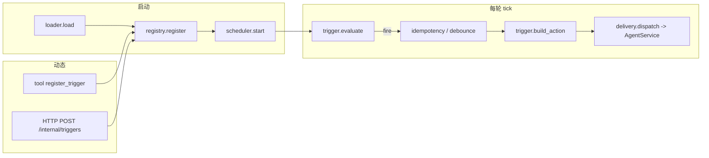

# 触发器（条件唤起 Agent）设计方案

本文在 **DAgents 现有进程内队列 + `AgentService.submit_message`** 之上，描述 **触发器（Trigger）** 的 **目标边界、按模块的职责划分、调度与基类协议、动态注册（Agent 友好）以及 `session_id` / `client_id` / 消息回流** 的约定。实现以本文件为设计基线；与代码冲突时以 **Git / CHANGELOG** 为准。

**相关索引**：[agent-input-output.md](./agent-input-output.md)（入队与 SSE）、[architecture-and-flows.md](./architecture-and-flows.md)（分层）、[roadmap.md](./roadmap.md) §3.4「触发器」。

---

## 1. 问题陈述与目标

### 1.1 现状

- 客户端通过 **HTTP** 创建会话并 **`POST` 提交消息**，经校验后调用 **`AgentService.submit_message`**（见 **`app/harness/api/app.py`**）。
- 每条会话对应进程内 **`MessageQueue`**，**串行消费**；**`MessageEnvelope`** 含 **`request_type` / `content` / `client_id` / `source`** 等（见 **`app/harness/queue/message_queue.py`**）。
- **SSE** 按 **`session_id` + `client_id`** 分桶；无订阅方时事件仍可产生，但无人接收（见 **`docs/agent-input-output.md`**）。

### 1.2 目标

在 **不替代** HTTP 主路径的前提下，增加 **可注册、可轮询求值** 的触发器：当 **条件满足** 时，由统一 **调度器** 调用触发器协议方法，经 **投递层** 向指定会话投递 **`MessageEnvelope`**（或 `resume`），从而唤起与「用户发消息」同构的 **`run_turn`** 路径。

### 1.3 非目标（首版明确不做或降级）

- **不**在首版引入必选的外部分布式调度器（Celery、K8s CronJob 等）；进程内 **`asyncio`** 轮询 + 可选 **HTTP Webhook** 入队即可 MVP。
- **不**在首版承诺跨进程 Exactly-once；以 **at-least-once + 幂等键** 为语义基线。
- **不**在首版把触发器做成任意 **`exec` 插件**；内置若干 **配置驱动子类** + 受限模板；后续再评估 **沙箱脚本** 或 **Webhook 签名校验 + JSON 模板**。
- **不**在首版实现「无 SSE 客户端时把 Assistant 全文自动推送到外部系统」；仅 **文档化** 回流策略与后续扩展点（见 §6）。

---

## 2. 设计原则

1. **复用编排与运行时**：触发器只负责 **「在何条件、向哪条会话、以何载荷调用 `submit_message` / `submit_resume`」**；不 fork 第二套 `run_turn` 循环。
2. **与 HTTP 入队对齐**：触发路径构造的 **`MessageEnvelope`** 语义与 HTTP 一致；**`source`** 建议 **`trigger:{trigger_id}`**，便于日志与指标区分。
3. **调度器单一入口**：所有「是否该触发」的副作用经 **调度器 tick** 串行或受控并发进入 **注册表快照**，避免触发器自启线程绕过策略。
4. **会话边界清晰**：默认 **只向已存在会话投递**；**自动建会话** 须单独开关并文档化副作用。
5. **安全默认关闭**：未显式启用时 **零触发**；Webhook / 管理注册接口须 **鉴权 + 限流**。
6. **可观测**：求值跳过 / 触发成功 / 投递失败 / 去抖丢弃等进入 **logging**；可选 **`/metrics`** 计数器（与 **`docs/prometheus-metrics.md`** 一致）。

---

## 3. 按模块划分（蓝图落地）

以下模块路径为 **建议包名** `app/harness/triggers/`（与 **`app/harness/api`**、**`queue`** 并列）；实现时可微调，但建议在 **CHANGELOG** 记录搬迁。

### 3.1 `triggers.base` — 触发器基类与求值结果

**职责**：定义调度器可调用的 **稳定协议**（抽象基类或 `typing.Protocol`），不关心具体是 Cron 还是 Webhook。

**基类（逻辑方法，名称实现时可微调）**：

| 方法 / 属性 | 由谁调用 | 语义 |
|-------------|----------|------|
| **`trigger_id: str`** | 注册表、日志 | 全局唯一，与配置 / 动态注册返回值一致。 |
| **`is_enabled() -> bool`** | 调度器每 tick | 软开关；`False` 时跳过求值与触发（便于动态禁用）。 |
| **`next_wake_after_seconds(now) -> float | None`** | 调度器 | **可选优化**：返回「最早需要再评估」的秒数；`None` 表示参与 **下一轮全局 tick**（简单轮询）。Cron/interval 可实现休眠提示，避免空转。 |
| **`evaluate(now) -> TriggerEvalResult`** | 调度器 | **只读求值**：是否满足触发条件；**不得**在此直接 `submit_message`（便于单测与幂等去抖在调度层统一处理）。 |
| **`build_action() -> TriggerAction`** | 调度器在 `evaluate` 为「触发」且通过幂等/去抖后 | 产出 **纯数据**：目标 **`session_id`**、**`client_id`**、**`request_type`**（`message` / `resume`）、**`content` / `resume` 载荷**、**`priority`**、**幂等键材料** 等。 |
| **`on_dispatch_result(...)`（可选）** | 投递层 | 投递成功/失败/队列满回调；用于指标或 **有限重试** 策略，**不**阻塞主消费循环过久。 |

**`TriggerEvalResult`（示意）**：`skip` | `fire` | `defer_until(timestamp)`，附 **人类可读原因** 字符串供 DEBUG。

**说明**：若更偏好「回调式」，可将 **`build_action`** 与 **`on_dispatch_result`** 合并为单个 **`async def fire(service: AgentService)`** 由调度器调用；代价是 **幂等与错误隔离** 更难在框架层统一。本设计推荐 **evaluate / build 分离**，**`AgentService` 仅由调度器内单一 `TriggerDelivery` 模块触碰**。

---

### 3.2 `triggers.registry` — 注册表

**职责**：维护 **当前进程内** 已注册 **`Trigger` 实例** 的增删查；供调度器轮询与 HTTP/Tool 动态注册。

| 能力 | 说明 |
|------|------|
| **`register(trigger: Trigger) -> None`** | `trigger_id` 冲突时策略二选一：**拒绝**或**覆盖**（首版建议 **拒绝 + 日志**）。 |
| **`unregister(trigger_id: str) -> bool`** | 动态下线；调度器下一轮不再遍历。 |
| **`iter_enabled() -> Iterator[Trigger]`** | 调度器 tick 使用；可返回 **快照** 避免遍历中并发修改（浅拷贝 id 列表再 resolve）。 |
| **`get(trigger_id) -> Trigger | None`** | 管理接口与单测。 |

**与配置加载关系**：启动时 **Loader** 解析文件 → 构造具体 **`CronTrigger` / `IntervalTrigger` / …** → **`registry.register`**；动态 API 同理。

---

### 3.3 `triggers.scheduler` — 调度器（轮询核心）

**职责**：**持续运行**（`asyncio` Task）的 **主循环**：周期性唤醒，遍历注册表（或按 **`next_wake_after_seconds`** 做简单堆优化），对每个触发器调用 **`evaluate` →（若 fire）幂等/去抖 → `build_action` → 投递`**。

| 要点 | 建议 |
|------|------|
| **tick 周期** | 全局 **`AGENT_TRIGGER_TICK_SECONDS`**（如 `1.0`）；单触发器可通过 **`next_wake_after_seconds`** 声明「本轮可跳过」。 |
| **与 `AgentService` 生命周期** | **`await service.start()` 之后** `scheduler.start(service)`，**`stop` 顺序相反**；确保队列已可接受投递。 |
| **错误隔离** | 单触发器 **`evaluate` / `build_action` 抛错** 捕获后 **logging + metric**，**不**取消整个调度 Task。 |
| **并发** | MVP：**单协程** 顺序处理各触发器；高负载再拆 **per-session 有序、跨 session 并行** 的 worker，且保持 **同 `session_id` 仍只经一条队列**。 |

**命名建议**：对外类型名 **`TriggerScheduler`**；内部循环函数 **`_tick_once`**。

---

### 3.4 `triggers.delivery` — 投递与 `AgentService` 对接

**职责**：把 **`TriggerAction`** 转为 **`AgentService.submit_message` / `submit_resume`**；统一 **`source` 前缀**、**优先级**、**队列满重试**。

| 能力 | 说明 |
|------|------|
| **`dispatch(service, action: TriggerAction) -> None`** | 会话不存在时按策略 **跳过** 或 **auto_create**（见 §5）。 |
| **重试** | 队列满：`try/except` + **有限次退避** + 指标；与现有 **`submit_message`** 契约一致。 |

---

### 3.5 `triggers.loader` — 静态配置加载

**职责**：进程启动时读取 **`AGENT_TRIGGERS_CONFIG_PATH`**（JSON/YAML）；校验后 **构造内置子类实例** 并 **`registry.register`**。文件不存在或空列表则 **零触发器**。

**与调度器关系**：仅 **启动阶段** 调用；**热更** 不在 MVP 必达，可通过 **`registry` + 管理 API** 后续补齐（见 §10）。

---

### 3.6 `triggers.dynamic` — 动态添加（Agent 友好）

**职责**：运行中 **注册 / 注销** 触发器，使 **Agent 或运维** 无需改文件重启即可挂接定时任务。

**推荐两条路径（可同时存在）**：

| 路径 | Agent 友好度 | 说明 |
|------|----------------|------|
| **A. HTTP 管理 API（内部路由）** | 中 | 例如 **`POST /internal/triggers`** body 为 **声明式 JSON**（与静态配置子集同 schema），鉴权 **Bearer / mTLS / HMAC**；服务端 **工厂函数** `build_trigger_from_dict` → `registry.register`。适合 **GitOps 外** 的运维脚本。 |
| **B. `@tool("register_trigger")`（受限参数）** | 高 | 暴露 **结构化参数**：`trigger_id`, `session_id`, `client_id`, `mode: interval|cron`, `interval_seconds` / `cron_expr`, `content`, `enabled`。工具实现内 **校验 + registry.register**，返回 **`trigger_id` 与下次理论唤醒说明**。模型用自然语言描述需求，工具落 **安全子集**，避免任意代码。 |

**安全**：动态注册必须 **显式总开关**（如 **`AGENT_TRIGGERS_DYNAMIC_ENABLED`**）；默认 **关**；与 **`AGENT_TRIGGERS_ENABLED`** 组合。

---

### 3.7 `triggers.webhook`（Phase B，可与 `dynamic` 同包分文件）

**职责**：HTTP **事件入口** 不直接长占调度器；将 **合法请求** 转为 **「一次性候选触发」**（例如写入 **内存队列** 或由 **`WebhookTrigger`** 在 **`evaluate` 中读队列」**）。调度器 tick 时 **`WebhookTrigger.evaluate`** 若队列非空则 `fire` 并消费。

**与轮询关系**：Webhook **不**替代调度器；Webhook 只 **喂数据**，**是否投递** 仍由调度器 + 幂等统一处理。

---

### 3.8 `triggers.metrics`（可选）

**职责**：封装 **`triggers_eval_total{trigger_id,result}`**、**`triggers_dispatch_total{status}`** 等；实现方式与 **`docs/prometheus-metrics.md`** 对齐。

---

## 4. 推荐方案总览（实现选型）

以下为本仓库首版推荐的 **一体化方案**，与 §3 模块一一对应。

1. **单一 `TriggerScheduler` 协程** + 全局 **`tick`**；注册表内均为 **`Trigger` 子类实例**。
2. **求值与投递分离**：`evaluate` →（框架层幂等/去抖）→ `build_action` → **`TriggerDelivery.dispatch`**，避免每个触发器重复实现队列语义。
3. **静态 YAML + 动态 Tool/API 双通道**：静态满足 **GitOps**；**`register_trigger` 工具**满足 **Agent 自助挂定时任务**（参数白名单 + 总开关）。
4. **Webhook（Phase B）**：独立路由 **鉴权后** 推入 **`WebhookTrigger` 内部队列**；调度器下一轮 **`evaluate`** 消费，保持 **「轮询为权威 tick」** 的调试模型。
5. **Cron / Interval**：各一个 **`Trigger` 子类**，共享 **`TriggerDelivery`** 与 **`TriggerRegistry`**。

**生命周期（Mermaid）**：



---

## 5. `session_id`、`client_id` 与 Agent 产出如何「返回」

### 5.1 决策表（谁决定）

| 字段 | 默认谁决定 | 可选扩展 |
|------|------------|----------|
| **`session_id`** | **`TriggerAction` 内显式字段**（静态配置或动态注册参数绑定）；**默认**指向 **已存在** 会话。 | **`auto_create_session`** 为真时，投递前 **`create_session`** 再 **`submit_message`**（须单独开关与审计日志）。 |
| **`client_id`** | **每条触发器配置必填或回落全局** `AGENT_TRIGGER_DEFAULT_CLIENT_ID`（如 **`trigger`**）；推荐 **`trigger:{trigger_id}`** 与 HTTP 用户 **`default`** 分离，便于 SSE 只订一方。 | Webhook 可在 **受限模板** 中覆盖为 **`body.client_id`**（白名单字段集）。 |
| **`source`** | 框架层写 **`trigger:{trigger_id}`**（与 §2 一致）。 | 无 |

### 5.2 触发后 Agent 消息如何「返回」

与 **HTTP 长连 SSE** 完全一致：**无魔法新通道**。

| 场景 | 行为 |
|------|------|
| **已有客户端** 对 **`(session_id, client_id)`** 建立 **`GET /v1/streams`** | 触发投递的 **`human_message`/`assistant`/…** 与人工消息 **同桶可见**，无需额外改造。 |
| **无任何 SSE 订阅** | 事件照常入队、**`run_turn` 仍执行**；仅 **无人实时收流**；会话状态仍可按现有 **SQLite / 内存** 策略落盘（若开启）。 |
| **希望「运营后台」独占看触发器产出** | 使用 **独立 `client_id`** 订阅；人在 **`default`** 桶不受干扰。 |

**首版不做的「回流增强」**（可记入 roadmap）：内部 WebSocket 桥、**按 `trigger_id` 的 Webhook 回调 URL** 把最终 assistant 文本 POST 出去等——避免与 **审批 / SSE 状态机** 强耦合。

---

## 6. 执行语义与队列交互（摘要）

| 触发动作 | API | 优先级建议 |
|----------|-----|------------|
| 模拟用户一句 | `submit_message(..., request_type="message", ...)` | 默认 **`other`**，避免抢 **`human` / `resume`**；紧急任务若配 **`human`** 须在配置中 **显式警告**。 |
| 审批继续 | `submit_resume(...)` | **`resume`** |

**与 `MessageQueue`**：**不**为触发器单独建队列；同一 **`session_id`** **单消费者串行**，与 [agent-turn-loop.md](./agent-turn-loop.md) 一致。**背压**：队列满时捕获异常、日志、指标，可选退避重试（见 **`TriggerDelivery`**）。

---

## 7. 幂等、去抖与并发（摘要）

- **幂等**：定时类自然键 **`trigger_id + scheduled_fire_time`**；Webhook 用 **`Idempotency-Key`** 或签名内 **`event_id`**；在 **调度器与 `delivery` 之间** 的 **TTL 缓存** 去重。
- **去抖**：配置 **`debounce_seconds`**；建议 **leading**（窗口内首次 `fire`，后续忽略）或 **trailing**（窗口结束再投）二选一 **写死一种** 并在 CHANGELOG 说明。
- **并发**：首版 **调度器单协程**；同 session 有序不变。

---

## 8. 配置 YAML 示意（与 §3 对齐）

```yaml
version: 1
triggers:
  - id: nightly_digest
    enabled: true
    session_id: "cron-demo"
    client_id: "trigger:nightly_digest"
    schedule:
      cron: "0 8 * * *"
    action:
      type: message
      content: "请根据昨夜日志生成摘要。"
      priority: other
    idempotency:
      mode: cron_window
```

---

## 9. 代码落点与里程碑

| 层次 | 建议路径 |
|------|----------|
| 协议与基类 | **`app/harness/triggers/base.py`** |
| 注册表 | **`app/harness/triggers/registry.py`** |
| 调度器 | **`app/harness/triggers/scheduler.py`** |
| 投递 | **`app/harness/triggers/delivery.py`** |
| 加载器 | **`app/harness/triggers/loader.py`** |
| 动态注册 | **`app/harness/triggers/dynamic.py`** + **`app/harness/tools/triggers.py`**（`@tool`） |
| HTTP Webhook | **`app/harness/api/app.py`** + **`triggers/webhook.py`** |
| 生命周期 | **`create_app` lifespan**：`service.start` → **`scheduler.start(service)`** → 关闭逆序 |
| 配置 | **`app/config/settings.py`**：`agent_triggers_enabled`、`agent_triggers_config_path`、`agent_trigger_default_client_id`、`agent_triggers_dynamic_enabled`、`agent_trigger_tick_seconds`、时区等 |

| 里程碑 | 交付物 |
|--------|--------|
| **M1** | `Trigger` ABC + **`IntervalTrigger`** + **`Registry` + `Scheduler` + `Delivery`**；静态 YAML 加载；日志。 |
| **M2** | **`CronTrigger`** + 幂等窗口；**`client_id` / `source`** 与 **`api-reference.md`** 脚注对齐。 |
| **M3** | **动态 `register_trigger` 工具** + 可选 **HTTP 内部注册**；鉴权 + 限流。 |
| **M4** | **Webhook** + HMAC；可选 **`auto_create_session`**、Prometheus 计数器。 |

---

## 10. 开放问题（实现前需拍板）

1. **全局 tick 默认间隔** 与 **单触发器 `next_wake_after_seconds`** 是否首版就实现堆优化，还是先 **统一 tick**？
2. **动态注册**：`trigger_id` 冲突 **拒绝** 还是 **覆盖**？
3. **配置热更**：首版仅启动加载是否可接受？热更是否走 **`SIGHUP` / 管理 API reload`**？
4. **多实例**：多进程各跑 **Scheduler** 会导致 **Cron 重复触发**；MVP 是否要求 **单副本** 或 **仅 leader 跑 cron**？

---

## 11. 文档维护

- 实现后：**`docs/api-reference.md`** 增加内部注册 / Webhook 路由；**`docs/agent-input-output.md`** 增加「触发器 **`client_id` 桶**」脚注。
- **`docs/roadmap.md`** §3.4 与实现状态对齐。

**最后更新**：按「调度器轮询 + 触发器基类 + 动态注册 + session/client/回流」蓝图重写模块划分与推荐方案。
