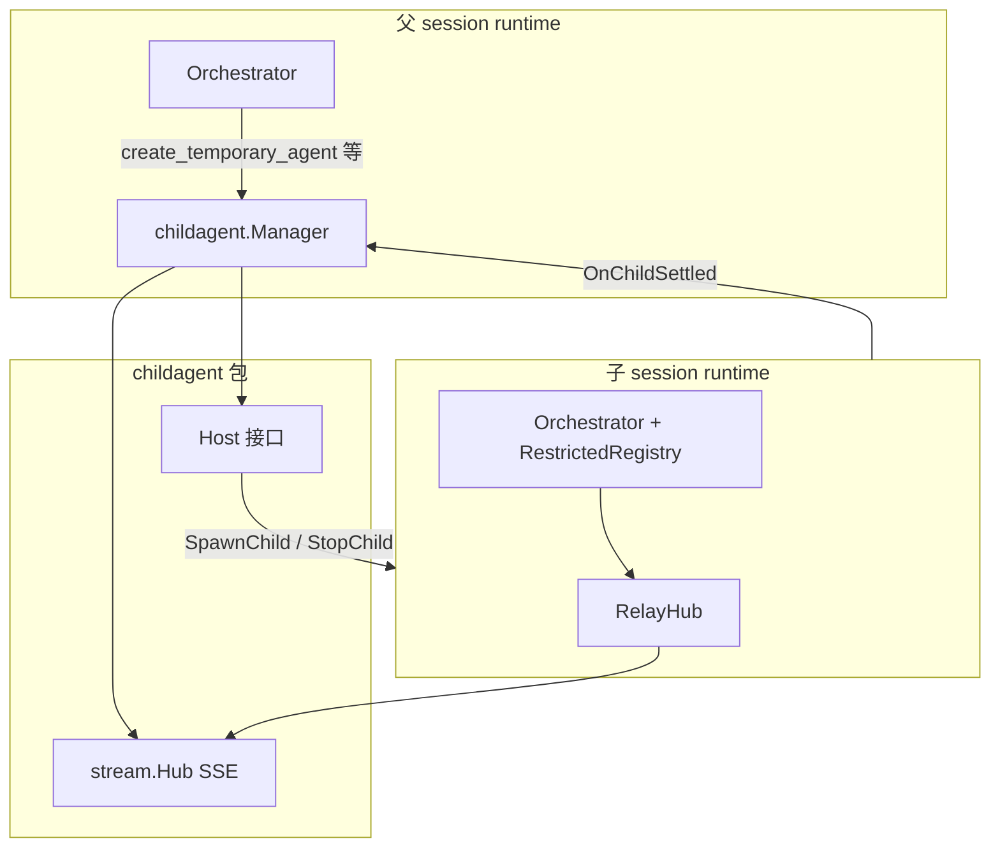

# childagent

Go Node **同进程临时 Agent（temporary agent）** 的控制面：管理创建 → 子 runtime 执行 → 结果交付 → 回收的全生命周期，并与父 session 的 SSE / HITL 打通。

**与外部 A2A 无关**（A2A 经 Manage/inbox；本包只服务父 Agent 工具 `create_temporary_agent` 等）。

实现契约见 [`docs/architecture/child-agent-tools.md`](../../../docs/architecture/child-agent-tools.md)。符号索引见 [`REFERENCE.md`](./REFERENCE.md)。

---

## 在整体架构中的位置



| 层 | 职责 |
|----|------|
| **`childagent`** | 记录表、TTL、wait/status/cancel、SSE 生命周期事件、resume 路由 |
| **`session`** | 真正 spawn/stop 子 `runtime`，实现 `Host`（`manager_child.go`、`runtime_child.go`） |
| **`turn/orchestrator`** | 识别 4 个临时 Agent 工具，转给 `Manager.HandleParentTool` |
| **`RelayHub`** | 子 turn 的 SSE **全部挂到父 `session_id`** 上 |

工具 schema 定义在 [`node/internal/tools/child_agent_tools.go`](../tools/child_agent_tools.go)（LLM 可见契约，不在本包内）。

---

## 文件与建议阅读顺序

| 顺序 | 文件 | 内容 |
|------|------|------|
| ① | `policy.go` | 协议常量、工具名、权限边界、首条 task 格式化 |
| ② | `types.go` | 状态机、`ActiveAgent` / `Result` |
| ③ | `parse.go` | 工具入参解析、`allowed_tools` 校验 |
| ④ | `registry.go` | 子 runtime 工具白名单（`RestrictedRegistry`） |
| ⑤ | `manager.go` | **核心**：创建、终态、TTL、SSE、resume 路由 |
| ⑥ | `tools_handler.go` | `wait` / `status` / `cancel` 实现 |
| ⑦ | `relay_hub.go` | 子 SSE → 父 SSE + HITL 元数据 |
| ⑧ | `session/manager_child.go` + `runtime_child.go` | 与 session 层的粘合（包外） |

测试：`manager_test.go`、`wait_delivered_test.go`；集成见 `session/manager_child_test.go`、`api/child_agents_api_test.go`。

---

## 协议常量（`policy.go`）

对外命名统一为 **temporary agent**，与 A2A 区分：

| 类别 | 值 |
|------|-----|
| 管理工具 | `create_temporary_agent`、`wait_temporary_agents`、`temporary_agent_status`、`cancel_temporary_agent` |
| SSE 生命周期 | `temporary_agent_created` / `_completed` / `_cancelled` |
| HITL scope | `hitl_scope: "temporary_agent"` |

其他约定：

- **`FormatChildTask`**：给子 Agent 首条 user 消息加固定系统前缀；角色与约束由父 Agent 写在 `task` 中。
- **`DefaultChildAllowedTools`**：未指定 `allowed_tools` 时默认 `read_file`、`glob_files`、`grep_file`、`bash_run`。
- **`IsParentOnlyTool`**：管理工具、`load_skills` / `unload_skills` / `clear_skills`、`ask_user_information`、`trigger_*` 永不下放给子 runtime。
- **`IsTemporaryAgentTool`**：供 orchestrator 识别并专用分发（不走普通 `Registry.Execute`）。

---

## 数据模型（`types.go`）

### 状态机

```text
creating → active → completed | failed | cancelled | expired
```

### 核心结构

| 类型 | 用途 |
|------|------|
| `CreateInput` | `create_temporary_agent` 解析后的入参 |
| `ActiveAgent` | 活跃临时 Agent 账本；含 `settledCh` 供 `wait=true` 阻塞 |
| `Result` | 交付给父 Agent 的终态 JSON |
| `Config` | YAML `child_agents.*`：TTL、并发上限、默认 wait 超时等 |

`Manager` 额外维护：

- **`settledResults`**：`unregisterActive` 后仍可供 `wait_temporary_agents` 读取的终态快照
- **`childToParent`**：`unregisterActive` 后仍保留，供 wait/status 校验父子归属

---

## 入参与工具权限（`parse.go`）

**`parseCreateInput`**：解析创建工具 JSON。

- 必填：`task`、`purpose`
- 可选：`allowed_tools`、`ttl_seconds`、`max_turns`、`wait`
- TTL / `max_turns` 会 clamp 到 `Config` 上下限

**`resolveAllowedTools`**：

1. 空列表 → `DefaultChildAllowedTools()`
2. 每项须在 `ParentDelegatableTools()` 内
3. 不得包含 `IsParentOnlyTool` 工具

---

## 子 runtime 工具白名单（`registry.go`）

`RestrictedRegistry` 包装完整 `tools.Registry`：

- `Definitions()` — 仅返回 `allowed_tools` 中的 OpenAI tool 定义
- `Execute()` / `StartBackground()` — 越权直接返回 error

子 runtime 在 `session/runtime_child.go` 的 `newChildRuntime` 中构造此表，替代父的完整 Registry。

---

## Manager 生命周期（`manager.go`）

### Host 依赖注入

`Manager` 不直接消费消息队列，通过 `Host` 接口操作 session 层（由 `session.Manager` 实现）：

| 方法 | 作用 |
|------|------|
| `SpawnChild` | 创建子 `runtime` 并 `start` |
| `EnqueueChildTask` | 投递首条 user 任务 |
| `StopChild` | 停止子 consumer |
| `DeliverChildResume` / `DeliverParentResume` | HITL resume 入队 |
| `ChildHasPendingHITL` / `ParentHasPendingHITL` | resume 路由前校验 |

`BindHost` 在 `session.Manager.SetChildAgentManager` 时调用。

### 创建 `HandleCreate`

```text
parseCreateInput → resolveAllowedTools → 生成 child-{12hex} id
  → 写入 activeByID / activeIDsByParent / childToParent
  → host.SpawnChild（起子 runtime）
  → FormatChildTask + EnqueueChildTask
  → status = active → SSE temporary_agent_created → 启动 TTL timer
  → wait=true ? waitUntilSettled 阻塞至终态 : 返回 kind=handle JSON
```

### 自然完成 `OnChildSettled`

子 runtime 在 turn 空闲、无 pending HITL、最后一条为 `assistant` 时，由 `runtime.tryCompleteChildIfIdle` 调用：

```text
OnChildSettled → finishWithEvent(completed)
  → 写 Result、close(settledCh)、写入 settledResults
  → SSE temporary_agent_completed
  → host.StopChild → unregisterActive
```

### 取消与 TTL

| 路径 | 触发 |
|------|------|
| `Cancel` | 工具 `cancel_temporary_agent`、HTTP cancel、wait 超时、显式 reason |
| `CancelAllForParent` | 父 session 删除时级联取消所有活跃子 Agent |
| `runTTLTimer` | TTL 到期 → `StatusExpired` |

### Resume 路由 `RouteResume`

父 session 收到 `request_type=resume` 时：

1. `resume_value.child_agent_id` 为空 → `DeliverParentResume`（父 HITL）
2. 非空 → 校验归属 + 子 runtime 是否有 pending HITL → `DeliverChildResume`

误投返回 `hitl_target_mismatch` / `no_pending_hitl`。

### SSE 发布

| 事件 | 时机 |
|------|------|
| `temporary_agent_created` | 创建成功、即将/开始消费 task |
| `temporary_agent_completed` | 交付终态（含 `expired` 可走同一事件） |
| `temporary_agent_cancelled` | 显式取消 |

均发往**父** `session_id` 的 Hub。

---

## 另外三个父工具（`tools_handler.go`）

| 方法 | 工具 | 行为 |
|------|------|------|
| `HandleWait` | `wait_temporary_agents` | 轮询（200ms）至全部终态或超时；`timeout_seconds=0` 立即快照 |
| `HandleStatus` | `temporary_agent_status` | 非阻塞 `GetResult` |
| `HandleCancelTool` | `cancel_temporary_agent` | 调 `Cancel`，已终态幂等 |

`HandleParentTool` 为 orchestrator 统一入口。

---

## SSE 转发（`relay_hub.go`）

子 runtime 的 `Publisher` 替换为 `RelayHub`：

1. **忽略子 turn 的 `done`** — 避免 Client 误判父 session 回合结束
2. **所有事件附加 `child_agent_id`**
3. **`approval_required` 附加** `hitl_scope=temporary_agent`、`child_purpose`（子 turn 仍走该事件；父 session 本地 turn 为 **`hitl_required`**）
4. **统一 `Publish` 到父 `session_id`**

Client 只订阅父 SSE；子 turn 的 `assistant` / `tool_result` 等由 Client 按 `child_agent_id` 过滤隐藏，仅展示审批与生命周期行。

---

## 与 orchestrator 的衔接

父 turn 遇到 `IsTemporaryAgentTool` 时**不走**普通 `Registry.Execute`：

- 子 runtime（`SetChildSession(true)`）调用同名校验 → `child_forbidden`
- 父 runtime → `childMgr.HandleParentTool`

子 Agent **不得**再创建临时 Agent，**不得**调用 `ask_user_information`。

---

## 两层 HITL

| 层 | 触发 | SSE 特征 |
|----|------|----------|
| **创建审批** | 父 turn 调 `create_temporary_agent` | 父 scope，通常无 `child_agent_id` |
| **子工具审批** | 子 turn 调 `bash_run` 等 | `hitl_scope=temporary_agent` + `child_agent_id` |

用户 resume 始终用**父** `session_id`；带 `child_agent_id` 时由 `RouteResume` 投到子 runtime。

详见契约文档 §13（创建策略）、§14（子工具审批）。

---

## 内存索引结构

```text
Manager
├── activeByID[childID]           → *ActiveAgent  # 活跃账本
├── activeIDsByParent[parentID]  → []childID      # 父下的活跃子列表
├── childToParent[childID]       → parentID      # 移出活跃表后仍保留
└── settledResults[childID]      → Result        # 终态快照
```

---

## 包外相关入口

| 路径 | 说明 |
|------|------|
| [`node/internal/session/README.md`](../session/README.md) | 会话 runtime、队列、父子 Orchestrator 构造 |
| [`node/internal/turn/README.md`](../turn/README.md) | 单步 turn、system prompt、HITL |
| `node/internal/tools/child_agent_tools.go` | 四个工具的 OpenAI schema |
| `node/internal/session/manager_child.go` | `Host` 实现、HTTP `ListChildAgents` |
| `node/internal/session/runtime_child.go` | `newChildRuntime`、`tryCompleteChildIfIdle` |
| `node/internal/turn/orchestrator.go` | 临时 Agent 工具专用分支 |
| `node/internal/api/child_agents_api.go` | `GET/POST .../child-agents` HTTP API |
| `node/internal/api/server.go` | `NewManager` + `SetChildAgentManager` 装配 |

---

## 本地验证

```bash
go test ./node/internal/childagent/... ./node/internal/session/... -run ChildAgent
go test ./node/internal/api/... -run ChildAgent
```

建议跟读路径：`HandleCreate` → `SpawnChild` → `newChildRuntime` → `tryCompleteChildIfIdle` → `OnChildSettled` → `finishWithEvent`。
