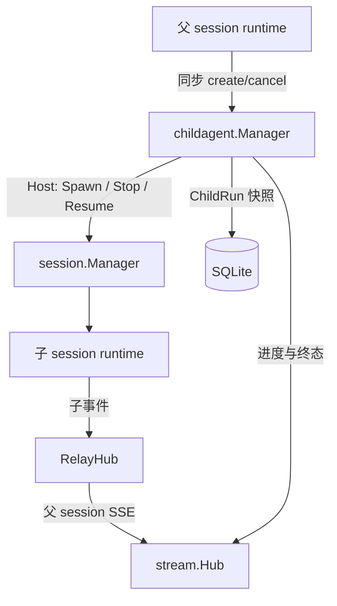

# childagent

`childagent` 是 Node 内部的临时子 Agent 控制面。它负责创建、运行跟踪、审批路由、取消、终态交付和快照持久化；子 Agent 的实际消息处理仍由 `session` runtime 完成。

本模块只提供两类模型工具：

- `create_temporary_agent`：创建并同步等待子 Agent 进入终态，然后返回结果。
- `cancel_temporary_agent`：取消仍在运行的子 Agent。

创建工具没有 `wait` 参数，也没有 `wait_temporary_agents` 或 `temporary_agent_status`。需要后台并行执行时，应使用独立的工具级后台能力，而不是把子 Agent 生命周期拆成多个模型工具。

## 在整体架构中的位置



| 层 | 职责 |
|---|---|
| `childagent` | 生命周期状态机、同步结果等待、TTL、取消、快照、父子审批路由 |
| `session` | 创建/停止子 runtime，向子 runtime 投递 task/resume |
| `turn` | 识别管理工具；创建和取消按普通 ToolCall → ToolResult 接回当前父 Turn |
| `RelayHub` | 将子 runtime 的进度、工具和审批事件关联到父 session |
| `store` | 持久化 ChildRun 控制面快照，不保存子 Agent 完整 transcript |
| Web UI | 消费 SSE 实时进度，并用 hydrate/API 快照恢复卡片 |

## 文件阅读顺序

1. `policy.go`：工具名、状态事件、权限边界。
2. `types.go`：状态、输入、结果、进度和持久化接口。
3. `parse.go`：创建参数与工具白名单校验。
4. `registry.go`：子 runtime 的受限工具注册表。
5. `manager.go`：生命周期、同步等待、终态、TTL、快照和事件。
6. `progress.go`：从子 SSE 事件生成轻量进度快照。
7. `tools_handler.go`：父工具入口。
8. `session/manager_child.go`、`runtime_child.go`：宿主和子 runtime 粘合。
9. `webui/frontend/src/stores/remoteWorkers.js`：前端实时/恢复投影。

## 状态模型

```text
creating → active → completed
                 ├→ failed
                 ├→ cancelled
                 ├→ expired
                 └→ interrupted（Node 重启时恢复出的运行中记录）
```

`creating` 和 `active` 是运行态，其余是终态。终态结果和快照不能只存在于活跃内存表中，否则子任务完成后刷新页面会丢卡片或把旧卡片错误显示为 active。

## 数据结构与边界

### `ActiveAgent`

Manager 内存中的运行账本，包含：

- `ChildAgentID`、`ParentAgentID`、`ToolCallID`、`Purpose`；
- `AllowedTools`、`LoadedSkills`、TTL 和最大回合数；
- 当前 `Progress`；
- `settledCh` 与终态 `Result`，仅用于同步 `create` 调用等待。

### `Progress`

面向父 Agent/UI 的轻量投影，不复制子 Agent transcript，包含当前阶段、当前工具、最近输出、回合数、审批数据和终态摘要。`pending_approval_data` 保存恢复审批卡片所需的完整 HITL payload。

### `RunRepository`

`childagent` 只依赖 `RunRepository` 接口，具体 SQLite 适配在 `session/child_run_repository.go`。`store.child_runs` 保存最新快照，使用 `child_agent_id` 幂等更新和 `revision` 做版本顺序。

## 同步创建数据流

```text
父模型提出 create ToolCall
  → turn 记录 assistant tool_call
  → policy 判定 deny / approval / auto
  → approval 时提交 pending lifecycle，再发布 hitl_required
  → 用户 resume 后继续同一个父 Turn
  → Manager.HandleCreate
      → 创建 ChildRun(creating)
      → Host.SpawnChild
      → Host.EnqueueChildTask
      → ChildRun(active)，发布 temporary_agent_created
      → 等待子 runtime 进入终态
      → 保存终态，发布 progress + completed/cancelled
      → 返回普通 tool result
  → 父模型收到 tool result，决定下一步
```

这里没有第二个“查询结果”的模型工具。同步等待超时会将运行收敛为 `expired`/`cancelled` 终态并直接返回错误结果，不会留下模型需要记住的后台句柄。

## 子 runtime 完成与失败

子 runtime 在 turn 空闲、没有 pending HITL 且最后一条消息是 assistant 时调用 `OnChildSettled`。LLM、工具链、生命周期或上下文错误通过 `OnChildFailed` 进入同一个 `finishWithEvent` 终态函数；取消和 TTL 也走该函数。这样所有路径都会：

1. 更新状态、摘要、错误、回合数和完成时间；
2. 持久化快照；
3. 发布父 session 可见事件；
4. 关闭同步等待通道；
5. 停止并移除子 runtime。

## 审批与取消

审批仍属于 Turn 链条，不是 childagent 自己创建另一条消息序列：

- 父审批：父 Turn 保存 `PendingHITL`，resume 后执行 create。
- 子工具审批：子 runtime 产生 HITL，`RelayHub` 附加 `child_agent_id`，父 session 收到的 resume 由 `RouteResume` 投递回子 runtime。
- 用户新消息不会抢占正在运行的 Turn；需要打断必须调用 Turn cancel。取消会让父/子生命周期进入终态，并使后续旧队列事件因 turn/epoch 校验被丢弃。

## 刷新与 Node 重启

### 普通刷新

前端通过 `GET /v1/agents/{id}/child-agents` 读取 `ListSnapshots`。该读取路径合并活跃内存快照、最近终态快照和 SQLite 快照；SSE 只负责低延迟更新。进度 revision 倒退时前端忽略旧事件。

### 审批刷新

如果快照中的 `progress.pending_approval_data` 存在，hydrate 会重新放入统一 HITL store，并把子卡片标记为等待审批。resume 仍需经过父 session 路由，不能仅凭前端状态放行。

### Node 重启

子 runtime 是进程内对象，不能在重启后假装可继续运行。Manager 注入 repository 时会将旧记录中的 `creating`/`active` 标记为 `interrupted`，前端可以明确展示“因 Node 重启中断”，而不是显示一个永远执行中的卡片。

## 权限边界

`allowed_tools` 必须是父 Agent 可下放工具的子集；管理工具、skills 变更、询问工具和 trigger 等 parent-only 工具不能下放。子 runtime 使用 `RestrictedRegistry`，所以即使模型返回越权工具名，也会在执行边界被拒绝。

## 前端展示约定

工具卡片通过 `tool_call_id` 关联子 Agent 进度；创建结果到达后也会通过 `child_agent_id` 兜底关联。卡片保留运行中、等待审批、完成、失败、取消、过期和重启中断状态，不另造一份“活跃子 Agent”列表。这样实时事件和刷新快照使用同一数据源，避免重复卡片与状态回退。

## 验证

```bash
go test ./node/internal/childagent -run Child
go test ./node/internal/session -run ChildAgent
go test ./node/internal/api -run ChildAgent
npm test --prefix node/webui/frontend -- --run src/stores/remoteWorkers.test.js
```

推荐跟读路径：`HandleCreate` → `SpawnChild` → `newChildRuntime` → `tryCompleteChildIfIdle` → `OnChildSettled/OnChildFailed` → `finishWithEvent` → `ListSnapshots`。
