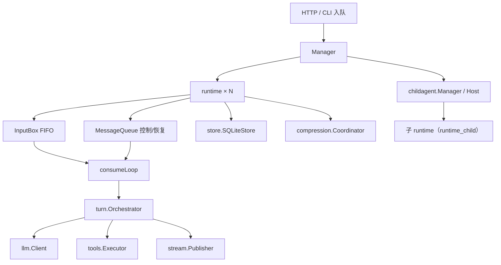

# node/internal/session

Go Node **会话运行时**：维护 `Manager` 会话表，每个 session 一个独立 `runtime`（队列 + consumer goroutine + `turn.Orchestrator`），负责消息入队、turn 调度、持久化、压缩与临时 Agent 子 runtime 的 spawn/stop。

符号索引见 [`REFERENCE.md`](./REFERENCE.md)。总览见 [`../../../docs/architecture/go-node-internals.md`](../../../docs/architecture/go-node-internals.md)。临时 Agent 见 [`../childagent/README.md`](../childagent/README.md)；turn 编排见 [`../turn/README.md`](../turn/README.md)。

---

## 在整体架构中的位置

| 层 | 职责 |
|----|------|
| **`Manager`** | 会话 CRUD、入队 API、skills 管理、实现 `childagent.Host` |
| **`runtime`** | 单 session 输入与执行边界：InputBox、控制队列、messages、loaded skills；Turn/Step 生命周期由 `turn.Coordinator` 维护 |
| **`turn.Orchestrator`** | 每步 LLM + 工具；由 runtime 按队列类型调用 |
| **`compression`** | 仅**父** session 在 human/tool 步前可能触发摘要压缩 |
| **`childagent`** | 父 runtime 可创建临时 Agent；子 runtime 经 `RelayHub` 把 SSE 挂到父 `session_id` |

---

## 父 session 与 子 session

父、子 **共用** `newRuntimeWithPublisher` → `turn.NewOrchestrator`，差异在构造参数与事后配置：

| 项 | 父 runtime | 子 runtime |
|----|------------|------------|
| 入口 | `newRuntime`（`manager.Create`） | `newChildRuntime`（`SpawnChild`） |
| SSE `Publisher` | `*stream.Hub` | `*childagent.RelayHub`（转发到父） |
| 工具 | 完整 `*tools.Registry` | `RestrictedRegistry`（白名单） |
| SQLite | 有 | `nil`（不持久化） |
| 上下文压缩 | 有（若启用） | **跳过** |
| `SetChildAgentManager` | 注入管理器（可 `create_temporary_agent`） | 不调用 |
| `SetChildSession` | 不调用 | `true`（禁止管理类临时 Agent 工具与 `ask_user`） |
| 终态 | 用户持久化 / 恢复 | `tryCompleteChildIfIdle` → `OnChildSettled` |

建议跟读路径：`Manager.Create` → `InputBox.Append` / `consumeLoop` → `handleInputMessage` / `handleTurnContinuation` / `handleResume`；子 Agent：`SpawnChild` → `newChildRuntime` → `EnqueueChildTask`。

---

## 队列与 turn 调度

每个 `runtime` 启动 `consumeLoop`。外部 user/trigger/A2A 输入进入 InputBox FIFO；resume、异步工具事实和恢复 continuation 走控制队列：

| RequestType | 处理函数 | 说明 |
|-------------|----------|------|
| InputBox `user` / `trigger` / `a2a` | `handleInputMessage` | 仅在 runtime idle 时取出并启动新 Turn；活动 Turn（含 pending HITL）期间只排队 |
| `async_tool_result` | `handleSideEffectProduceAsync` | 后台 job **Produce**（SSE + 缓冲，不 inline 改 history） |
| `turn_continuation` | `handleTurnContinuation` | 恢复/重启后补偿性续跑 |
| `side_effect_continue` | `handleSideEffectContinue` | 步首 Apply 缓冲 + `ContinueAfterSideEffects` |
| `resume` | `handleResume` | HITL 审批 / `ask_user_information` 恢复 |

异步旁路缓冲见 `side_effects.go` / `runtime_side_effects.go`：`ApplyReady` 在 `runTurnStepWithSideEffects` 步首；`ReconcileAfterStep` 在步末于 `TaskComplete` 时 schedule continue。Trigger delivery 在 InputBox 输入被消费后清除。

生产路径下，orchestrator 工具步结束后由 runtime 在同一 Turn 链内 inline 续跑下一个 Step，不再把 `tool_result` 作为新的 MessageQueue 请求；resume 仍通过控制队列恢复原 Turn。

`handleInputMessage` / `handleTurnContinuation` 在步前对**非子** session 调用 `compression.MaybeHandle`；步末 `persist`（子 session 的 `store` 为 nil 时 no-op）。

---

## 配置：`TurnOptions`

由 `Manager` 持有，传入 `newRuntimeWithPublisher`，影响 orchestrator 与 runtime 外围能力：

| 字段 | 作用 |
|------|------|
| `FSRoot` | 工具沙箱根目录（不在 system prompt 中暴露绝对路径；子目录约定见 prompt 与 tool schema） |
| `MaxToolLoops` | 单条 human message 内工具循环上限（子 Agent 创建时用 `SpawnSpec.MaxTurns` 覆盖） |
| `SkillsRoot` / `SkillsEnabled` / `SkillsMaxInPrompt` | skills 目录与同时启用数量上限 |
| `RuntimeDir` | `promptcontext.Reader` 根目录 |
| `CompressionSilent` / `CompressionBlocking` | 压缩阈值 |
| `IdleAutoCompressSeconds` / `IdleAutoCompressPollSeconds` / `IdleAutoCompressMinTokens` | idle 维护：无动作自动压缩 + **卸内存**（见 `idle_auto_compress.go`、`release.go`） |
| `RawMessageHistoryEnabled` / `RawMessageHistoryDir` | 原始 message journal |

---

## 文件一览

| 文件 | 说明 |
|------|------|
| `manager.go` | `Manager`、`TurnOptions`、会话 CRUD、入队、skills、上下文 API |
| `idle_auto_compress.go` | idle 维护扫描：可选压缩 + `Release` 卸内存（F-NM2–NM5） |
| `release.go` | `Manager.Release`：persist → stop → 移出 map，保留 SQLite（F-NM1） |
| `runtime.go` | `runtime` 结构体、构造、`consumeLoop`、human/tool/resume 处理 |
| `runtime_persistence.go` | 运行时快照持久化、InputBox 崩溃恢复与替换数据提取 |
| `runtime_skills_boundary.go` | skills 目录快照与模型上下文边界变更 |
| `runtime_turn.go` | `runTurnStep` 单步 turn 脚手架 |
| `runtime_child.go` | `newChildRuntime`、子 session 元数据、`tryCompleteChildIfIdle` |
| `manager_child.go` | `SpawnChild` / `StopChild`、`childagent.Host`、子任务入队与 resume 路由 |
| `context_view.go` | `ContextView`（`GET /context`）、token 粗算 |
| `triggers.go` | `TriggerSubmitter`、`EnqueueTriggerMessage` |
| `*_test.go` | 单测 |

### 状态事实源

- **InputBox**：外部 user/trigger/A2A 输入的有界 FIFO，只负责接收、序号和
  崩溃恢复，不负责执行 turn 或改写 history。
- **MessageQueue**：resume、cancel、重启续跑和异步 side-effect 等控制事件；
  它不是普通用户输入的第二个排序队列。
- **TurnCoordinator**：Turn/Step 生命周期、审批等待和终态的唯一事实源；
  `runtime` 中的 legacy pending/tool-loop 字段只做兼容投影。
- **SQLite runtime snapshot**：transcript、InputBox checkpoint 和兼容字段的
  持久化快照；生命周期事件用于恢复时重建 Turn 投影，两者不能互相冒充。
- **ModelContextSnapshot**：冻结一次模型请求可见的 prompt/tool/skills 输入；
  step 更新通过 SSE/生命周期事件发送，只有上下文边界才重建快照。

---

## 相关文档

- 临时 Agent 协议：[`docs/architecture/child-agent-tools.md`](../../../docs/architecture/child-agent-tools.md)
- System prompt 拼接：[`../turn/prompt.go`](../turn/prompt.go)
- 压缩：[`../compression/README.md`](../compression/README.md)
