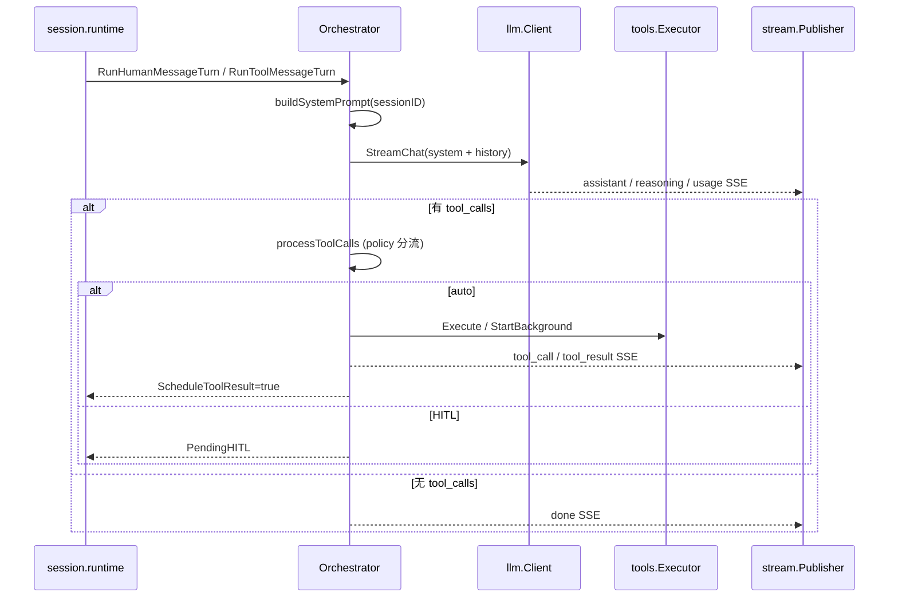

# node/internal/turn

Go Node **单 session turn 编排**：一次模型请求 + 工具批处理 + 分阶段 HITL，经 `stream.Publisher` 推送 SSE。由 [`session`](../session/README.md) 的 `runtime` 按队列类型调用；**不**管理会话表或持久化。

符号索引见 [`REFERENCE.md`](./REFERENCE.md)。与 `runtime`、队列的协作见 [`../../../docs/architecture/go-node-internals.md`](../../../docs/architecture/go-node-internals.md)。

---

## 职责边界

| 本包负责 | 本包不负责 |
|----------|------------|
| `Orchestrator`：LLM 流式、tool schema、工具执行、HITL 暂停 | 消息队列消费（`session.consumeLoop`） |
| `BuildSystemPrompt`：每步 system prompt 拼接 | SQLite / 压缩触发时机（runtime 在步前调用 compression） |
| 临时 Agent 工具转交 `childagent.Manager` | 子 runtime spawn（`session.SpawnChild`） |
| 异步工具回灌 message 形态（`tool_result_messages.go`） | skills 目录配置（由 runtime 注入 `SkillAccess`） |

---

## Orchestrator 生命周期

**构造**：`NewOrchestrator(agentID, fsRoot, hub, client, toolExec, policy, skillAccess, maxToolLoops, promptCtx, journal, logger)`  
**事后注入**（由 `session.newRuntimeWithPublisher` 完成）：

- `SetToolResultEnqueuer`：工具步结束后入队 `tool_result`（生产必须）
- `SetChildAgentManager(mgr)`：父 session 注入临时 Agent 管理器
- `SetChildSession(true)`：子 session 禁止管理类工具与 `ask_user`

`policy == nil` 时加载默认策略文件；`maxToolLoops <= 0` 时用默认 **16**。超过上限时对后续 tool_calls 写入 soft `tool` 结果（见 `ToolLoopLimitExceededMessage`），不硬失败。

---

## 公开 turn API（runtime 使用）

| 方法 | 场景 |
|------|------|
| `RunHumanMessageTurn` | 追加 user 消息后**单步**模型回合；Step 序号来自 `TurnExecutionContext` |
| `RunToolMessageTurn` | history 已含 tool 结果后**单步**续跑 |
| `ContinueAfterResume` | HITL resume 写入 tool 结果并调度续跑 |
| `InterruptPending` | 新 user 消息打断 pending tool calls |

旁路 side-effect（Produce/Apply/Continue）见 [`side_effect_messages.go`](./side_effect_messages.go)、[`task_complete.go`](./task_complete.go)；session 侧 [`../session/side_effects.go`](../session/side_effects.go)。规格：[`../../../docs/design/turn-side-effects-refactor.md`](../../../docs/design/turn-side-effects-refactor.md)。

每步返回 `StepOutcome`：`Pending`、`StepIndex`、`ScheduleToolResult`、`Err`。生产调用不再传递或维护独立的 tool-loop 计数。

---

## System prompt

**文件**：[`prompt.go`](./prompt.go)  
**调用**：`orchestrator.buildSystemPrompt` → `BuildSystemPrompt(SystemPromptInput{...})`

拼接顺序（对齐 Python `get_system_prompt`）：

1. `staticSystemPrompt`（行为准则、保密说明；**不含**各工具用法，见 tool schema）
2. 主机环境快照（`hostsnapshot`）+ Agent ID / session_id（**不含** FS_ROOT 绝对路径）
3. 工作区子目录约定（`data/`、`memory/`、`externaltools/` 外置 CLI 等；path 相对工作区根）
4. **外置 CLI 与工具**（`externaltools_menu.md` + `externaltools/` 可执行文件扫描，见 [`../externaltools/`](../externaltools/)）
5. `prompt_context` 稳定段（soul / user / long_term）
6. 已加载 skills 正文（动态会话状态，非工具 catalog）
7. `custom.md`

skills **目录元数据**不再写入 system prompt；启用 `load_skills` 时注入 **`load_skills` 工具 description**（`Registry.SetSkillsCatalog`）。

父与子 session **同一套** prompt 逻辑，暂无子专用分支。压缩摘要使用独立 system prompt，见 [`../compression/coordinator.go`](../compression/coordinator.go)。

---

## HITL 与工具分流

`processToolCalls` 按 `policy.DecideTool` 将 tool calls 分为：

- **auto**：`executeAutoBatch` 同步 `Execute`（`bash_run` 仅在显式 `timeout_seconds` 时超时降级；历史参数仍可走内部 `StartBackground`）
- **HITL pending**：`ask_user_information` 与 `require_approval` 工具合并为 **`PendingHITL.Items[]`**（不再区分 `HITLKind`）
- **SSE**：本地 turn 发 **`hitl_required`**（`items[]` 每项 `hitl_type`：`user_information` \| `execute_tool`）；`done` 为 `awaiting_hitl` / `awaiting=hitl`

**分步 resume**：Client 按 item 类型提交 `resume`（`type=user_information` 或 `type=approval|selection`）；Node `ContinueAfterResume` 部分消 pending，全部 resolved 后 `ScheduleToolResult`。

**仍用旧事件的路径**：A2A caller 中继（`approval_required` / `user_information_required`）、子 Agent 审批 relay（`approval_required` + `child_agent_id`）。

临时 Agent 四类工具在父 session 转 `childagent.Manager.HandleParentTool`；子 session 调用管理类工具会被拒绝。

`pending.go` 定义 `PendingHITL`、`PendingHITLItem`；`hitl_payload.go` / `approval_payload.go` 构造 SSE 展示字段。

---

## Turn 状态

| `State` | 含义 | Python `run_turn_phase` |
|---------|------|---------------------------|
| `idle` | 无活跃模型/工具步 | `idle` |
| `model_streaming` | 正在流式请求 LLM | `model_streaming` |
| `awaiting_tool` | 等待工具执行 | `awaiting_tool_execution` |

映射函数：`RunTurnPhase`。

---

## 文件一览

| 文件 | 说明 |
|------|------|
| `orchestrator.go` | `Orchestrator`、单步 LLM 循环、usage |
| `sse_publish.go` | 全部 SSE `publish*` 入口 |
| `tool_router.go` | 工具分流（policy/childagent/skills/HITL）、并行执行 |
| `cancel_partial.go` | 流式 cancel 部分 assistant 落库与 tool 补位 |
| `history_write.go` | `appendHistory` / `insertHistory` |
| `prompt.go` | `BuildSystemPrompt`、`staticSystemPrompt`、`DefaultMaxToolLoops` |
| `pending.go` | `PendingHITL`、`PendingHITLItem`、`ToolUserInterruptedMessage` |
| `hitl_payload.go` | `hitl_required` SSE 载荷 |
| `pending_resume.go` | `ContinueAfterResume` 分步消 pending |
| `step.go` | `StepOutcome`、`RuntimeToolMessageContent` |
| `side_effect_messages.go` | 旁路 Apply 计划、合并 `get_callback` batch |
| `task_complete.go` | `TaskComplete` / `TaskPhase` 判定 |
| `tool_result_messages.go` | async 消息 bundle 构建、tail 分类 |
| `approval_payload.go` | HITL 审批 SSE 载荷辅助 |
| `*_test.go` | 单测 |

---

## 相关文档

- Session 队列与父子 runtime：[`../session/README.md`](../session/README.md)
- 临时 Agent：[`../childagent/README.md`](../childagent/README.md)
- 工具执行：[`../tools/README.md`](../tools/README.md)
- Prompt 侧车：[`../promptcontext/README.md`](../promptcontext/README.md)
